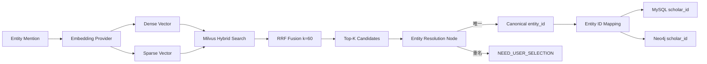
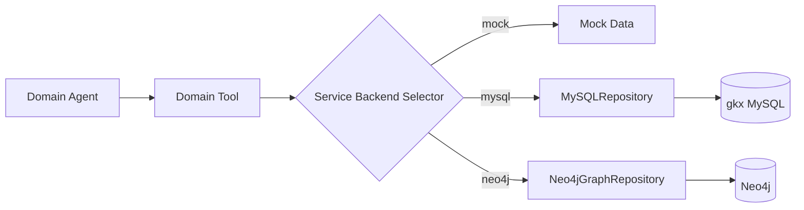
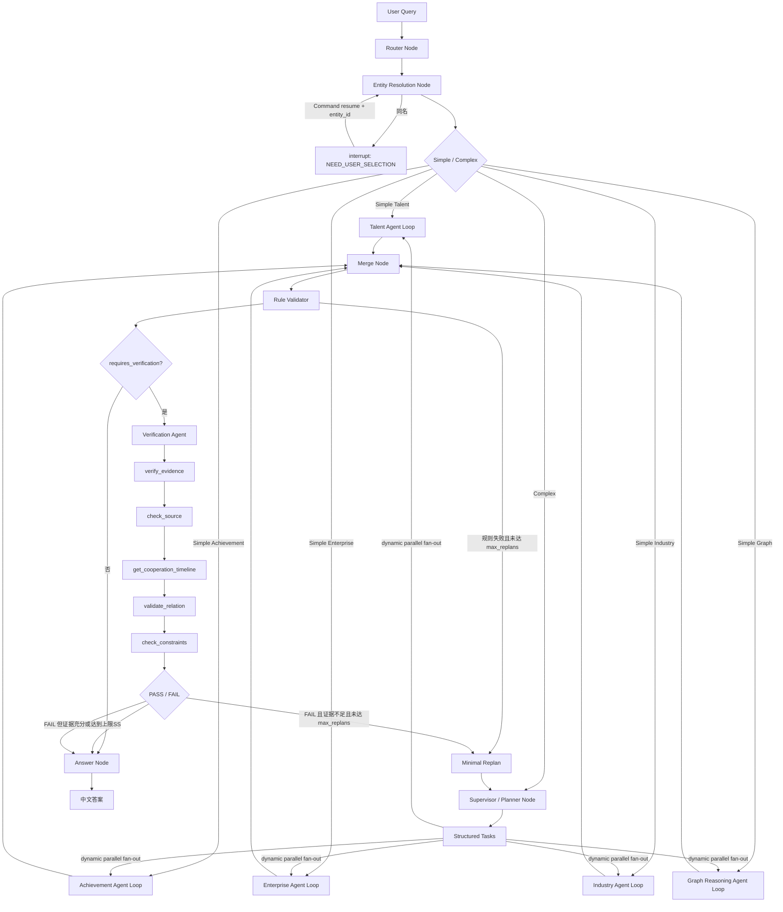
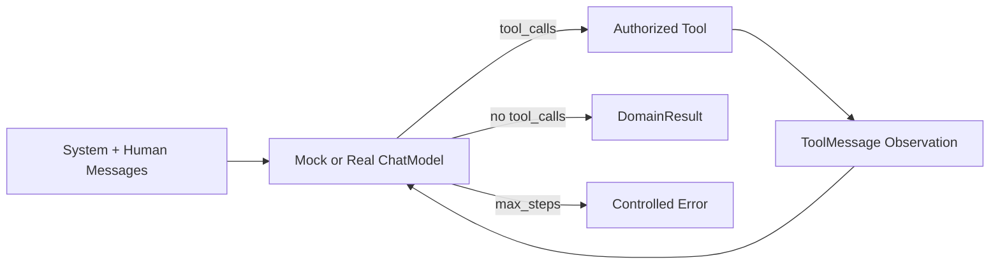

# 亿级科技知识图谱 Multi-Agent GraphRAG（第六阶段）

这是一个可运行、可调试、用于学习与面试讲解的 Multi-Agent GraphRAG 示例。第五阶段在原有 Multi-Agent、Tool Calling、Replan 和持久化能力上，新增 MySQL 与 Neo4j Repository，并保留 Mock 后端用于离线学习和回归测试。

第六阶段新增统一 canonical entity ID、Dense/Sparse Embedding Provider、Milvus Lite Hybrid Search 和 RRF 实体召回。Shared State 只保存 canonical ID，各数据库内部 ID 只在 Service/Repository 边界转换。

## 架构边界

- Router、Entity Resolution、Supervisor、Merge、Rule Validator、Answer 都是 LangGraph Node，不是 Agent。
- 已实现 TalentOrganizationAgent、ResearchAchievementAgent、EnterpriseRelationAgent、IndustryChainAgent 和 GraphReasoningAgent 五个领域 Agent。
- 每个 Agent 使用局部 `SystemMessage → AIMessage.tool_calls → ToolMessage → Model` 循环，并通过工具白名单阻止跨领域调用。
- `ModelFactory` 根据 `MODEL_PROVIDER` 返回离线 Mock 或真实 OpenAI-Compatible ChatModel，业务代码不绑定具体模型 SDK。
- Entity Resolution 使用 LangGraph `interrupt()` 暂停，使用同一 `thread_id` 和 `Command(resume=...)` 恢复。
- Supervisor 根据复杂 Query 生成结构化 `tasks`；LangGraph 按任务列表动态 fan-out，并行运行相关领域 Agent 后在 Merge 汇合。
- Validation 分为两层：Rule Validator 负责确定性校验；VerificationAgent 仅在 `requires_verification=true` 的复杂语义判断中执行。
- VerificationAgent 使用局部 `SystemMessage/HumanMessage/AIMessage/ToolMessage` 实现真正的多轮 Tool Calling Loop，完整 Messages 不写入全局 State。
- Supervisor 重规划时读取 `missing_domains`、`missing_evidence` 和 `task_history`，只补调缺失领域，并受 `max_replans` 限制。
- FastAPI 使用 SQLite Checkpointer，可跨 HTTP 请求、跨进程重启按 `thread_id` 恢复和审计 State。
- 关键阶段输出 JSON 结构化事件日志，包括 Router、消歧、Planner、Tool、Validation、Verification 和 Answer。

## 领域能力

| Agent | 当前 Mock Tools |
|---|---|
| TalentOrganizationAgent | `get_person_profile`、`get_employment_history`、`match_employment_overlap` |
| ResearchAchievementAgent | `get_author_papers`、`get_common_papers`、`aggregate_cooperation` |
| EnterpriseRelationAgent | `get_person_company_roles`、`get_company_projects`、`get_company_patents` |
| IndustryChainAgent | `get_chain_structure`、`get_node_companies`、`get_node_events`、`rank_top_events` |
| GraphReasoningAgent | `get_neighbors`、`find_path`、`k_hop_expand`、`calculate_path_strength` |
| VerificationAgent | `verify_evidence`、`check_source`、`get_cooperation_timeline`、`validate_relation`、`check_constraints` |

## 第五阶段数据仓储

- `MySQLRepository`：只读接入 `gkx.dwd_scholar`、`dwd_scholar_paper_relation` 和 `dwd_scholar_papers`，支持学者检索、单人论文、共同论文。
- `Neo4jGraphRepository`：只读实现一跳邻居、最短路径、K 跳扩展和路径强度。
- `EntityService`、`AchievementService`、`GraphService` 负责选择 Repository；Agent 与 Tool Schema 无须感知底层数据库。
- 三类后端可独立切换，默认均为 `mock`，所以正常测试不要求本机数据库在线。

本机开发环境已支持 Milvus Lite。它使用与 Milvus Standalone 相同的 `MilvusClient` API，适合先实现 BGE-M3 Dense/Sparse 与 Hybrid Search：

```python
from pymilvus import MilvusClient

client = MilvusClient(".runtime/milvus.db")
```

Milvus Lite 数据文件应放在已忽略的 `.runtime/` 中，不提交到 Git。后续迁移到 Standalone 时，将 URI 改为 `http://127.0.0.1:19530` 即可。

项目使用 `GRAPHRAG_MILVUS_URI`，不要用 `MILVUS_URI` 表示 Lite 文件路径，因为后者会被 `pymilvus` SDK 自己读取并按 HTTP 地址解析。

## 第六阶段实体检索



默认使用确定性离线 Embedding，便于测试：

```bash
export EMBEDDING_PROVIDER=mock
export ENTITY_BACKEND=milvus
python -m scripts.sync_milvus_entities --source mock
python demo.py
```

启用真实 BGE-M3：

```bash
pip install FlagEmbedding
export EMBEDDING_PROVIDER=bge_m3
export EMBEDDING_MODEL_NAME=BAAI/bge-m3
export ENTITY_BACKEND=milvus
python -m scripts.sync_milvus_entities --source mysql --limit 10000
```

真实 BGE-M3 首次运行会下载模型并使用其 Dense Vector 与 lexical weights。教学测试不会自动下载模型。

统一 ID 示例：

```text
canonical: person_zw_001
mysql:     450e887j
neo4j:     SCH001
```

`GraphRAGState.resolved_entities` 保存 `person_zw_001`；AchievementService 查询 MySQL 前转换成 `450e887j`，GraphService 查询 Neo4j 前转换成 `SCH001`，结果写回 State 前再转换回 canonical ID。

真实数据模式示例（请在终端或本机未跟踪的 `.env` 中配置密码）：

```bash
export ENTITY_BACKEND=mysql
export ACHIEVEMENT_BACKEND=mysql
export GRAPH_BACKEND=neo4j
export MYSQL_DATABASE=gkx
export MYSQL_PASSWORD='your-local-password'
export NEO4J_PASSWORD='your-local-password'
```

数据调用链：



## 运行

要求 Python 3.11+：

```bash
python3.11 -m venv .venv
source .venv/bin/activate
python -m pip install -r requirements.txt
python demo.py
pytest -q
uvicorn app.main:app --reload
```

## 模型配置

默认是 `auto` 模式：检测到智谱 Key 时使用 GLM-5.2，否则回退 Mock：

```bash
export ZHIPUAI_API_KEY=your-api-key
```

也可以显式配置通用变量：

```bash
export MODEL_PROVIDER=openai
export MODEL_NAME=glm-5.2
export MODEL_API_KEY=your-api-key
export MODEL_BASE_URL=https://open.bigmodel.cn/api/paas/v4/
```

需要强制离线时使用 `MODEL_PROVIDER=mock`。密钥只通过环境变量注入，禁止写入源码、README 或提交到 Git。

完整模板见 `.env.example`。代码不会自动读取或提交 `.env`，可由进程管理器注入环境变量。

## 持久化 API

启动服务：

```bash
uvicorn app.main:app --reload
```

接口：

| 方法 | 路径 | 用途 |
|---|---|---|
| `POST` | `/queries` | 创建查询，可能返回 `NEED_USER_SELECTION` |
| `POST` | `/queries/{thread_id}/resume` | 提交 `{姓名: entity_id}` 并恢复图 |
| `GET` | `/queries/{thread_id}` | 查询当前 State 和下一节点 |
| `GET` | `/queries/{thread_id}/history` | 查询检查点历史 |
| `GET` | `/health` | 查看阶段、模型后端和 Checkpointer |

默认检查点文件是 `.runtime/checkpoints.sqlite`，已被 `.gitignore` 排除。

## 完整执行流程



每个 Domain Agent Loop 内部执行：



Supervisor 只为 Query 涉及的领域创建任务。例如“综合分析学术、职业、企业、产业链和间接关系路径”会并行调用全部五个领域 Agent；简单企业或产业链问题会跳过 Supervisor，直接进入相应 Agent。

语义判断场景“判断张伟和李明是不是长期稳定的核心科研合作伙伴”执行：

```text
Router → Entity Resolution → AchievementAgent
→ 共同论文 + 共同项目 + 聚合结果
→ Merge → Rule Validator
→ VerificationAgent 多轮 Tool Calling
→ Evidence / Source / Timeline / Relation / Constraints
→ PASS 或 FAIL → Answer 或受 max_replans 限制的 Replan
```

Rule Validator 使用普通 Python 校验 entity_id、共同作者/项目参与者、evidence_id、项目时间范围、聚合 count 和数据完整性。VerificationAgent 不替代这些规则，只负责“长期、稳定、核心合作伙伴”这样的语义关系判断。

## 测试

当前测试覆盖：

- 重名实体暂停与恢复；
- 简单论文查询跳过 Supervisor；
- 企业角色、项目、专利工具；
- 产业链结构、节点企业、TOP-N 事件；
- 一跳邻居、最短路径、K 跳扩展、路径强度；
- 简单企业路由；
- 无人物实体的产业链查询；
- 五领域复杂 Query 的 Supervisor 动态并行 fan-out 与 Merge。
- Rule Validator 的时间范围、count 和数据完整性检查；
- VerificationAgent 五步 Tool Calling/ToolMessage 循环；
- 长期稳定核心科研合作伙伴 PASS 场景；
- Verification FAIL 与 Rule Validation FAIL 的 `max_replans` 路由限制。
- 所有 Domain Agent 的多轮 ToolMessage 回灌与停止条件；
- OpenAI Provider 缺少 API Key 时的快速失败；
- Supervisor 只补调缺失领域的最小化 Replan；
- FastAPI 创建、interrupt、resume、State 和 history；
- SQLite Checkpointer 的跨请求会话持久化。

运行：

```bash
pytest -q
```

当前测试结果以本机 `pytest -q` 输出为准；真实数据库集成采用单独 smoke test，不进入默认 CI。

## 后续阶段建议（尚未实现）

下一阶段建议继续接入 MySQL 项目、专利、任职和教育关系，并把当前教学映射迁移到经过数据治理确认的正式 `entity_id_mapping` 表。随后可用真实 BGE-M3 批量重建 Milvus 索引，并增加增量同步与召回质量评测。
