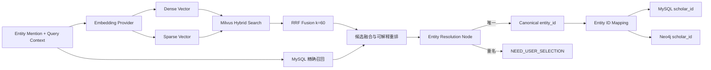
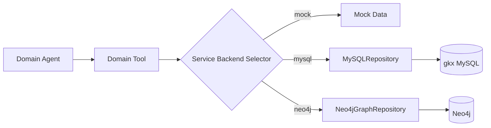
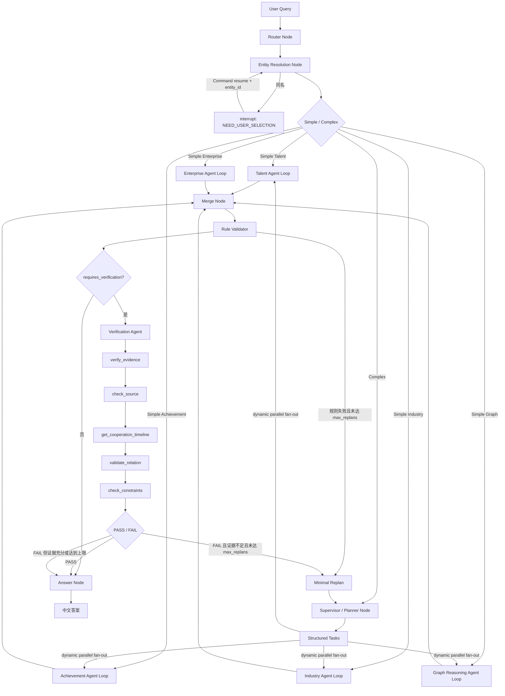
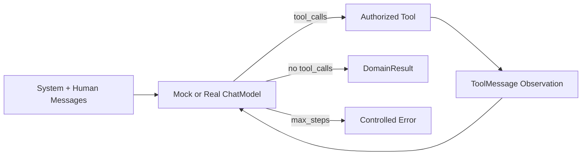

# 亿级科技知识图谱 Multi-Agent GraphRAG（第九阶段）

这是一个可运行、可调试、用于学习与面试讲解的 Multi-Agent GraphRAG 示例。第九阶段新增统一 EvidenceRecord、Neo4j 企业/产业 Repository、共享数据库 Client、真实依赖健康探针、MySQL→Neo4j 同步工具和端到端质量评测。

第六阶段新增统一 canonical entity ID、Dense/Sparse Embedding Provider、Milvus Lite Hybrid Search 和 RRF 实体召回。Shared State 只保存 canonical ID，各数据库内部 ID 只在 Service/Repository 边界转换。

## 架构边界

- Router、Entity Resolution、Supervisor、Merge、Rule Validator、Answer 都是 LangGraph Node，不是 Agent。
- 已实现 TalentOrganizationAgent、ResearchAchievementAgent、EnterpriseRelationAgent、IndustryChainAgent、GraphReasoningAgent 和 WebResearchAgent 六个领域 Agent。
- 每个 Agent 使用局部 `SystemMessage → AIMessage.tool_calls → ToolMessage → Model` 循环，并通过工具白名单阻止跨领域调用。
- `ModelFactory` 根据 `MODEL_PROVIDER` 返回离线 Mock 或真实 OpenAI-Compatible ChatModel，业务代码不绑定具体模型 SDK。
- Entity Resolution 使用 LangGraph `interrupt()` 暂停，使用同一 `thread_id` 和 `Command(resume=...)` 恢复。
- Supervisor 根据复杂 Query 生成结构化 `tasks`；LangGraph 按任务列表动态 fan-out，并行运行相关领域 Agent 后在 Merge 汇合。
- 每个复杂任务携带 `required_fact_types` 与 `required_entity_ids`；Rule Validator 按任务契约验收。
- Validation 分为两层：Rule Validator 负责确定性校验；VerificationAgent 仅在 `requires_verification=true` 的复杂语义判断中执行。
- VerificationAgent 使用局部 `SystemMessage/HumanMessage/AIMessage/ToolMessage` 实现真正的多轮 Tool Calling Loop，完整 Messages 不写入全局 State。
- Supervisor 重规划时读取 `missing_domains`、`missing_evidence` 和 `task_history`，只补调缺失领域，并受 `max_replans` 限制。
- FastAPI 使用后台 Run 执行 LangGraph，`POST /queries` 立即返回 `RUNNING`，前端通过 SSE 接收轨迹和终态。
- `run_id` 与一次执行绑定并禁止复用，避免旧 Checkpoint State 污染新问题。
- 节点轨迹包含脱敏、限长的输入输出快照，并限制线程数和单线程事件数。
- Entity Resolution 支持 `hybrid`：MySQL 权威精确召回、BGE-M3 + Milvus 语义补召回、上下文重排和置信阈值。
- 后台 Run 状态、interrupt、错误和耗时持久化到独立 SQLite Registry，并支持取消和超时。
- Tool Observation 在写入 Shared State 前转换为统一证据记录；证据明细保留在 State 与执行轨迹中供审计，最终答案不展开内部证据编号。
- 企业和产业领域可独立切换到 Neo4j，并复用 GraphService 的同一 Driver。
- 领域Tool支持`local/mcp`双传输：local模式进程内调用；MCP模式从独立Server动态发现白名单工具并通过Streamable HTTP执行。
- MCP Server复用现有Service/Repository，公开人才、成果、企业、产业、图检索、证据验证和可选联网搜索共七组能力；LangGraph控制节点保持本地。
- WebResearchAgent仅在问题明确要求联网、最新资料、官网、新闻或外部查证时执行；网页结果作为带URL的外部候选证据，不覆盖图谱事实，也不自动回写图谱。

## 领域能力

| Agent | Tools 与可切换后端 |
|---|---|
| TalentOrganizationAgent | `get_person_profile`、`get_employment_history`、`get_education_history`、`match_employment_overlap` |
| ResearchAchievementAgent | `get_author_papers`、`get_common_papers`、`get_common_projects`、`get_person_patents`、`get_common_patents`、`aggregate_cooperation` |
| EnterpriseRelationAgent | `get_person_company_roles`、`get_company_projects`、`get_company_patents` |
| IndustryChainAgent | `get_chain_structure`、`get_node_companies`、`get_node_events`、`rank_top_events` |
| GraphReasoningAgent | `get_neighbors`、`find_path`、`k_hop_expand`、`calculate_path_strength` |
| WebResearchAgent | `search_web`（Brave/Tavily，可通过 local 或 MCP 调用） |
| VerificationAgent | `verify_evidence`、`check_source`、`get_cooperation_timeline`、`validate_relation`、`check_constraints` |

## 第五阶段数据仓储

- `MySQLRepository`：只读接入 `gkx.dwd_scholar`、论文、项目和专利表，支持学者、任职、教育、单人/共同论文、共同项目及单人/共同专利查询。
- `Neo4jGraphRepository`：只读实现一跳邻居、最短路径、K 跳扩展和路径强度。
- `EntityService`、`AchievementService`、`GraphService` 负责选择 Repository；Agent 与 Tool Schema 无须感知底层数据库。
- 三类后端可独立切换；当前本地配置默认实体检索为 Milvus，科研成果和图查询仍可保持 Mock。自动化测试强制使用轻量 Mock，不要求数据库在线。

本机开发环境已支持 Milvus Lite。它使用与 Milvus Standalone 相同的 `MilvusClient` API，适合先实现 BGE-M3 Dense/Sparse 与 Hybrid Search：

```python
from pymilvus import MilvusClient

client = MilvusClient(".runtime/milvus.db")
```

Milvus Lite 数据文件应放在已忽略的 `.runtime/` 中，不提交到 Git。后续迁移到 Standalone 时，将 URI 改为 `http://127.0.0.1:19530` 即可。

项目使用 `GRAPHRAG_MILVUS_URI`，不要用 `MILVUS_URI` 表示 Lite 文件路径，因为后者会被 `pymilvus` SDK 自己读取并按 HTTP 地址解析。

## 第八阶段混合实体检索



## 第九阶段真实数据与统一证据

领域后端可以独立切换：

```env
ENTITY_BACKEND=hybrid
ACHIEVEMENT_BACKEND=mysql
GRAPH_BACKEND=neo4j
ENTERPRISE_BACKEND=neo4j
INDUSTRY_BACKEND=neo4j
```

统一证据结构包含 `evidence_id`、`fact_type`、`source_type`、`source_name`、
`source_record_id`、`entity_ids`、`event_time`、`content` 和 `source_tool`。Merge Node 按
`evidence_id` 去重，Rule Validator 校验证据结构，Answer Node保留可读结论与外部来源URL，不展开内部证据编号。

MySQL 到 Neo4j 同步默认只预览，必须显式增加 `--apply` 才写入：

```bash
python -m scripts.sync_neo4j_research_graph --limit 100
python -m scripts.sync_neo4j_research_graph --limit 100 --batch-id stage9-001 --apply
```

同步使用 `MERGE` 保证同一学者、论文及 `AUTHOR_OF` 关系可重复执行。

配置 `ENTITY_BACKEND=hybrid` 后启用 MySQL + Milvus 双路召回；确定性 Mock 仅用于自动化测试：

```bash
export EMBEDDING_PROVIDER=bge_m3
export ENTITY_BACKEND=hybrid
export HF_HOME=.runtime/huggingface
export EMBEDDING_CACHE_DIR=.runtime/huggingface
export GRAPHRAG_MILVUS_URI=.runtime/milvus-bge-m3.db
python -m scripts.sync_milvus_entities --source mock
python demo.py
```

从 MySQL 使用真实 BGE-M3 重建索引：

```bash
export EMBEDDING_PROVIDER=bge_m3
export EMBEDDING_MODEL_NAME=BAAI/bge-m3
export ENTITY_BACKEND=milvus
python -m scripts.sync_milvus_entities --source mysql --limit 10000
```

### 独立合成数据源

需要在不修改原始 `gkx` 的前提下演练完整图谱构建时，可生成确定性的 `gkx_synthetic`：

```bash
python -m scripts.generate_synthetic_gkx
python -m scripts.validate_synthetic_gkx
python -m scripts.import_synthetic_gkx  # 默认只预览，不连接或写入 MySQL
```

实际导入必须显式指定 `--apply --confirm-database gkx_synthetic`。导入器会拒绝把 `gkx`
作为目标。数据模型、规模参数和安全操作参见 `docs/07_synthetic_gkx_dataset.md`。

真实 BGE-M3 首次运行会下载模型，并使用 1024 维 Dense Vector 与模型 lexical weights。测试显式注入 Mock Embedding，不重复加载模型。

统一 ID 示例：

```text
canonical: person_zw_001
mysql:     450e887j
neo4j:     SCH001
```

`GraphRAGState.resolved_entities` 保存 `person_zw_001`；AchievementService 查询 MySQL 前转换成 `450e887j`，GraphService 查询 Neo4j 前转换成 `SCH001`，结果写回 State 前再转换回 canonical ID。

真实数据模式示例（请在终端或本机未跟踪的 `.env` 中配置密码）：

```bash
export ENTITY_BACKEND=mysql
export ACHIEVEMENT_BACKEND=mysql
export GRAPH_BACKEND=neo4j
export MYSQL_DATABASE=gkx
export MYSQL_PASSWORD='your-local-password'
export NEO4J_PASSWORD='your-local-password'
```

数据调用链：



## 运行

要求 Python 3.11+：

```bash
python3.11 -m venv .venv
source .venv/bin/activate
python -m pip install -r requirements.txt
python demo.py
pytest -q
uvicorn app.main:app --reload
```

默认`TOOL_TRANSPORT=local`，行为与原有版本一致。需要使用MCP时，先启动工具服务：

```bash
.venv/bin/python -m mcp_runtime.server
```

再在另一个终端启动主应用：

```bash
export TOOL_TRANSPORT=mcp
export MCP_SERVER_URL=http://127.0.0.1:8100/mcp
.venv/bin/uvicorn app.main:app --host 127.0.0.1 --port 8000
```

可通过`.venv/bin/python -m scripts.smoke_mcp_tools`列出远端工具。完整边界、白名单、联网搜索配置与故障行为见
[`docs/08_mcp_tool_transport.md`](docs/08_mcp_tool_transport.md)。

启动后访问 [http://127.0.0.1:8000](http://127.0.0.1:8000) 打开 GraphRAG Studio 前端。页面支持：

- 输入自然语言问题并创建独立 `thread_id`；
- 使用“联网搜索”按钮按查询开启或关闭 WebResearchAgent；关闭时后端不会构建联网 Agent 或调用 Tavily/MCP；
- 实时查看 Router、Entity Resolution、Supervisor、Domain Agent、Tool、Merge、Validator、Verification 和 Answer 事件；
- 在检测到同名专家时选择候选 `entity_id`，从 LangGraph interrupt 中断点恢复；
- 查看最终中文答案、规则校验状态、实体 ID 和完整 `GraphRAGState`；
- 使用 SSE 实时接收执行轨迹，不把 Agent Messages 写入 Shared State；彩色节点可查看脱敏后的输入与输出。

前端是 FastAPI 同源静态页面，不需要 Node.js 构建：

```text
frontend/index.html
frontend/styles.css
frontend/app.js
```

## 模型配置

默认是 `auto` 模式：检测到智谱 Key 时使用 GLM-5.2，否则回退 Mock：

```bash
export ZHIPUAI_API_KEY=your-api-key
```

也可以显式配置通用变量：

```bash
export MODEL_PROVIDER=openai
export MODEL_NAME=glm-5.2
export MODEL_API_KEY=your-api-key
export MODEL_BASE_URL=https://open.bigmodel.cn/api/paas/v4/
```

需要强制离线时使用 `MODEL_PROVIDER=mock`。密钥只通过环境变量注入，禁止写入源码、README 或提交到 Git。

完整模板见 `.env.example`。项目会从根目录自动读取 `.env`，且系统环境变量优先级更高；`.env` 已被 Git 忽略，不会提交。

## 后台 Run 与持久化 API

启动服务：

```bash
uvicorn app.main:app --reload
```

接口：

| 方法 | 路径 | 用途 |
|---|---|---|
| `POST` | `/queries` | 创建后台 Run，立即返回 `202 RUNNING` |
| `POST` | `/queries/{run_id}/resume` | 提交 `{姓名: entity_id}`，后台恢复执行 |
| `POST` | `/queries/{run_id}/cancel` | 协作式取消后台 Run |
| `GET` | `/queries/{run_id}` | 查询运行状态，包括 `ENTITY_NOT_FOUND/CANCELLED/TIMED_OUT` |
| `GET` | `/queries/{run_id}/stream` | SSE 推送 trace 与终态 |
| `GET` | `/queries/{run_id}/history` | 查询 SQLite Checkpoint 历史 |
| `GET` | `/queries/{run_id}/events` | 兼容性增量事件接口 |
| `GET` | `/health` | 查看阶段、模型后端和 Checkpointer |
| `GET` | `/health/dependencies` | 主动探测当前启用的 MySQL、Milvus、Neo4j 或 Mock 后端 |
| `GET` | `/metrics` | 查看无敏感数据的运行状态与耗时摘要 |

默认检查点文件是 `.runtime/checkpoints.sqlite`，已被 `.gitignore` 排除。
新问题必须使用新的 `run_id`；重复提交相同 ID 返回 `409`。

## 完整执行流程



每个 Domain Agent Loop 内部执行：



Supervisor 只为 Query 涉及的领域创建任务。例如“综合分析学术、职业、企业、产业链和间接关系路径”会并行调用全部五个领域 Agent；简单企业或产业链问题会跳过 Supervisor，直接进入相应 Agent。

语义判断场景“判断张伟和李明是不是长期稳定的核心科研合作伙伴”执行：

```text
Router → Entity Resolution → AchievementAgent
→ 共同论文 + 共同项目 + 聚合结果
→ Merge → Rule Validator
→ VerificationAgent 多轮 Tool Calling
→ Evidence / Source / Timeline / Relation / Constraints
→ PASS 或 FAIL → Answer 或受 max_replans 限制的 Replan
```

Rule Validator 使用普通 Python 校验 entity_id、共同作者/项目参与者、evidence_id、项目时间范围、聚合 count 和数据完整性。VerificationAgent 不替代这些规则，只负责“长期、稳定、核心合作伙伴”这样的语义关系判断。

## 测试

当前测试覆盖：

- 重名实体暂停与恢复；
- 简单论文查询跳过 Supervisor；
- 企业角色、项目、专利工具；
- 产业链结构、节点企业、TOP-N 事件；
- 一跳邻居、最短路径、K 跳扩展、路径强度；
- 简单企业路由；
- 无人物实体的产业链查询；
- 五领域复杂 Query 的 Supervisor 动态并行 fan-out 与 Merge。
- Rule Validator 的时间范围、count 和数据完整性检查；
- VerificationAgent 五步 Tool Calling/ToolMessage 循环；
- 长期稳定核心科研合作伙伴 PASS 场景；
- Verification FAIL 与 Rule Validation FAIL 的 `max_replans` 路由限制。
- 所有 Domain Agent 的多轮 ToolMessage 回灌与停止条件；
- OpenAI Provider 缺少 API Key 时的快速失败；
- Supervisor 只补调缺失领域的最小化 Replan；
- FastAPI 创建、interrupt、resume、State 和 history；
- SQLite Checkpointer 的跨请求会话持久化。
- 后台 Run 状态、SSE 终态和重复 `run_id` 拒绝；
- Supervisor 任务契约与 Rule Validator 验收；
- Verification 经 Service/Repository 使用当前数据后端；
- 节点快照敏感字段脱敏和 Graph path strength 答案。
- MySQL + Milvus 候选融合、上下文重排和自动确认阈值；
- 持久化 Run Registry、协作式超时以及统一 Evidence Repository。
- MySQL 任职、教育、项目和专利参数化查询，以及专利/教育端到端回答。
- 统一 EvidenceRecord、Neo4j 企业/产业 Service 适配和依赖健康探针；
- 可重复的 MySQL→Neo4j 同步预览/写入流程；
- 路由、工具、答案、校验和证据覆盖端到端评测。
- API → LangGraph → Agent → MCP → 数据库/模型的统一 Trace；
- 模型 Token/成本、工具成功率、重规划、超时率和 P95 延迟统计；
- 50 条分层黄金集、CI 回归门禁和前端双 Run 对比。

运行：

```bash
pytest -q
python -m scripts.evaluate_stage9_e2e
python -m scripts.run_agent_evals --check
```

当前测试结果以本机 `pytest -q` 输出为准；真实数据库集成采用单独 smoke test，不进入默认 CI。

## Agent 评测与可观测

每次 API 查询都生成持久化 Trace，并记录 API、LangGraph Node、Agent、模型、Tool、MCP Client/Server
以及 MySQL、Neo4j、Milvus Span。接口包括：

```text
GET /observability/summary
GET /observability/runs
GET /observability/runs/{run_id}
GET /observability/compare?left_run_id=...&right_run_id=...
```

在 `.env` 中设置模型的每百万 Token 单价后，系统按真实 Provider 返回的 usage 计算单次 Run 成本；
Mock 模型没有真实 Token，成本固定为 0。浏览器页面底部可以选择两个 Run，对比模型、Prompt、工作流版本、
总耗时、Token、成本、工具成功率、重规划、错误数和最慢 Span。

`evals/golden_v1.jsonl` 固定包含 10 条实体消歧、20 条路由、20 条完整工作流用例。
CI 使用 `evals/baselines/agentops_v1.json` 同时执行绝对门槛与相对回退检测，失败时阻止合并，并上传评测报告。
详细设计见 [docs/07_agent_evaluation_observability.md](docs/07_agent_evaluation_observability.md)。

## 后续阶段建议

后续可增加 API 鉴权、Redis/Celery 或同类跨进程任务队列，并将当前 vendor-neutral Trace 导出为
OpenTelemetry/OTLP，接入 Grafana Tempo、Jaeger 或 LangSmith。

第七阶段运行时和任务契约详解见 [docs/03_stage7_runtime.md](docs/03_stage7_runtime.md)。

当前项目从 API、LangGraph、实体消歧、Agent Tool Calling 到 SSE 返回的完整流程见 [docs/04_current_runtime_flow.md](docs/04_current_runtime_flow.md)。

真实后端启动后可执行在线查询黑盒验收：

```bash
python -m scripts.smoke_online_query \
  --base-url http://127.0.0.1:8000 \
  --question '南京科技大学042的何伟发表过哪些论文？'

# 对重名问题自动选择首个候选，覆盖 interrupt/resume 分支
python -m scripts.smoke_online_query \
  --question '何伟发表过哪些论文？' --auto-select-first
```

第八阶段混合实体解析、统一证据与 Run 治理见 [docs/05_stage8_hybrid_resolution.md](docs/05_stage8_hybrid_resolution.md)。

第九阶段真实数据、统一证据和评测见 [docs/06_stage9_real_data_and_evaluation.md](docs/06_stage9_real_data_and_evaluation.md)。
