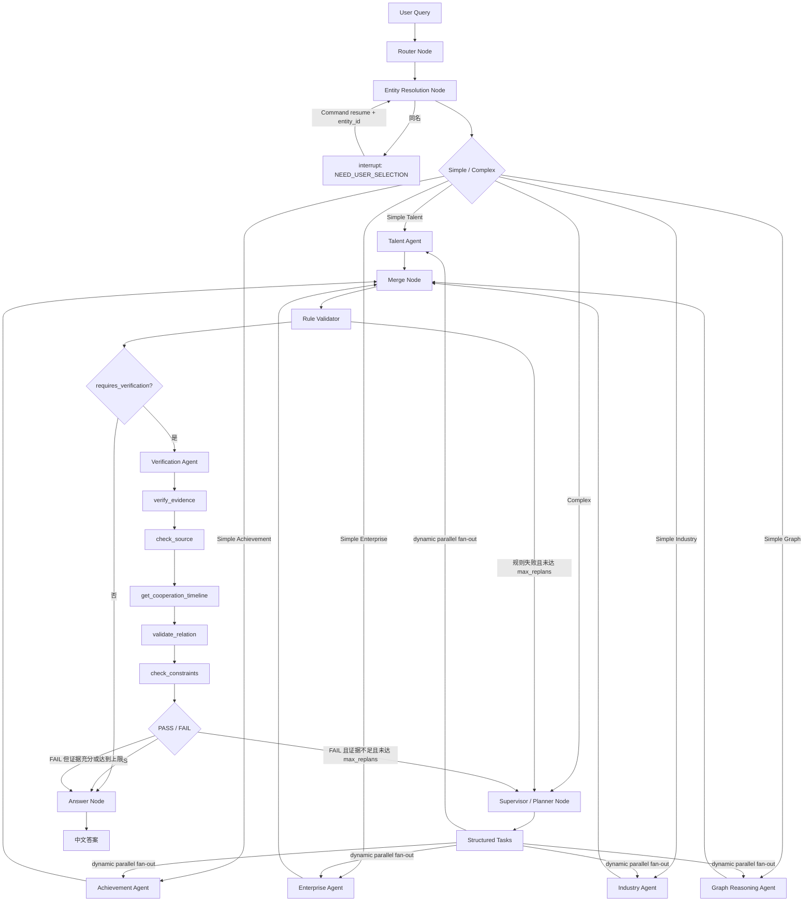

# 亿级科技知识图谱 Multi-Agent GraphRAG（第三阶段）

这是一个可运行、可调试、用于学习与面试讲解的 Multi-Agent GraphRAG 示例。第三阶段仍全部使用 Mock 数据，没有连接 Milvus、TRSGraph、MySQL/TDSQL。

## 架构边界

- Router、Entity Resolution、Supervisor、Merge、Rule Validator、Answer 都是 LangGraph Node，不是 Agent。
- 已实现 TalentOrganizationAgent、ResearchAchievementAgent、EnterpriseRelationAgent、IndustryChainAgent 和 GraphReasoningAgent 五个领域 Agent。
- 每个 Agent 通过 LangChain `AIMessage.tool_calls` 调用自己白名单中的 `@tool`，无法跨领域执行未授权工具。
- 默认 ModelFactory 提供无需 API Key 的确定性 Mock 模型；未来可在 `models/llm.py` 中替换真实 ChatModel，业务层无需绑定具体 SDK。
- Entity Resolution 使用 LangGraph `interrupt()` 暂停，使用同一 `thread_id` 和 `Command(resume=...)` 恢复。
- Supervisor 根据复杂 Query 生成结构化 `tasks`；LangGraph 按任务列表动态 fan-out，并行运行相关领域 Agent 后在 Merge 汇合。
- Validation 分为两层：Rule Validator 负责确定性校验；VerificationAgent 仅在 `requires_verification=true` 的复杂语义判断中执行。
- VerificationAgent 使用局部 `SystemMessage/HumanMessage/AIMessage/ToolMessage` 实现真正的多轮 Tool Calling Loop，完整 Messages 不写入全局 State。

## 第二阶段领域能力

| Agent | 当前 Mock Tools |
|---|---|
| TalentOrganizationAgent | `get_person_profile`、`get_employment_history`、`match_employment_overlap` |
| ResearchAchievementAgent | `get_author_papers`、`get_common_papers`、`aggregate_cooperation` |
| EnterpriseRelationAgent | `get_person_company_roles`、`get_company_projects`、`get_company_patents` |
| IndustryChainAgent | `get_chain_structure`、`get_node_companies`、`get_node_events`、`rank_top_events` |
| GraphReasoningAgent | `get_neighbors`、`find_path`、`k_hop_expand`、`calculate_path_strength` |
| VerificationAgent | `verify_evidence`、`check_source`、`get_cooperation_timeline`、`validate_relation`、`check_constraints` |

## 运行

要求 Python 3.11+：

```bash
python3.11 -m venv .venv
source .venv/bin/activate
python -m pip install -r requirements.txt
python demo.py
pytest -q
uvicorn app.main:app --reload
```

## 第三阶段执行流程



Supervisor 只为 Query 涉及的领域创建任务。例如“综合分析学术、职业、企业、产业链和间接关系路径”会并行调用全部五个领域 Agent；简单企业或产业链问题会跳过 Supervisor，直接进入相应 Agent。

语义判断场景“判断张伟和李明是不是长期稳定的核心科研合作伙伴”执行：

```text
Router → Entity Resolution → AchievementAgent
→ 共同论文 + 共同项目 + 聚合结果
→ Merge → Rule Validator
→ VerificationAgent 多轮 Tool Calling
→ Evidence / Source / Timeline / Relation / Constraints
→ PASS 或 FAIL → Answer 或受 max_replans 限制的 Replan
```

Rule Validator 使用普通 Python 校验 entity_id、共同作者/项目参与者、evidence_id、项目时间范围、聚合 count 和数据完整性。VerificationAgent 不替代这些规则，只负责“长期、稳定、核心合作伙伴”这样的语义关系判断。

## 测试

当前测试覆盖：

- 重名实体暂停与恢复；
- 简单论文查询跳过 Supervisor；
- 企业角色、项目、专利工具；
- 产业链结构、节点企业、TOP-N 事件；
- 一跳邻居、最短路径、K 跳扩展、路径强度；
- 简单企业路由；
- 无人物实体的产业链查询；
- 五领域复杂 Query 的 Supervisor 动态并行 fan-out 与 Merge。
- Rule Validator 的时间范围、count 和数据完整性检查；
- VerificationAgent 五步 Tool Calling/ToolMessage 循环；
- 长期稳定核心科研合作伙伴 PASS 场景；
- Verification FAIL 与 Rule Validation FAIL 的 `max_replans` 路由限制。

运行：

```bash
pytest -q
```

## 后续阶段建议（尚未实现）

把 Mock Verification Model 替换为真实结构化 ChatModel；让 Supervisor 在 Replan 时明确读取 `missing_domains` 和 `missing_evidence` 并只补调缺失任务；把内存 checkpointer 与 API 的恢复接口升级为可持久化会话；随后再逐层替换 Mock Service 为 Milvus、TRSGraph 与关系数据库。
