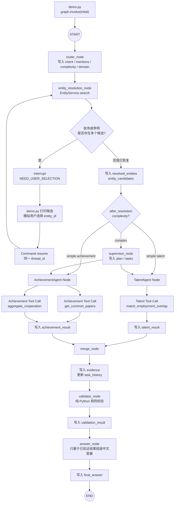

# 第一阶段架构详解：从 User Query 到最终答案

本文只解释当前仓库已经实现的第一阶段代码，不泛泛讨论 LangGraph，也不把第二阶段尚未实现的能力描述成现有功能。

示例问题是：

> 综合分析张伟和李明的学术和职业合作关系。

当前系统把工作分成两类角色：

- **Node（工作流节点）**：负责固定职责，如路由、实体消歧、规划、合并、确定性校验和答案组装。
- **Agent（领域智能体）**：面对一个领域目标，读取可用工具 Schema，由模型产生 Tool Call，再执行被选择的工具。

第一阶段真正实现的领域 Agent 只有：

- `TalentOrganizationAgent`，代码入口是 `agents/talent_agent.py::build_talent_agent()`；
- `ResearchAchievementAgent`，代码入口是 `agents/achievement_agent.py::build_achievement_agent()`。

## 1. User Query 如何进入 LangGraph

图在 `graph/builder.py::build_graph()` 中构建：

```python
graph = StateGraph(GraphRAGState)
graph.add_node("router", router_node)
...
graph.add_edge(START, "router")
return graph.compile(checkpointer=checkpointer or InMemorySaver())
```

`StateGraph(GraphRAGState)` 表示这张图的节点围绕同一个状态结构工作。`START → router` 表示任何一次新执行首先进入 Router Node。

演示程序 `demo.py::main()` 先调用 `build_graph()`，随后创建初始状态：

```python
initial = {
    "question": "综合分析张伟和李明的学术和职业合作关系。",
    "replan_count": 0,
    "max_replans": 2,
    "resolved_entities": {},
    "task_history": [],
}
```

然后执行：

```python
first = graph.invoke(initial, config=config)
```

这里发生了三件事：

1. `initial` 被作为 `GraphRAGState` 的初始内容；
2. `config.configurable.thread_id` 标识本次会话；
3. 编译图使用 `InMemorySaver` 保存检查点，使中断后的恢复能够找到同一执行上下文。

`GraphRAGState` 使用 `TypedDict(total=False)`。因此并不要求第一次调用就提供所有字段；每个节点只返回它负责新增或更新的字段，LangGraph 再将这些局部更新合入共享 State。

FastAPI 的预留入口位于 `app/main.py::query()`，它同样调用 `graph.invoke()`。不过当前完整的人工消歧恢复演示以 `demo.py` 为准。

## 2. Router Node 为什么不是 Agent

Router 的实现是 `nodes/router_node.py::router_node()`：

```python
def router_node(state: GraphRAGState) -> dict:
    output = ModelFactory.structured_model().invoke_router(state["question"])
    return output.model_dump()
```

它只做一次受约束的结构化分类，输出 `models/schemas.py::RouterOutput`：

```python
class RouterOutput(BaseModel):
    intent: str
    entity_mentions: list[str]
    complexity: Literal["simple", "complex"]
    primary_domain: Literal["talent", "achievement", "enterprise", "industry", "graph"]
    requires_verification: bool = False
```

Router 不是 Agent，原因不是“它没有使用模型”，而是它没有 Agent 的决策—行动循环：

- 没有领域工具；
- 不根据工具 Observation 继续推理；
- 不自主尝试多个动作；
- 职责和输出协议是固定的。

当前离线模型 `models/llm.py::MockStructuredModel.invoke_router()` 通过确定性规则模拟 Structured Output。以后替换成真实 LLM 时，Router 仍然是 Node：是否属于 Agent 取决于职责和运行方式，而不是是否调用 LLM。

对于示例问题，Router 输出近似为：

```json
{
  "intent": "综合合作关系分析",
  "entity_mentions": ["张伟", "李明"],
  "complexity": "complex",
  "primary_domain": "achievement",
  "requires_verification": false
}
```

## 3. Entity Resolution 为什么放在 Multi-Agent 之前

Router 提取到的“张伟”和“李明”只是文本 mention，不是知识图谱中的唯一实体。

Mock 数据 `data/mock_entities.py::MOCK_ENTITIES` 中存在：

- `person_zw_001`：清华大学计算机系教授张伟；
- `person_zw_002`：北京理工大学材料学院研究员张伟；
- `person_lm_001`：清华大学人工智能研究院副教授李明；
- `person_lm_002`：中科院自动化所模式识别研究员李明。

如果先调用领域 Agent，TalentAgent 可能查询了一个张伟，AchievementAgent 却查询了另一个张伟。随后 Merge 得到的“职业关系”和“学术关系”就不属于同一对真实实体，答案表面完整，语义上却已经错了。

所以 `nodes/entity_resolution_node.py::entity_resolution_node()` 必须位于 Router 之后、Supervisor 和领域 Agent 之前：

```text
文本姓名 → 唯一 entity_id → 领域检索与推理
```

这样所有下游任务共享相同的实体身份基准。

## 4. 同名专家如何返回用户确认

Entity Resolution 通过 `services/entity_service.py::EntityService.search()` 查询候选。

在 `entity_resolution_node()` 中：

- 0 个候选：当前实现不会自动解析；
- 1 个候选：直接写入 `resolved`；
- 多个候选：写入局部变量 `ambiguous`，然后调用 `interrupt()`。

关键代码是：

```python
selections = interrupt({
    "status": "NEED_USER_SELECTION",
    "candidates": ambiguous,
    "instruction": "请为每个姓名选择一个 entity_id",
})
```

`interrupt()` 会停止本次图执行，并把 payload 暴露给调用方。`demo.py` 从返回值的 `__interrupt__` 中读取候选并打印：

```python
interrupts = first.get("__interrupt__", ())
payload = interrupts[0].value
```

模拟用户选择后，程序使用同一个 `thread_id` 恢复：

```python
selection = {
    "张伟": "person_zw_001",
    "李明": "person_lm_001",
}
final = graph.invoke(Command(resume=selection), config=config)
```

恢复后，`interrupt()` 表达式的返回值就是 `selection`。节点还会检查每个选择是否真的属于该姓名的候选集合，非法 ID 会触发 `ValueError`。

需要特别理解一个 LangGraph 行为：恢复中断时，包含 `interrupt()` 的节点会从节点开头重新执行，而不是从源代码下一行机械续跑。因此日志里会再次出现 `NEED_USER_SELECTION`。到达同一个 `interrupt()` 调用后，LangGraph 使用 `Command(resume=...)` 的值继续执行，而不会再次暂停。

## 5. entity_id 为什么必须写入 Shared State

节点最终返回：

```python
{
    "resolved_entities": resolved,
    "entity_candidates": candidates,
    "awaiting_user_selection": False,
}
```

其中 `resolved_entities` 的形式是：

```json
{
  "张伟": "person_zw_001",
  "李明": "person_lm_001"
}
```

它必须进入 Shared State，主要有四个原因：

1. Supervisor 规划时需要知道问题里的 mention 已经绑定到哪些实体；
2. 两个并行 Agent 必须读取同一组 ID；
3. Validator 要验证 ID 是否存在，并校验论文作者是否包含这些 ID；
4. Answer Node 要把自然语言姓名和唯一实体对应起来，避免答案身份不明。

如果 entity_id 只保存在 Entity Resolution 的局部变量里，节点返回后就丢失了；如果分别传给 Agent，又容易造成分支不一致。Shared State 是各节点之间明确、可检查、可持久化的数据契约。

## 6. Supervisor 为什么只是 Node

Supervisor 的实现是 `nodes/supervisor_node.py::supervisor_node()`。它读取：

- `question`；
- `resolved_entities`；
- 可选的 `validation_result`；
- `replan_count` 和 `max_replans`。

它输出 `SupervisorPlan`：

```json
{
  "tasks": [
    {
      "task_id": "task_talent",
      "agent": "talent_agent",
      "goal": "查询两位专家的共同任职经历与职业关系"
    },
    {
      "task_id": "task_achievement",
      "agent": "achievement_agent",
      "goal": "查询两位专家的共同论文与学术合作"
    }
  ],
  "execution_mode": "parallel",
  "reason": "问题同时涉及职业和学术两个领域"
}
```

Supervisor 不是 Agent，因为它不拥有 `get_common_papers`、`match_employment_overlap` 等业务工具，也不直接检索知识图谱。它只描述“哪些领域应该做什么”。

此外，真正的图调度关系是在 `graph/builder.py` 静态注册的：

```python
graph.add_edge("supervisor", "talent_agent")
graph.add_edge("supervisor", "achievement_agent")
```

因此第一阶段的 Supervisor 输出虽然包含 `tasks` 和 `execution_mode`，图仍固定 fan-out 到两个已实现 Agent。下一阶段才适合让任务内容更动态地参与发送和重规划路由。

## 7. TalentAgent 为什么属于 Agent

`agents/talent_agent.py::build_talent_agent()` 创建 `ToolCallingDomainAgent`，并只绑定人才领域工具：

```python
[
    get_person_profile,
    get_employment_history,
    match_employment_overlap,
]
```

它具备当前第一阶段定义下的 Agent 特征：

- 接收 Supervisor 分配的领域目标；
- 模型能够看到该领域可用工具；
- 模型产生结构化 Tool Call；
- Agent 执行所选择的工具；
- Agent 把事实、证据、工具调用和错误整理为 `DomainResult`。

在本示例中它选择 `match_employment_overlap`，用两人的 entity_id 查找共同任职机构和时间重叠。

## 8. AchievementAgent 为什么属于 Agent

`agents/achievement_agent.py::build_achievement_agent()` 同样创建 `ToolCallingDomainAgent`，但工具白名单不同：

```python
[
    get_author_papers,
    get_common_papers,
    aggregate_cooperation,
]
```

它不能访问 TalentAgent 的任职工具。这种工具隔离很重要：领域 Agent 的能力边界由它绑定的工具集合决定，而不是依赖提示词要求模型“请不要乱调用”。

示例中 AchievementAgent 产生两个 Tool Call：

- `get_common_papers(entity_ids=...)`；
- `aggregate_cooperation(entity_ids=...)`。

前者返回共同论文明细，后者返回共同论文数量、合作年份和论文 ID。

## 9. Agent 如何看到 Tool Schema

工具定义使用 LangChain 的 `@tool`，例如 `tools/achievement_tools.py`：

```python
@tool
def get_common_papers(entity_ids: list[str]) -> list[dict]:
    """查询两位或多位专家共同署名论文。"""
```

LangChain 会从以下内容构造工具 Schema：

- 函数名：`get_common_papers`；
- docstring：工具用途；
- 参数名：`entity_ids`；
- 类型标注：`list[str]`。

`ToolCallingDomainAgent.__init__()` 调用：

```python
self.model = model.bind_tools(tools)
self.tools = {item.name: item for item in tools}
```

在真实 ChatModel 中，`bind_tools()` 通常会把这些 Schema 按模型供应商要求转换后随请求发送。当前 `MockToolCallingModel.bind_tools()` 为了离线运行，只保存允许的工具名称：

```python
self.allowed_tools = {t.name for t in tools}
```

所以当前版本保留了真实工具对象、标准 Schema 来源和标准 Tool Call 消息格式，但模型选择行为是确定性的 Mock。

## 10. Agent 如何产生 Tool Call

Agent Node 先从 State 中读取自己的任务目标：

```python
result = build_talent_agent().run(
    _goal(state, "talent_agent"),
    state["resolved_entities"],
)
```

随后 `ToolCallingDomainAgent.run()` 调用已绑定工具的模型：

```python
message = self.model.invoke({
    "goal": goal,
    "resolved_entities": resolved_entities,
})
```

`MockToolCallingModel.invoke()` 返回标准 LangChain `AIMessage`，其 `tool_calls` 类似：

```json
[
  {
    "name": "match_employment_overlap",
    "args": {
      "entity_ids": ["person_zw_001", "person_lm_001"]
    },
    "id": "一个 UUID",
    "type": "tool_call"
  }
]
```

AchievementAgent 则会生成两个调用。Agent 遍历 `message.tool_calls`，从自己的工具字典中按名称查找，再执行：

```python
tool = self.tools.get(call["name"])
output = tool.invoke(call["args"])
```

即使模型生成了未授权工具名称，`self.tools.get()` 也找不到它，Agent 会记录“工具未授权”错误，而不会跨领域执行。

## 11. Tool Observation 如何重新回到 Agent

这一点必须准确区分“当前代码”和“典型多轮 Agent”。

当前代码中，工具返回值 `output` 会回到 `ToolCallingDomainAgent.run()`，然后被整理进：

```python
facts.append({"tool": call["name"], "data": output})
```

证据 ID 同时被提取到 `evidence`。最后 Agent 返回 `DomainResult`：

```python
{
  "agent": "...",
  "summary": "...",
  "facts": [...],
  "evidence": [...],
  "tool_calls": [...],
  "errors": [...]
}
```

因此，当前 Observation 确实回到了 Agent 的执行封装，并由 Agent 组织成结构化领域结果；但是它**没有作为 `ToolMessage` 再次发送给模型做第二轮推理**。

当前是单轮模式：

```text
模型生成 Tool Calls
→ Agent 执行工具
→ Agent 整理 Observation
→ 返回 DomainResult
```

典型多轮 Tool-Calling Agent 则是：

```text
模型生成 Tool Call
→ 执行工具
→ ToolMessage 返回模型
→ 模型根据 Observation 决定继续调用工具或输出结论
```

第一阶段采用单轮模式是为了让调用链容易学习，同时仍使用真实 LangChain Tool 对象与 `AIMessage.tool_calls` 协议。不能把它误解成已经实现完整 ReAct 循环。

## 12. 两个 Agent 的结果如何 Merge

`graph/builder.py` 建立了 fan-out/fan-in：

```python
graph.add_edge("supervisor", "talent_agent")
graph.add_edge("supervisor", "achievement_agent")
graph.add_edge("talent_agent", "merge")
graph.add_edge("achievement_agent", "merge")
```

两个 Agent Node 写不同的 State 字段：

- `talent_agent_node()` 返回 `{"talent_result": result}`；
- `achievement_agent_node()` 返回 `{"achievement_result": result}`。

由于两个并行分支不写同一个字段，不会发生并行更新冲突。LangGraph 等待两个入边分支完成后执行 `nodes/merge_node.py::merge_node()`。

Merge Node 不重新推理业务结论，只做数据汇总：

1. 读取 `talent_result` 和 `achievement_result`；
2. 把两个结果中的证据扁平合并为 State 的 `evidence`；
3. 把每个 Agent 的完成或错误状态追加到 `task_history`。

领域结果本身仍分别保留，便于 Validator 和 Answer 按领域读取。

## 13. Validator 为什么不用 LLM

`nodes/validator_node.py::validator_node()` 检查的是确定性事实：

- entity_id 是否存在；
- 复杂问题是否同时返回 talent 和 achievement 结果；
- Agent 是否报告工具错误；
- evidence_id 是否存在；
- 共同论文是否真的同时包含两个 entity_id；
- 聚合的论文 count 是否等于论文明细条数。

这些规则都能用 Python 精确表达。使用 LLM 会带来不必要的问题：

- 同一输入可能得到不同判断；
- 很难证明 count 校验绝对正确；
- 增加延迟和费用；
- 可能把缺失证据“解释”为存在。

Validator 最终输出 `ValidationResult`：

```json
{
  "valid": true,
  "needs_replan": false,
  "missing_domains": [],
  "errors": []
}
```

复杂语义判断，例如“是不是长期稳定的核心合作伙伴”，才适合在第二阶段交给 Verification Agent；它与确定性 Rule Validator 是不同层次的校验。

当前第一阶段虽然生成 `needs_replan`，但图仍固定连接 `validator → answer`，尚未实现 Validator 返回 Supervisor 的重规划条件边。

## 14. LangGraph 条件边如何控制执行路径

当前图唯一的条件边注册在 `graph/builder.py`：

```python
graph.add_conditional_edges(
    "entity_resolution",
    after_resolution,
    {
        "supervisor": "supervisor",
        "talent": "talent_agent",
        "achievement": "achievement_agent",
    },
)
```

路由函数是 `graph/routing.py::after_resolution()`：

```python
def after_resolution(state):
    return (
        "supervisor"
        if state.get("complexity") == "complex"
        else state.get("primary_domain", "achievement")
    )
```

因此：

- `complexity == "complex"`：进入 Supervisor；
- 简单人才问题：返回 `talent`，直接进入 TalentAgent；
- 简单科研成果问题：返回 `achievement`，直接进入 AchievementAgent。

示例问题包含“综合”和“学术和职业”，Router 将它标记为 `complex`，所以消歧完成后进入 Supervisor，而不是直接进入某一个 Agent。

注意，`interrupt()` 不是条件边。它是在 Entity Resolution 节点内部暂停整个图；只有通过 `Command(resume=...)` 完成该节点，图才会评估 `after_resolution()`。

## 15. Demo 中每一次 State 变化

下面用“已有字段 + 本节点更新字段”的方式展示。实际日志、工具调用 UUID 等可能不同，但核心数据结构一致。

### S0：调用 `graph.invoke()` 前

来源：`demo.py::main()`。

```json
{
  "question": "综合分析张伟和李明的学术和职业合作关系。",
  "replan_count": 0,
  "max_replans": 2,
  "resolved_entities": {},
  "task_history": []
}
```

此时还不知道意图、复杂度、实体候选或执行计划。

### S1：Router Node 执行后

来源：`nodes/router_node.py::router_node()`。

新增字段：

```json
{
  "intent": "综合合作关系分析",
  "entity_mentions": ["张伟", "李明"],
  "complexity": "complex",
  "primary_domain": "achievement",
  "requires_verification": false
}
```

完整 State 等于 S0 加以上字段。`primary_domain` 是 `achievement`，但复杂度优先决定后续进入 Supervisor。

### S2：第一次进入 Entity Resolution，发生暂停

来源：`nodes/entity_resolution_node.py::entity_resolution_node()`。

节点查询出两组候选，并执行：

```json
{
  "status": "NEED_USER_SELECTION",
  "candidates": {
    "张伟": [
      {
        "entity_id": "person_zw_001",
        "name": "张伟",
        "organization": "清华大学",
        "title": "计算机系教授"
      },
      {
        "entity_id": "person_zw_002",
        "name": "张伟",
        "organization": "北京理工大学",
        "title": "材料学院研究员"
      }
    ],
    "李明": [
      {
        "entity_id": "person_lm_001",
        "name": "李明",
        "organization": "清华大学",
        "title": "人工智能研究院副教授"
      },
      {
        "entity_id": "person_lm_002",
        "name": "李明",
        "organization": "中科院自动化所",
        "title": "模式识别研究员"
      }
    ]
  },
  "instruction": "请为每个姓名选择一个 entity_id"
}
```

这一段是 interrupt payload，不是节点正常 return 的 State 更新。节点尚未执行到末尾，所以此时不能认为 `resolved_entities` 或 `entity_candidates` 已经由该节点正式提交。

检查点保存了图执行位置和已有 State。调用方得到 `__interrupt__` 后打印候选。

### S3：用户选择作为 Resume 输入

`demo.py` 模拟用户输入：

```json
{
  "张伟": "person_zw_001",
  "李明": "person_lm_001"
}
```

这不是直接覆盖 Shared State，而是作为 `Command(resume=selection)` 的恢复值交给中断点。

### S4：Entity Resolution 恢复并完成后

节点从头重放候选查询，到达 `interrupt()` 后取得 resume 值，校验选择，然后返回：

```json
{
  "resolved_entities": {
    "张伟": "person_zw_001",
    "李明": "person_lm_001"
  },
  "entity_candidates": {
    "张伟": ["此处实际保存完整候选对象"],
    "李明": ["此处实际保存完整候选对象"]
  },
  "awaiting_user_selection": false
}
```

现在唯一实体 ID 正式进入 Shared State。

随后条件函数 `after_resolution()` 读取 `complexity == "complex"`，返回 `supervisor`。

### S5：Supervisor Node 执行后

来源：`nodes/supervisor_node.py::supervisor_node()`。

新增：

```json
{
  "plan": {
    "tasks": [
      {
        "task_id": "task_talent",
        "agent": "talent_agent",
        "goal": "查询两位专家的共同任职经历与职业关系"
      },
      {
        "task_id": "task_achievement",
        "agent": "achievement_agent",
        "goal": "查询两位专家的共同论文与学术合作"
      }
    ],
    "execution_mode": "parallel",
    "reason": "问题同时涉及职业和学术两个领域"
  },
  "tasks": [
    "与 plan.tasks 相同的两个任务对象"
  ]
}
```

`plan` 保留完整 Planner 输出；顶层 `tasks` 便于 Agent Node 直接检索自己的任务。

### S6A：TalentAgent 分支执行后

`nodes/agent_nodes.py::talent_agent_node()` 从 `tasks` 找到 `talent_agent` 的 goal，然后读取 `resolved_entities`。

TalentAgent 调用：

```json
{
  "name": "match_employment_overlap",
  "arguments": {
    "entity_ids": ["person_zw_001", "person_lm_001"]
  }
}
```

工具通过两人的任职历史得到：

```json
[
  {
    "entity_ids": ["person_zw_001", "person_lm_001"],
    "organization": "清华大学",
    "from_year": 2019,
    "evidence_ids": [
      "ev_employment_zw_001",
      "ev_employment_lm_001"
    ]
  }
]
```

该分支只更新 `talent_result`：

```json
{
  "talent_result": {
    "agent": "talent_agent",
    "summary": "talent_agent 完成 1 次工具调用，得到 1 组结果",
    "facts": [
      {
        "tool": "match_employment_overlap",
        "data": ["上面的共同任职结果"]
      }
    ],
    "evidence": [
      {
        "evidence_id": "ev_employment_zw_001",
        "source_tool": "match_employment_overlap"
      },
      {
        "evidence_id": "ev_employment_lm_001",
        "source_tool": "match_employment_overlap"
      }
    ],
    "tool_calls": [
      {
        "name": "match_employment_overlap",
        "arguments": {
          "entity_ids": ["person_zw_001", "person_lm_001"]
        }
      }
    ],
    "errors": []
  }
}
```

### S6B：AchievementAgent 分支执行后

该分支与 TalentAgent 由 Supervisor fan-out，可并行调度。它读取相同的 `resolved_entities`，但使用科研成果工具。

它产生两个 Tool Call：

```json
[
  {
    "name": "get_common_papers",
    "arguments": {
      "entity_ids": ["person_zw_001", "person_lm_001"]
    }
  },
  {
    "name": "aggregate_cooperation",
    "arguments": {
      "entity_ids": ["person_zw_001", "person_lm_001"]
    }
  }
]
```

共同论文是：

```json
[
  {
    "paper_id": "paper_001",
    "title": "Knowledge Graph Reasoning with Multi-Agent Collaboration",
    "year": 2021,
    "authors": ["person_zw_001", "person_lm_001"],
    "evidence_id": "ev_paper_001"
  },
  {
    "paper_id": "paper_002",
    "title": "Hybrid Retrieval for Scientific Knowledge Graphs",
    "year": 2023,
    "authors": ["person_zw_001", "person_lm_001"],
    "evidence_id": "ev_paper_002"
  }
]
```

聚合结果是：

```json
{
  "entity_ids": ["person_zw_001", "person_lm_001"],
  "common_paper_count": 2,
  "years": [2021, 2023],
  "paper_ids": ["paper_001", "paper_002"]
}
```

该分支只更新 `achievement_result`，结构与 `DomainResult` 一致，包含两组 facts、两个证据、两次 tool_calls 和空 errors。

### S7：Merge Node 执行后

当两个分支都到达 Merge，State 已同时包含：

```text
talent_result
achievement_result
```

`merge_node()` 新增或更新：

```json
{
  "evidence": [
    {
      "evidence_id": "ev_employment_zw_001",
      "source_tool": "match_employment_overlap"
    },
    {
      "evidence_id": "ev_employment_lm_001",
      "source_tool": "match_employment_overlap"
    },
    {
      "evidence_id": "ev_paper_001",
      "source_tool": "get_common_papers"
    },
    {
      "evidence_id": "ev_paper_002",
      "source_tool": "get_common_papers"
    }
  ],
  "task_history": [
    {
      "agent": "talent_agent",
      "status": "completed"
    },
    {
      "agent": "achievement_agent",
      "status": "completed"
    }
  ]
}
```

原来的两个领域结果仍保留，没有被 Merge 删除或压缩。

### S8：Rule Validator 执行后

Validator 验证：

- `person_zw_001`、`person_lm_001` 都存在；
- complex 查询要求的两个领域结果都存在；
- 两个 Agent 都没有工具错误；
- 四个 evidence_id 都存在；
- `paper_001` 和 `paper_002` 的 authors 都包含两位专家；
- `common_paper_count == len(common_papers) == 2`。

State 新增：

```json
{
  "validation_result": {
    "valid": true,
    "needs_replan": false,
    "missing_domains": [],
    "errors": []
  }
}
```

### S9：Answer Node 执行后

`nodes/answer_node.py::answer_node()` 只读取：

- `resolved_entities`；
- `validation_result`；
- `talent_result.facts`；
- `achievement_result.facts`。

它不会调用模型知识补全事实。最终新增：

```json
{
  "final_answer": "基于当前知识图谱 Mock 数据，张伟（person_zw_001）、李明（person_lm_001） 的合作关系如下：\n1. 职业关系：存在共同任职经历：清华大学（自 2019 年起重叠）。\n2. 学术关系：共同论文：《Knowledge Graph Reasoning with Multi-Agent Collaboration》（2021）；《Hybrid Retrieval for Scientific Knowledge Graphs》（2023）。\n以上结论仅来自已返回且通过规则校验的证据。"
}
```

随后 `answer → END`，图执行结束。

## 完整流程图



## State 字段的生产者和消费者

| State 字段 | 主要生产者 | 主要消费者 |
|---|---|---|
| `question` | `demo.py` / API 调用方 | Router、Supervisor、简单查询 Agent goal |
| `intent` | Router | Supervisor，未来也可用于路由 |
| `complexity` | Router | `after_resolution()`、Validator |
| `primary_domain` | Router | `after_resolution()`、Validator |
| `entity_mentions` | Router | Entity Resolution |
| `resolved_entities` | Entity Resolution | Supervisor、两个 Agent、Validator、Answer |
| `entity_candidates` | Entity Resolution | 调试、UI 展示或后续审计 |
| `plan` | Supervisor | 调试、解释规划 |
| `tasks` | Supervisor | `nodes/agent_nodes.py::_goal()` |
| `talent_result` | TalentAgent Node | Merge、Validator、Answer |
| `achievement_result` | AchievementAgent Node | Merge、Validator、Answer |
| `evidence` | Merge | Validator |
| `task_history` | Merge | 后续重规划和调试 |
| `validation_result` | Rule Validator | Answer；第二阶段可供 Supervisor replan |
| `final_answer` | Answer Node | `demo.py` / API 调用方 |
| `replan_count`、`max_replans` | 调用方初始化 | Supervisor；第一阶段尚未形成完整重规划回边 |

## 学习当前实现时要记住的三个边界

第一，**Node 与 Agent 的区别是职责和控制方式，不是是否使用 LLM**。Router 和 Supervisor 可以使用 Structured Output 模型，但仍是固定工作流 Node；领域 Agent 通过工具完成开放式领域行动。

第二，**当前工具调用是真实协议、离线决策**。工具是 LangChain `@tool`，调用由 `AIMessage.tool_calls` 表达，但 `MockToolCallingModel` 的工具选择是确定性的，方便没有 API Key 时运行和调试。

第三，**当前 Agent 是单轮 Tool Calling，不是完整多轮 ReAct**。Observation 被 Agent 整理为 `DomainResult` 后交给 Merge，并未再次发送给模型。第二阶段若需要根据第一次查询结果决定下一次工具调用，应引入 `ToolMessage` 和受最大轮数限制的 Agent 内部循环。
