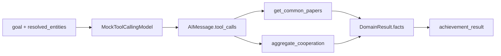
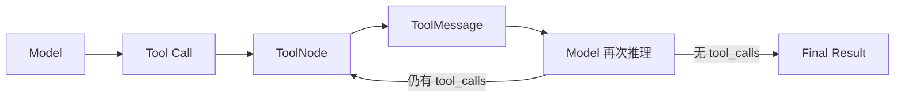

# AchievementAgent 代码级工作原理

本文只分析当前项目中的 `AchievementAgent`，不修改代码，也不把尚未实现的标准 LangGraph Agent 循环描述成当前能力。

## 最重要的结论

当前 `AchievementAgent` 是一个**单轮 Tool Calling Agent**，不是完整的：

```text
Model → ToolNode → ToolMessage → Model
```

当前真实执行方式是：

```text
AchievementAgent Node
→ Mock 模型一次生成两个 tool_calls
→ Python 循环直接执行两个 Tool
→ Agent 将 Observation 整理为 DomainResult
→ 写入 GraphRAGState.achievement_result
```

当前没有实现：

- System Prompt；
- `messages` State；
- LangGraph `ToolNode`；
- `ToolMessage`；
- Observation 再次进入模型；
- 模型根据 Observation 继续选择工具；
- 多轮 ReAct 循环。

## 代码调用链

```text
graph/builder.py
    ↓
nodes/agent_nodes.py
    ↓
agents/achievement_agent.py
    ↓
agents/base.py
    ↓
models/llm.py
    ↓
tools/achievement_tools.py
    ↓
data/mock_achievements.py
    ↓
models/schemas.py
    ↓
GraphRAGState.achievement_result
```

## 1. Agent 的 System Prompt 在哪里

当前 AchievementAgent **没有 System Prompt**。

`agents/achievement_agent.py::build_achievement_agent()` 只负责构造 Agent：

```python
def build_achievement_agent() -> ToolCallingDomainAgent:
    return ToolCallingDomainAgent(
        "achievement_agent",
        ModelFactory.tool_calling_model("achievement"),
        [get_author_papers, get_common_papers, aggregate_cooperation],
    )
```

这里传入了：

1. Agent 名称；
2. Tool Calling 模型；
3. 工具列表。

没有传入：

```python
SystemMessage(...)
```

也没有：

```python
ChatPromptTemplate.from_messages(...)
```

在 `agents/base.py::ToolCallingDomainAgent.run()` 中，模型调用是：

```python
message = self.model.invoke({
    "goal": goal,
    "resolved_entities": resolved_entities,
})
```

这里传给 Mock 模型的是普通 Python 字典，不是一组聊天 Messages。

因此当前代码中不存在类似这样的 System Prompt：

```text
你是科研成果 Agent。
你只能根据工具查询论文、专利和项目。
禁止使用模型自身知识补充事实。
```

未来替换真实 ChatModel 时可以增加这种 Prompt，但不能把它当成当前已经实现的功能。

## 2. AchievementAgent 有哪些 Tool

绑定位置是 `agents/achievement_agent.py`：

```python
[
    get_author_papers,
    get_common_papers,
    aggregate_cooperation,
]
```

工具定义在 `tools/achievement_tools.py`。

### 2.1 `get_author_papers`

```python
@tool
def get_author_papers(entity_id: str) -> list[dict]:
    """查询专家发表的论文。"""
    return [
        p.copy()
        for p in PAPERS
        if entity_id in p["authors"]
    ]
```

输入一个专家唯一 ID，例如：

```json
{
  "entity_id": "person_zw_001"
}
```

输出该专家作为作者参与的论文列表。

### 2.2 `get_common_papers`

```python
@tool
def get_common_papers(entity_ids: list[str]) -> list[dict]:
    """查询两位或多位专家共同署名论文。"""
    wanted = set(entity_ids)
    return [
        p.copy()
        for p in PAPERS
        if wanted.issubset(set(p["authors"]))
    ]
```

核心条件是：

```python
wanted.issubset(set(p["authors"]))
```

这表示所有目标 `entity_id` 都必须出现在论文作者列表中。它不是根据姓名模糊匹配，而是根据唯一实体 ID 做确定性集合判断。

### 2.3 `aggregate_cooperation`

```python
@tool
def aggregate_cooperation(entity_ids: list[str]) -> dict:
    """汇总共同论文数量与合作年份。"""
    papers = get_common_papers.invoke({
        "entity_ids": entity_ids
    })

    return {
        "entity_ids": entity_ids,
        "common_paper_count": len(papers),
        "years": sorted({p["year"] for p in papers}),
        "paper_ids": [p["paper_id"] for p in papers],
    }
```

这个工具内部再次调用 `get_common_papers`，然后返回聚合结果：

- 共同论文数量；
- 合作年份；
- 共同论文 ID。

## 3. 为什么它只能看到这些 Tool

工具边界在 Agent 构造时确定：

```python
return ToolCallingDomainAgent(
    "achievement_agent",
    ModelFactory.tool_calling_model("achievement"),
    [get_author_papers, get_common_papers, aggregate_cooperation],
)
```

`agents/base.py::ToolCallingDomainAgent.__init__()` 执行：

```python
self.model = model.bind_tools(tools)
self.tools = {item.name: item for item in tools}
```

它形成两层限制。

### 第一层：模型可见工具限制

```python
model.bind_tools(tools)
```

模型只绑定 AchievementAgent 的三个工具。

### 第二层：执行白名单限制

```python
self.tools = {
    item.name: item
    for item in tools
}
```

结果近似为：

```python
{
    "get_author_papers": get_author_papers,
    "get_common_papers": get_common_papers,
    "aggregate_cooperation": aggregate_cooperation,
}
```

执行 Tool Call 时，Agent 使用：

```python
tool = self.tools.get(call["name"])
```

如果模型错误地产生 TalentAgent 的调用：

```json
{
  "name": "match_employment_overlap"
}
```

AchievementAgent 的工具字典中没有它，因此：

```python
tool is None
```

随后触发：

```python
raise ValueError(f"工具未授权: {call['name']}")
```

所以领域隔离不是只依赖 Prompt，而是在执行层通过白名单再次保证。

## 4. Tool 如何通过 `bind_tools` 暴露给模型

### 4.1 当前使用了 `bind_tools`

`agents/base.py` 中：

```python
self.model = model.bind_tools(tools)
```

但是当前模型是 `models/llm.py::MockToolCallingModel`，不是 OpenAI 等真实 ChatModel。

它的 `bind_tools()` 是：

```python
def bind_tools(self, tools: list[Any]) -> "MockToolCallingModel":
    self.allowed_tools = {t.name for t in tools}
    return self
```

当前 Mock 实现只保存工具名称：

```python
{
    "get_author_papers",
    "get_common_papers",
    "aggregate_cooperation",
}
```

它没有把完整 JSON Schema 发送给远程模型，因为当前没有远程模型。

### 4.2 Tool Schema 从哪里产生

工具使用 LangChain 的 `@tool` 定义，例如：

```python
@tool
def get_common_papers(entity_ids: list[str]) -> list[dict]:
    """查询两位或多位专家共同署名论文。"""
```

LangChain 可以从以下内容构造工具 Schema：

- 函数名：`get_common_papers`；
- docstring：查询两位或多位专家共同署名论文；
- 参数名：`entity_ids`；
- 类型标注：`list[str]`。

近似 JSON Schema 是：

```json
{
  "name": "get_common_papers",
  "description": "查询两位或多位专家共同署名论文。",
  "parameters": {
    "type": "object",
    "properties": {
      "entity_ids": {
        "type": "array",
        "items": {
          "type": "string"
        }
      }
    },
    "required": ["entity_ids"]
  }
}
```

真实 ChatModel 的 `bind_tools()` 通常会将这种 Schema 转换成模型供应商要求的 Tool 定义并随请求发送。

### 4.3 当前没有 LangGraph `ToolNode`

项目中不存在：

```python
from langgraph.prebuilt import ToolNode

tool_node = ToolNode(tools)
graph.add_node("achievement_tools", tool_node)
```

也没有：

```python
tools_condition
```

因此当前工具不是通过 `ToolNode` 执行的，而是在 `ToolCallingDomainAgent.run()` 的 Python 循环中执行。

## 5. 用户任务如何进入 AchievementAgent

复杂问题首先经过 `nodes/supervisor_node.py::supervisor_node()`。

Supervisor 生成的任务之一是：

```json
{
  "task_id": "task_achievement",
  "agent": "achievement_agent",
  "goal": "查询两位专家的共同论文与学术合作"
}
```

任务被写入：

```python
GraphRAGState["tasks"]
```

`graph/builder.py` 注册了：

```python
graph.add_edge("supervisor", "achievement_agent")
```

因此图会进入 `nodes/agent_nodes.py::achievement_agent_node()`：

```python
def achievement_agent_node(state: GraphRAGState) -> dict:
    result = build_achievement_agent().run(
        _goal(state, "achievement_agent"),
        state["resolved_entities"],
    )
    return {"achievement_result": result}
```

`_goal()` 从 `tasks` 中寻找分配给 AchievementAgent 的任务：

```python
def _goal(state: GraphRAGState, agent_name: str) -> str:
    task = next(
        (
            x
            for x in state.get("tasks", [])
            if x["agent"] == agent_name
        ),
        None,
    )
    return task["goal"] if task else state["question"]
```

因此复杂示例中，Agent 的关键输入是：

```json
{
  "goal": "查询两位专家的共同论文与学术合作",
  "resolved_entities": {
    "张伟": "person_zw_001",
    "李明": "person_lm_001"
  }
}
```

如果是没有经过 Supervisor 的简单科研问题，`tasks` 中没有对应任务，`_goal()` 就直接使用原始 `state["question"]`。

## 6. 模型第一次调用时收到哪些 Messages

严格来说，当前模型没有收到 Messages。

实际调用是：

```python
message = self.model.invoke({
    "goal": goal,
    "resolved_entities": resolved_entities,
})
```

它收到的是普通 Python payload：

```json
{
  "goal": "查询两位专家的共同论文与学术合作",
  "resolved_entities": {
    "张伟": "person_zw_001",
    "李明": "person_lm_001"
  }
}
```

当前没有输入：

```python
SystemMessage
HumanMessage
AIMessage
ToolMessage
```

只有模型的返回值是 LangChain `AIMessage`。

所以当前数据流是：

```text
Python dict payload
→ MockToolCallingModel.invoke()
→ AIMessage
```

而不是：

```text
SystemMessage + HumanMessage
→ ChatModel
```

## 7. 模型如何决定调用 `get_common_papers`

当前不是通过自然语言语义推理决定，而是通过领域硬编码规则决定。

Agent 构造时调用：

```python
ModelFactory.tool_calling_model("achievement")
```

返回：

```python
MockToolCallingModel(domain="achievement")
```

它的 `invoke()` 中有：

```python
names = (
    ["match_employment_overlap"]
    if self.domain == "talent"
    else ["get_common_papers", "aggregate_cooperation"]
)
```

由于：

```python
self.domain == "achievement"
```

因此 `names` 固定为：

```python
[
    "get_common_papers",
    "aggregate_cooperation",
]
```

之后再检查这些名称是否位于 Agent 绑定的白名单中：

```python
for name in names:
    if name in self.allowed_tools:
        calls.append(...)
```

因此第一阶段保留了标准 Tool Call 协议，但工具选择逻辑仍然是确定性的 Mock，并不是模型读懂“共同论文”后自主规划出来的。

## 8. `tool_calls` 数据结构

`MockToolCallingModel.invoke()` 构造：

```python
calls.append({
    "name": name,
    "args": {
        "entity_ids": entity_ids,
    },
    "id": str(uuid.uuid4()),
    "type": "tool_call",
})
```

然后返回：

```python
AIMessage(
    content=json.dumps(
        {"reason": payload["goal"]},
        ensure_ascii=False,
    ),
    tool_calls=calls,
)
```

对于当前 demo，返回值近似为：

```python
AIMessage(
    content='{"reason":"查询两位专家的共同论文与学术合作"}',
    tool_calls=[
        {
            "name": "get_common_papers",
            "args": {
                "entity_ids": [
                    "person_zw_001",
                    "person_lm_001",
                ]
            },
            "id": "uuid-1",
            "type": "tool_call",
        },
        {
            "name": "aggregate_cooperation",
            "args": {
                "entity_ids": [
                    "person_zw_001",
                    "person_lm_001",
                ]
            },
            "id": "uuid-2",
            "type": "tool_call",
        },
    ],
)
```

Agent 读取的是：

```python
message.tool_calls
```

它不会解析 `message.content` 中的 `reason` 来决定工具调用。

## 9. 当前代码如何执行 Tool

当前没有 `ToolNode`。实际执行者是：

```python
agents/base.py::ToolCallingDomainAgent.run()
```

核心代码是：

```python
for call in message.tool_calls:
    calls.append(
        ToolCallSpec(
            name=call["name"],
            arguments=call["args"],
        )
    )

    tool = self.tools.get(call["name"])

    try:
        if tool is None:
            raise ValueError(
                f"工具未授权: {call['name']}"
            )

        output = tool.invoke(call["args"])
```

对于：

```json
{
  "name": "get_common_papers",
  "args": {
    "entity_ids": ["person_zw_001", "person_lm_001"]
  }
}
```

执行过程相当于：

```python
tool = self.tools["get_common_papers"]

output = tool.invoke({
    "entity_ids": [
        "person_zw_001",
        "person_lm_001",
    ]
})
```

LangChain Tool 对象负责校验参数并调用其包装的 Python 函数。

## 10. Tool 返回结果如何变成 `ToolMessage`

当前不会变成 `ToolMessage`。

工具输出保存在局部变量：

```python
output = tool.invoke(call["args"])
```

随后直接写入 Agent 的 `facts`：

```python
facts.append({
    "tool": call["name"],
    "data": output,
})
```

所以当前转换路径是：

```text
Python Tool 返回值
→ DomainResult.facts
```

而不是：

```text
Python Tool 返回值
→ ToolMessage
→ messages
```

完整 ToolNode 架构通常会生成类似：

```python
ToolMessage(
    content=json.dumps(output),
    tool_call_id=call["id"],
    name=call["name"],
)
```

当前项目没有这段逻辑。

## 11. Observation 如何再次进入模型

当前 Observation 不会再次进入模型。

整个 `run()` 中只有一次模型调用：

```python
message = self.model.invoke(...)
```

之后只是执行：

```python
for call in message.tool_calls:
    output = tool.invoke(...)
```

循环结束后直接返回：

```python
return DomainResult(...).model_dump()
```

不存在第二次：

```python
self.model.invoke(messages + tool_messages)
```

当前流程是：



尚未实现的典型多轮 Agent 是：



## 12. Agent 在什么条件下停止 Tool Calling

当前没有模型驱动的停止判断。

停止条件就是遍历完第一次模型响应中的所有调用：

```python
for call in message.tool_calls:
```

所以：

- `tool_calls` 有两个：执行两个后停止；
- `tool_calls` 为空：不执行工具，直接生成空结果；
- 某个工具失败：记录错误，再继续处理后续 Tool Call；
- 所有调用遍历结束：构造 `DomainResult` 并返回。

当前没有实现这些典型终止机制：

- 模型返回不含 `tool_calls` 的最终消息；
- `tools_condition`；
- `max_agent_steps`；
- 最大 Tool Calling 轮数；
- Agent 自主生成最终自然语言答案。

项目中的 `max_replans` 是 Supervisor 层面的规划限制，不是 AchievementAgent 内部 Tool Calling 的轮数限制。

## 13. 最终结构化结果如何写回 `GraphRAGState`

每次工具返回后，结果先写入 `facts`：

```python
facts.append({
    "tool": call["name"],
    "data": output,
})
```

然后提取证据：

```python
rows = output if isinstance(output, list) else [output]

for row in rows:
    if isinstance(row, dict):
        ids = row.get(
            "evidence_ids",
            [row.get("evidence_id")],
        )

        evidence.extend(
            {
                "evidence_id": x,
                "source_tool": call["name"],
            }
            for x in ids
            if x
        )
```

工具错误写入：

```python
errors.append(f"{call['name']}: {exc}")
```

最后构造 `models/schemas.py::DomainResult`：

```python
return DomainResult(
    agent=self.name,
    summary=summary,
    facts=facts,
    evidence=evidence,
    tool_calls=calls,
    errors=errors,
).model_dump()
```

`DomainResult` 的结构是：

```python
class DomainResult(BaseModel):
    agent: str
    summary: str
    facts: list[dict[str, Any]]
    evidence: list[dict[str, Any]]
    tool_calls: list[ToolCallSpec]
    errors: list[str]
```

然后 `achievement_agent_node()` 返回一个局部 State 更新：

```python
return {
    "achievement_result": result
}
```

LangGraph 将它合并进 Shared State：

```python
state["achievement_result"] = result
```

这不会覆盖 `question`、`resolved_entities`、`tasks` 等其他字段。

# 使用指定实体 ID 完整模拟

现在使用题目给出的映射：

```text
张伟 = person_001
李明 = person_002
```

需要注意：这两个 ID 不存在于当前 `data/mock_entities.py` 和 `data/mock_achievements.py`。

当前真实 Mock ID 是：

```text
person_zw_001
person_zw_002
person_lm_001
person_lm_002
```

因此，如果绕过 Entity Resolution，把 `person_001` 和 `person_002` 直接送给 AchievementAgent，科研工具会返回空数据；后续 Rule Validator 还会报告这两个 entity_id 不存在。

下面仍严格使用指定 ID 模拟当前代码。

## 第 1 步：进入 Agent 的输入

```json
{
  "goal": "查询张伟和李明的共同论文与学术合作",
  "resolved_entities": {
    "张伟": "person_001",
    "李明": "person_002"
  }
}
```

`MockToolCallingModel.invoke()` 执行：

```python
entity_ids = list(
    payload["resolved_entities"].values()
)
```

得到：

```json
[
  "person_001",
  "person_002"
]
```

## Reason

Mock 模型的 `AIMessage.content` 是：

```json
{
  "reason": "查询张伟和李明的共同论文与学术合作"
}
```

这个 Reason 只保存在 `AIMessage.content` 中，当前 Agent 后面不会解析或使用它。

## Tool Call 1

```json
{
  "name": "get_common_papers",
  "args": {
    "entity_ids": [
      "person_001",
      "person_002"
    ]
  },
  "id": "mock-uuid-1",
  "type": "tool_call"
}
```

执行：

```python
get_common_papers.invoke({
    "entity_ids": [
        "person_001",
        "person_002",
    ]
})
```

工具内部得到：

```python
wanted = {
    "person_001",
    "person_002",
}
```

它遍历 `PAPERS`，但没有论文的 `authors` 同时包含这两个 ID。

## Observation 1

```json
[]
```

Agent 将其保存为：

```json
{
  "tool": "get_common_papers",
  "data": []
}
```

由于结果为空，没有提取到 `evidence_id`。

当前代码不会把这个 Observation 重新发送给模型。

## Tool Call 2

第二个调用已经在模型第一次生成的 `AIMessage.tool_calls` 中，**不是模型观察到空论文结果后再次决定的**：

```json
{
  "name": "aggregate_cooperation",
  "args": {
    "entity_ids": [
      "person_001",
      "person_002"
    ]
  },
  "id": "mock-uuid-2",
  "type": "tool_call"
}
```

执行：

```python
aggregate_cooperation.invoke({
    "entity_ids": [
        "person_001",
        "person_002",
    ]
})
```

`aggregate_cooperation` 内部会再次调用 `get_common_papers`，仍然得到空列表。

## Observation 2

```json
{
  "entity_ids": [
    "person_001",
    "person_002"
  ],
  "common_paper_count": 0,
  "years": [],
  "paper_ids": []
}
```

Agent 将其保存为：

```json
{
  "tool": "aggregate_cooperation",
  "data": {
    "entity_ids": [
      "person_001",
      "person_002"
    ],
    "common_paper_count": 0,
    "years": [],
    "paper_ids": []
  }
}
```

## Final Result

遍历完两个 Tool Call 后，Agent 直接构造：

```json
{
  "agent": "achievement_agent",
  "summary": "achievement_agent 完成 2 次工具调用，得到 2 组结果",
  "facts": [
    {
      "tool": "get_common_papers",
      "data": []
    },
    {
      "tool": "aggregate_cooperation",
      "data": {
        "entity_ids": [
          "person_001",
          "person_002"
        ],
        "common_paper_count": 0,
        "years": [],
        "paper_ids": []
      }
    }
  ],
  "evidence": [],
  "tool_calls": [
    {
      "name": "get_common_papers",
      "arguments": {
        "entity_ids": [
          "person_001",
          "person_002"
        ]
      }
    },
    {
      "name": "aggregate_cooperation",
      "arguments": {
        "entity_ids": [
          "person_001",
          "person_002"
        ]
      }
    }
  ],
  "errors": []
}
```

Agent Node 返回：

```python
{
    "achievement_result": final_result
}
```

于是 Shared State 增加：

```json
{
  "achievement_result": {
    "agent": "achievement_agent",
    "summary": "achievement_agent 完成 2 次工具调用，得到 2 组结果",
    "facts": ["上面的两组结果"],
    "evidence": [],
    "tool_calls": ["上面的两次调用"],
    "errors": []
  }
}
```

后续 Validator 会通过 `EntityService.exists()` 检查这两个 ID，并得到：

```json
{
  "valid": false,
  "needs_replan": true,
  "missing_domains": [],
  "errors": [
    "entity_id 不存在: person_001",
    "entity_id 不存在: person_002"
  ]
}
```

## 当前真实时序与标准多轮时序的差异

题目希望观察的形式是：

```text
Reason
→ Tool Call
→ Observation
→ Tool Call
→ Observation
→ Final Result
```

当前代码的准确时序则是：

```text
Reason + 两个 Tool Calls 一次性生成
→ 执行 Tool Call 1
→ Observation 1 写入 facts
→ 执行预先生成的 Tool Call 2
→ Observation 2 写入 facts
→ Final DomainResult
```

这一区别非常重要：当前 AchievementAgent 已经实现标准 Tool Call 数据结构、LangChain Tool 执行和结构化结果回写，但尚未实现 `ToolNode → ToolMessage → Model` 的多轮闭环。
