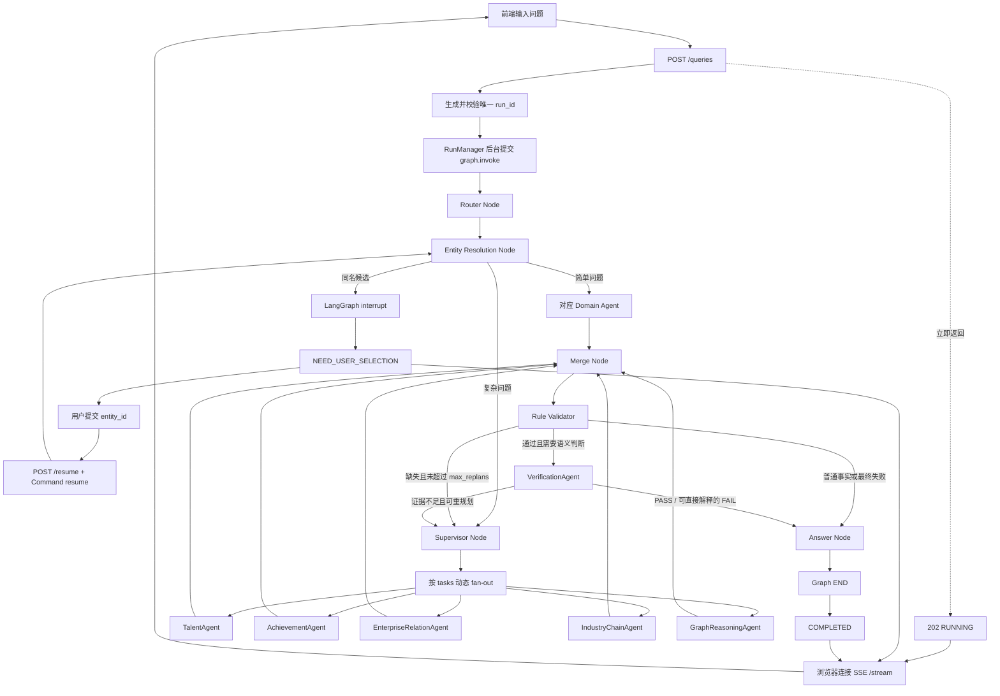
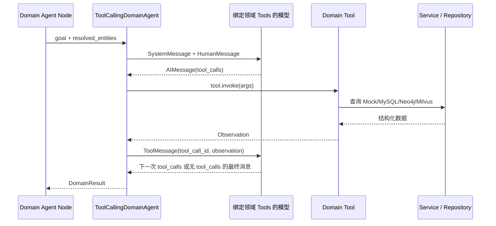

# 当前项目完整运行流程

本文说明当前第九阶段代码中，一个问题从前端进入系统、经过 LangGraph、领域 Agent、统一证据归一、校验和回答生成，最后通过 SSE 返回页面的完整过程。内容以当前代码为准，不是通用 LangGraph 教程。

> 本地 `Milvus Lite` 在线读取由独立短进程执行，避免它的 gRPC/OpenMP 运行时与 API 内的模型
> 运行时发生动态库冲突。远程 Milvus URI 仍使用进程内客户端。在线实体解析建议配置
> `ENTITY_BACKEND=hybrid`，由 MySQL 精确召回和 Milvus 语义召回融合；合成图查询建议配置
> `NEO4J_MANAGED_ONLY=true`，只读取 `synthetic=true` 的 Workflow 受管子图。

## 1. 总体流程



## 2. API 创建独立后台 Run

入口位于 `app/main.py::create_query()`。

前端发送：

```http
POST /queries
Content-Type: application/json

{
  "question": "综合分析张伟和李明的学术、职业和产业合作关系。",
  "max_replans": 2
}
```

服务端执行以下操作：

1. 使用客户端传入的 `thread_id`，或生成新的 `run-{uuid}`；
2. 检查内存 Run Registry 和 SQLite checkpoint 中是否已经存在该 ID；
3. 如果 ID 已存在，返回 `409`，防止旧 State 与新问题合并；
4. 创建 `RUNNING` 状态的 Run；
5. 初始化 `GraphRAGState`；
6. 将 `graph.invoke()` 提交给 `services/run_service.py::RunManager` 的线程池；
7. 立即返回 `202 RUNNING`，不阻塞 HTTP 请求。

初始 State 的核心内容如下：

```json
{
  "thread_id": "run-...",
  "question": "综合分析张伟和李明的学术、职业和产业合作关系。",
  "resolved_entities": {},
  "task_history": [],
  "replan_count": 0,
  "max_replans": 2
}
```

SQLite checkpointer 使用同一个 `thread_id/run_id` 保存 LangGraph 状态。`run_id` 标识一次查询运行；只有同一查询的实体消歧恢复才能继续使用它。

## 3. Router Node

LangGraph 在 `graph/builder.py` 中通过 `START → router` 进入第一个节点。

`nodes/router_node.py::router_node()` 调用：

```python
ModelFactory.structured_model().invoke_router(state["question"])
```

Router 生成结构化字段：

- `intent`：问题意图；
- `complexity`：`simple` 或 `complex`；
- `primary_domain`：主要领域；
- `requires_verification`：是否需要复杂语义验证；
- `entity_mentions`：问题中出现的实体名称。

Router 不绑定业务 Tool，不执行论文、任职或图查询，因此它是分类 Node，不是 Domain Agent。`DOMAIN_KEYWORDS` 还会对唯一、明确的领域关键词进行确定性保护，避免模型把“发表过哪些论文”误路由到 Talent。

执行后，State 在初始字段基础上增加 Router 的结构化输出。

## 4. Entity Resolution 与同名消歧

`router → entity_resolution` 是固定边。`nodes/entity_resolution_node.py::entity_resolution_node()` 使用进程内复用的 `EntityService` 检索每个 mention。

- 无候选：触发 `ENTITY_NOT_FOUND`，停止无意义的领域查询；
- 唯一 MySQL 精确候选，或 Top1 达到阈值且与 Top2 分差足够：自动写入 `{名称: entity_id}`；
- 多个候选：调用 LangGraph `interrupt()`。

中断值示例：

```json
{
  "status": "NEED_USER_SELECTION",
  "candidates": {
    "张伟": [
      {"entity_id": "person_zw_001", "organization": "清华大学"},
      {"entity_id": "person_zw_002", "organization": "北京大学"}
    ]
  },
  "instruction": "请为每个姓名选择一个 entity_id"
}
```

后台 Run 状态变成 `NEED_USER_SELECTION`，SSE 把该状态推送给前端。用户选择后，前端调用：

```http
POST /queries/{run_id}/resume

{
  "selections": {
    "张伟": "person_zw_001",
    "李明": "person_lm_001"
  }
}
```

API 使用 `Command(resume=selections)` 从 checkpoint 中的中断位置恢复。Entity Resolution 会验证选择是否属于原候选列表，然后写入：

```json
{
  "resolved_entities": {
    "张伟": "person_zw_001",
    "李明": "person_lm_001"
  },
  "entity_backend_ids": {
    "张伟": {"canonical": "person_zw_001", "mysql": "...", "neo4j": "..."},
    "李明": {"canonical": "person_lm_001", "mysql": "...", "neo4j": "..."}
  },
  "awaiting_user_selection": false
}
```

规范化 `entity_id` 必须进入 Shared State，后续所有 Agent、Tool、Validator 和 Verification 才能查询并校验同一个人。

## 5. 简单路径与复杂路径

`graph/routing.py::after_resolution()` 根据 `complexity` 选择路径。

### 简单问题

例如“张伟发表过哪些论文？”：

```text
Router
→ Entity Resolution
→ AchievementAgent
→ Merge
→ Rule Validator
→ Answer
```

简单问题跳过 Supervisor，直接进入 `primary_domain` 对应的 Agent。

### 复杂问题

复杂问题进入 `nodes/supervisor_node.py::supervisor_node()`。Supervisor 调用结构化模型生成 `SupervisorPlan`，只负责：

- 任务拆解；
- 领域路由；
- 并行调度描述；
- 校验失败后的 Replan。

每个 `PlannedTask` 都包含验收契约：

```json
{
  "task_id": "task_achievement",
  "agent": "achievement_agent",
  "goal": "分析两位专家的共同论文、共同项目及科研合作时间",
  "required_fact_types": [
    "common_papers",
    "common_projects",
    "cooperation_summary"
  ],
  "required_entity_ids": ["person_zw_001", "person_lm_001"]
}
```

`models/contracts.py` 维护事实类型、领域 Agent 和 Tool 的映射。Supervisor 的关键词保护会纠正明显遗漏的领域，但 Supervisor 本身不调用业务 Tool，所以仍然是 Planner Node，而不是 Agent。

`graph/routing.py::planned_agents()` 返回任务中的 Agent 名称。LangGraph 由此动态 fan-out；多个 Agent 分支可并行执行，完成后统一进入 Merge。

## 6. Domain Agent 的 Tool Calling Loop

五个领域节点定义在 `nodes/agent_nodes.py`，它们只是把 State 中的目标和实体交给对应 Agent：

- `TalentAgent`：画像、任职和教育关系；
- `AchievementAgent`：论文、项目和科研合作；
- `EnterpriseRelationAgent`：企业角色、项目和专利；
- `IndustryChainAgent`：产业链结构、企业和事件；
- `GraphReasoningAgent`：邻居过滤、Top-K 路径、K 跳、受限子图、图聚合、治理 Schema 和路径强度。

真正的循环位于 `agents/base.py::ToolCallingDomainAgent.run()`：



每个 Agent 在构造时只执行 `model.bind_tools(本领域工具列表)`，因此无法看到或调用其他领域 Tool。模型返回的 `tool_calls` 包含工具名、参数和调用 ID；Agent 执行 `tool.invoke()`，再用相同调用 ID 构造 `ToolMessage` 放回局部 Messages。

停止条件是模型返回的 AIMessage 不再包含 `tool_calls`，或达到 `max_steps=12`。完整 Messages 只存在于 Agent 本次运行内部，不写入 `GraphRAGState`。

Agent 最终返回统一 `DomainResult`：

```json
{
  "agent": "achievement_agent",
  "summary": "...",
  "facts": [
    {"tool": "get_common_papers", "data": []}
  ],
  "evidence": [
    {"evidence_id": "ev_paper_001", "source_tool": "get_common_papers"}
  ],
  "tool_calls": [],
  "errors": []
}
```

各节点分别写入 `talent_result`、`achievement_result`、`enterprise_result`、`industry_result` 或 `graph_result`。

## 7. Merge Node

`nodes/merge_node.py::merge_node()` 汇总所有已执行领域 Agent 的结果：

1. 从各领域结果中提取证据；
2. 按 `(evidence_id, source_tool)` 去重；
3. 将每个任务本次 attempt 的完成或错误状态写入 `task_history`；
4. 保留各领域原始结构化结果，不提前生成自然语言结论。

Merge 后主要新增或更新：

```json
{
  "evidence": ["按结构保存的证据引用"],
  "task_history": [
    {"task_id": "task_achievement", "agent": "achievement_agent", "attempt": 0, "status": "completed"}
  ]
}
```

## 8. 第一层：Rule Validator

`nodes/validator_node.py::validator_node()` 是普通 Python Node，不调用 LLM。它进行可重复、确定性的检查：

- `entity_id` 是否存在；
- 计划中的领域结果是否返回；
- Agent 是否完成 Task Contract 中的 `required_fact_types`；
- Task 的 `required_entity_ids` 是否与当前实体一致；
- `evidence_id` 是否可从当前 Service/Repository 回查；
- 共同论文是否确实包含所有查询专家；
- 共同项目是否包含所有参与者；
- 项目时间范围是否合法；
- 聚合 count 是否与明细数量一致；
- 图路径的 hop、节点数和边数是否一致；
- TOP 产业事件是否按重要度降序排列。

输出写入 `validation_result`：

```json
{
  "valid": true,
  "needs_replan": false,
  "missing_domains": [],
  "errors": []
}
```

如果校验失败且 `replan_count < max_replans`，条件边返回 Supervisor。Supervisor 根据当前结果、校验错误和历史任务重新规划缺失领域；达到上限后不再循环，直接由 Answer Node 返回无法形成可靠结论的原因。

## 9. 第二层：VerificationAgent

只有 Router 标记 `requires_verification=true` 且 Rule Validator 已通过时，流程才进入 `nodes/verification_node.py::verification_agent_node()`。

例如：

> 判断张伟和李明是不是长期稳定的核心科研合作伙伴。

VerificationAgent 使用以下调用链：

```text
VerificationAgent
→ verification_tools
→ EvidenceService
→ AchievementService
→ 当前 Mock 或 MySQL Repository
```

它通过 `verify_evidence`、`check_source`、`validate_relation`、`check_constraints` 和 `get_cooperation_timeline` 完成证据、来源、关系、时间线和语义约束判断。

- 证据不足：`needs_replan=true`，在次数允许时回到 Supervisor；
- 证据充分但“不满足长期稳定核心合作”的约束：可以直接返回 `FAIL` 并进入 Answer；
- 满足条件：返回 `PASS` 并进入 Answer。

Verification 不替代 Rule Validator；前者负责复杂语义关系，后者负责确定性数据正确性。

## 10. Answer Formatter 与 Answer Node

`nodes/answer_node.py::answer_node()` 不调用模型，也不使用模型自身知识。

五个领域的确定性格式化逻辑已经拆分到：

```text
formatters/talent_formatter.py
formatters/achievement_formatter.py
formatters/enterprise_formatter.py
formatters/industry_formatter.py
formatters/graph_formatter.py
```

Answer Node 的处理规则：

1. Rule Validator 未通过：返回具体校验错误；
2. 校验通过：调用已有领域结果对应的 Formatter；
3. 综合多个 Formatter 的“是否存在合作”信号；
4. 如果存在 Verification 结果，附加 PASS/FAIL、置信度和原因；
5. 明确声明答案只使用当前知识图谱返回并通过校验的数据。

最终只写入：

```json
{
  "final_answer": "最终中文答案"
}
```

随后执行 `answer → END`。

## 11. SSE 实时轨迹与前端展示

前端创建查询后连接：

```http
GET /queries/{run_id}/stream?after=0
```

服务端推送两类 SSE 消息：

- `trace`：Node、Agent、Tool、Merge、Validator、Verification 和 Answer 的运行事件；
- `status`：`NEED_USER_SELECTION`、`COMPLETED` 或 `FAILED`。

所有 LangGraph Node 在 `graph/builder.py` 中都由 `services/observability.py::traced_node()` 包装，因此可以记录节点完整输入和输出快照。轨迹系统会：

- 递归隐藏 password、secret、api_key、token、authorization 等敏感字段；
- 限制单个快照大小；
- 限制每个 Run 的事件数量；
- 限制内存中保存的 Run 数量；
- 默认只把事件摘要写入服务日志。

即使服务进程重启、内存 Run 记录消失，SSE 也会读取 SQLite checkpoint 推导已完成或等待消歧的终态，而不会无限发送 heartbeat。

## 12. Shared State 字段生命周期

| 阶段 | 读取的主要字段 | 新增或更新字段 |
|---|---|---|
| API 初始化 | HTTP 请求 | `thread_id`、`question`、`max_replans`、空实体和历史 |
| Router | `question` | `intent`、`complexity`、`primary_domain`、`requires_verification`、`entity_mentions` |
| Entity Resolution | `entity_mentions`、已有实体 | `resolved_entities`、`entity_backend_ids`、`entity_candidates` |
| Supervisor | 问题、实体、校验、验证、历史 | `plan`、`tasks`、`replan_count` |
| Domain Agent | `tasks`、`question`、实体 | 对应领域的 `*_result` |
| Merge | 所有领域结果、任务 | `evidence`、`task_history` |
| Rule Validator | 实体、任务、领域结果、证据 | `validation_result` |
| VerificationAgent | 问题、实体、科研证据 | `verification_result`、验证历史 |
| Answer | 实体、领域结果、两层校验结果 | `final_answer` |

State 的定义位于 `graph/state.py::GraphRAGState`。Node 只返回自己负责的增量字段，由 LangGraph 合入 Shared State；Agent 的内部 Messages 不属于 Shared State。

## 13. 示例：综合关系问题

问题：

> 综合分析张伟和李明的学术、职业和产业合作关系。

典型执行序列：

```text
1. POST /queries → 202 RUNNING
2. Router → complex，提取张伟、李明
3. Entity Resolution → 发现同名 → NEED_USER_SELECTION
4. 用户提交两个 entity_id → Command(resume)
5. Entity Resolution → 写入规范实体 ID
6. Supervisor → 生成 Talent、Achievement、Enterprise 等 Task Contract
7. LangGraph → 并行执行对应 Domain Agent
8. 每个 Agent → Model Tool Call → Tool Observation → ToolMessage → 后续 Tool Call/结束
9. Merge → 汇总领域结果、证据和任务历史
10. Rule Validator → 按任务契约及数据规则校验
11. 普通综合问题无需 Verification → Answer Formatter
12. Answer Node → 生成 grounded 中文答案
13. RunManager → COMPLETED
14. SSE → 把最终 State 和 final_answer 推送给前端
```

这条链路体现了当前项目的边界：Router、Entity Resolution、Supervisor、Merge、Rule Validator 和 Answer 都是 LangGraph Node；只有拥有领域 Tool、能够进行多轮 Tool Calling 的 Specialist 才是 Agent。
