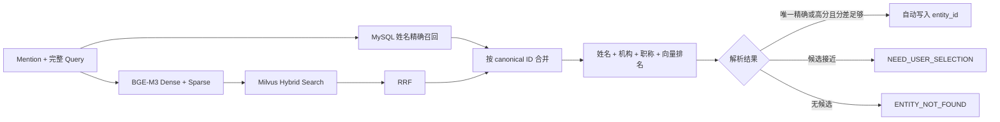

# 第八阶段：混合实体解析、证据统一与运行治理

第八阶段不增加新 Agent，重点提高实体身份可靠性、证据接口一致性和后台 Run 的可治理性。

## 混合实体解析

启用方式：

```env
ENTITY_BACKEND=hybrid
ENTITY_CANDIDATE_TOP_K=10
ENTITY_AUTO_RESOLVE_THRESHOLD=0.90
ENTITY_SCORE_GAP_THRESHOLD=0.15
ENTITY_VECTOR_MIN_SCORE=0.02
```

调用链：



MySQL 是权威身份召回来源，Milvus 负责别名、描述性输入和上下文补召回。候选包含 `exact_match`、`vector_rank`、`context_score`、`final_score` 与 `match_reasons`，便于前端解释为什么召回该专家。

当前可解释打分是教学版确定性规则。自动确认阈值必须用 `evals/entity_resolution_cases.json` 扩充后的真实标注集校准，不能直接当作生产参数。

## 明确的无实体状态

零候选不再继续调用 Domain Agent。Entity Resolution 触发包含以下值的 LangGraph interrupt：

```json
{
  "status": "ENTITY_NOT_FOUND",
  "mentions": ["不存在的专家"],
  "instruction": "未找到实体，请检查名称或补充机构、职称、研究方向后重新提问"
}
```

RunManager 和 SSE 将其作为独立终态发送，前端提示用户重新描述问题。

## 统一 Evidence Repository

验证链统一为：

```text
Rule Validator / VerificationAgent
→ EvidenceService
→ EvidenceRepository
→ AchievementService
→ Mock 或 MySQL Repository
```

证据记录统一包含：

```json
{
  "evidence_id": "mysql_paper_123",
  "evidence_type": "paper",
  "source": "mysql:gkx.dwd_scholar_papers",
  "source_record_id": "123",
  "entity_ids": ["person_1", "person_2"],
  "event_time": 2024,
  "payload": {}
}
```

当前科研证据可以通过实际 Achievement 后端回查；人才、企业、产业和图证据先统一为领域 Repository 引用，待对应真实表接入后替换其实现，Validator/Agent 接口无需变化。

## 第八阶段真实 MySQL 扩展

本阶段根据本机 `gkx` 实际表结构增加了只读参数化查询：

- `dwd_scholar`：专家画像、任职经历和教育经历；
- `dwd_zh_project`：按 `project_host` 与 `participants` JSON 查询单人/共同项目；
- `dwd_patent` + `dwd_patent_title`：按 `inventors` JSON 查询单人/共同专利；
- 已有论文关系表：单人论文与共同论文。

TalentAgent 新增 `get_education_history`；AchievementAgent 新增 `get_person_patents` 和 `get_common_patents`。专利查询使用独立任务契约，不会被错误要求同时返回共同论文和共同项目。

只读 smoke test 已验证当前本机库中学者查询、项目 JSON 查询和专利 JSON 查询能够执行。个别学者的任职或教育字段为空时会正确返回空列表，不生成 Mock 事实。

## Run 治理

新增环境配置：

```env
RUN_MAX_WORKERS=4
RUN_TIMEOUT_SECONDS=120
RUN_REGISTRY_PATH=.runtime/runs.sqlite
```

能力包括：

- SQLite Run Registry 持久保存状态、interrupt、错误和耗时；
- `POST /queries/{run_id}/cancel` 请求协作式取消；
- 超时后设置停止信号；每个 LangGraph Node 执行前后检查；
- `GET /metrics` 返回无问题内容、无 State、无密钥的状态计数和平均耗时；
- 服务重启后可查询 Run 终态和实体消歧 interrupt。

Python 线程无法强行终止正在进行的网络系统调用，因此取消和超时是协作式的：正在执行的单次模型/数据库调用会先返回，系统在下一个 Node 边界安全终止。

前端主按钮采用双状态：空闲时显示“开始分析”，Run 执行时显示“停止分析”。点击停止后按钮进入“正在停止”，收到 `CANCELLED` 终态后恢复，用户可以修改问题或选择示例重新发起独立 Run。

## 实体解析评测

运行：

```bash
python -m scripts.evaluate_entity_resolution
```

输出指标：

- Recall@K；
- Top-1 Accuracy；
- 自动确认准确率；
- ENTITY_NOT_FOUND 准确率；
- 每条样本的候选数量和预测 ID。

示例集仅用于验证评测管线。接入真实数据后，应扩充到至少 50～100 条，覆盖同名、别名、中英文名、机构、职称、研究方向、拼写错误和不存在实体。
