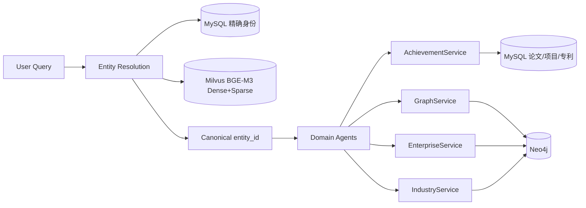

# 第九阶段：真实数据全链路、统一证据与质量评测

第九阶段不增加 Agent。目标是让已有 Domain Agent 通过稳定的 Service/Repository 边界读取
MySQL、Milvus 和 Neo4j，并让每条最终结论都能追溯到结构化证据。

## 1. 数据后端



`services/resources.py` 统一管理生命周期。Graph、Enterprise 和 Industry 启用 Neo4j 时复用
同一个 `Neo4jGraphRepository`，避免每次 Tool Call 创建 Driver。

配置示例：

```env
ENTITY_BACKEND=hybrid
ACHIEVEMENT_BACKEND=mysql
GRAPH_BACKEND=neo4j
ENTERPRISE_BACKEND=neo4j
INDUSTRY_BACKEND=neo4j
```

缺少真实数据或密码时，任一领域都可以单独设为 `mock`，自动化测试也始终使用 Mock。

## 2. 统一 EvidenceRecord

`services/evidence_normalizer.py::normalize_tool_output()` 在 Agent 收到 Tool Observation 后立即归一证据：

```json
{
  "evidence_id": "mysql_paper_123",
  "fact_type": "common_paper",
  "source_type": "mysql",
  "source_name": "mysql:gkx.dwd_scholar_papers",
  "source_record_id": "123",
  "entity_ids": ["person_zw_001", "person_lm_001"],
  "event_time": 2023,
  "content": {"paper_id": "123", "title": "..."},
  "source_tool": "get_common_papers"
}
```

执行链路：

```text
Tool Function
→ Tool Observation
→ normalize_tool_output
→ DomainResult.evidence
→ Merge 按 evidence_id 去重
→ Rule Validator 确定性校验
→ Answer 输出证据编号
```

聚合统计本身不伪造成原始证据；它引用的论文、项目、专利或关系才是证据。

## 3. 企业和产业真实查询

`repositories/neo4j_repository.py` 新增：

- `get_person_company_roles`
- `get_company_projects`
- `get_company_patents`
- `get_chain_structure`
- `get_node_companies`
- `get_node_events`

`tools/enterprise_tools.py` 和 `tools/industry_tools.py` 不再直接读取 Mock 常量，而是调用对应 Service。
Agent 的 Tool Schema 和业务代码无需知道底层当前是 Mock 还是 Neo4j。

## 4. 数据同步

`scripts/sync_neo4j_research_graph.py` 从 MySQL 读取学者和论文，用参数化 Cypher `MERGE`
写入 Neo4j。默认 dry-run：

```bash
python -m scripts.sync_neo4j_research_graph --limit 100
```

确认统计后写入：

```bash
python -m scripts.sync_neo4j_research_graph --limit 100 --batch-id stage9-001 --apply
```

数据库密码只放 `.env`，脚本输出不包含凭据。

## 5. 健康检查

`GET /health` 返回阶段和配置，不主动访问数据库。`GET /health/dependencies` 才执行真实探针，
分别报告 entity、achievement、enterprise、industry 和 graph 的就绪状态。某个后端失败时返回
`503 degraded`，但不会暴露密码。

## 6. 端到端评测

`evals/stage9_end_to_end_cases.json` 覆盖论文、专利、教育、任职、复杂合作、图路径和语义验证。

```bash
# 可重复离线评测，强制 Mock
python -m scripts.evaluate_stage9_e2e

# 使用 .env 中的 GLM 和真实数据库
python -m scripts.evaluate_stage9_e2e --live
```

评测输出：

- Router 领域准确性；
- 必要 Tool 是否被调用；
- Answer 是否覆盖标注关键词；
- Rule Validator 是否通过；
- Citation Coverage；
- 总体 Pass Rate。

## 7. 第九阶段边界

真实 Repository 只负责读取或同步数据，不改变 Router、Supervisor、Validator 和 Answer 的 Node 身份；
也没有把 Service 包装成 Agent。产业图查询要求 Neo4j 中存在 `IndustrySegment`、`Enterprise`、
`IndustryEvent` 标签及相应关系；若实际图库命名不同，应在 Repository 层适配，不修改 Agent。
