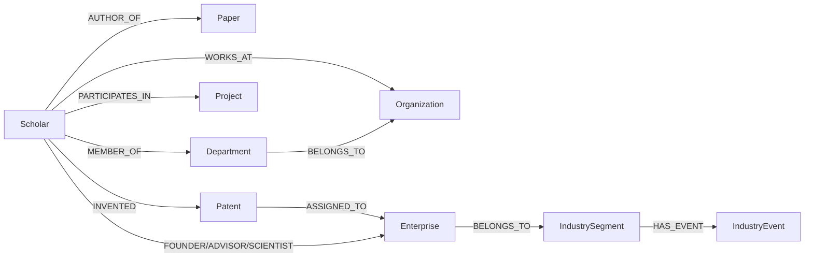

# gkx_synthetic 假数据集

该数据集用于图谱构建 Workflow、GraphRAG、实体消歧和质量评测。它不包含真实个人信息，所有
名称、邮箱哈希、ORCID、论文 DOI 和企业代码均为确定性生成的合成值。

## 安全边界

- 原始 `gkx` 数据库不会被读取、清空或覆盖；
- 默认只在 `.runtime/synthetic_gkx` 生成 JSONL；
- MySQL 导入默认是 dry-run；
- 导入器只允许 `gkx_synthetic` 或 `gkx_synthetic_*`；
- 真正写入需要同时提供 `--apply` 和完全匹配的 `--confirm-database`。

## 数据模型



每个论文、项目、专利、企业角色和产业事件关系都带稳定 `evidence_id`。项目和专利同时保留
旧式姓名 JSON 与规范化关系表，可用于比较“姓名匹配”和“稳定 ID 关联”的准确性。

## 生成

小规模验证：

```bash
python -m scripts.generate_synthetic_gkx \
  --output .runtime/synthetic_gkx-small \
  --scholars 100 --organizations 10 --enterprises 20 \
  --papers 300 --projects 50 --patents 80 \
  --industry-segments 10 --industry-events 30

python -m scripts.validate_synthetic_gkx --input .runtime/synthetic_gkx-small
```

默认完整规模：

```bash
python -m scripts.generate_synthetic_gkx
python -m scripts.validate_synthetic_gkx
python -m scripts.audit_synthetic_gkx
```

默认包括2000名学者、100家机构、300家企业、15000篇论文、2000个项目、5000件专利、
100个产业节点和500个产业事件。固定种子为 `20260821`，相同参数会得到相同文件和 SHA-256。

## 导入 MySQL

先预览，不连接数据库：

```bash
python -m scripts.import_synthetic_gkx
```

确认目标后写入独立数据库：

```bash
export SYNTHETIC_MYSQL_PASSWORD='本机密码'
python -m scripts.import_synthetic_gkx \
  --database gkx_synthetic \
  --apply --confirm-database gkx_synthetic
```

导入器不会删除已有表。若需要重建，应创建新的版本库，例如 `gkx_synthetic_v2`，验证完成后再
切换应用配置，避免原地删除造成不可恢复的数据损失。

## 应用配置

```env
MYSQL_DATABASE=gkx_synthetic
ENTITY_BACKEND=mysql
ACHIEVEMENT_BACKEND=mysql
```

Neo4j/Milvus 导入应使用独立的 synthetic release/collection，不能与生产数据共用 active alias。

## 构建 Neo4j 与 Milvus

完整图谱先执行 dry-run：

```bash
python -m scripts.sync_neo4j_synthetic_graph --release-id gkx-synthetic-v1
```

配置并启动 Neo4j 后执行写入：

```bash
python -m scripts.sync_neo4j_synthetic_graph --release-id gkx-synthetic-v1 --apply
```

独立 Milvus Lite collection：

```bash
python -m scripts.sync_milvus_entities --source mysql --limit 2000 \
  --collection scholar_entities_synthetic --embedding-provider mock
```

`mock` 是确定性 Dense/Sparse 混合向量，适合离线联调。正式 BGE-M3 索引应使用新的版本化
collection 构建，完成 Recall@K 评测后再切换应用配置。

## Phase 1 可恢复 Workflow

Workflow 将节点状态保存到 `.runtime/kg-workflow.sqlite`，并按 release 生成：

```text
contracts/schema.json
bronze/*.jsonl + manifest.json
silver/*.jsonl + manifest.json
quality/quality-report.json
gold/mutation-plan.json
```

先运行不写服务层的完整 dry-run：

```bash
python -m scripts.run_kg_workflow --release-id gkx-synthetic-v2
```

确认后构建、对账并激活：

```bash
python -m scripts.run_kg_workflow --release-id gkx-synthetic-v2 --apply
```

失败后使用输出中的原 `run_id` 恢复：

```bash
python -m scripts.run_kg_workflow \
  --release-id gkx-synthetic-v2 --run-id kg-xxxxxxxxxxxxxxxx --apply
```

已完成节点会跳过，失败节点增加 attempt 后重试。只有 Neo4j 节点/关系数、Milvus 实体数和
Gold 计划全部一致，才会原子更新 active release 与15个数据集的 Watermark。

## Watermark 增量 Workflow

现有库首次启用增量前，为15张源表补齐 `updated_at`。迁移脚本只接受
`gkx_synthetic` 或 `gkx_synthetic_*`，不会修改原始 `gkx`：

```bash
python -m scripts.migrate_synthetic_incremental
python -m scripts.migrate_synthetic_incremental \
  --apply --confirm-database gkx_synthetic
```

先预览增量，不推进 Watermark：

```bash
python -m scripts.run_kg_workflow \
  --release-id gkx-synthetic-inc-001 --run-type INCREMENTAL
```

确认后发布并激活：

```bash
python -m scripts.run_kg_workflow \
  --release-id gkx-synthetic-inc-001 --run-type INCREMENTAL --apply
```

抽取条件使用稳定复合水位 `(updated_at, primary_key)`，即时间相同时继续按主键推进，避免漏数。
每条变更会生成包含 `event_id`、数据集、记录 ID、UPSERT/DELETE、载荷哈希和载荷的标准事件。
事件写入 SQLite Inbox 时按 `event_id` 去重；只有质量门禁、Neo4j/Milvus 发布和数量对账全部
通过后，才在同一控制库事务中激活 release 并提交15个新 Watermark。

失败续跑必须复用原 `run_id`：

```bash
python -m scripts.run_kg_workflow \
  --release-id gkx-synthetic-inc-001 \
  --run-id kg-xxxxxxxxxxxxxxxx \
  --run-type INCREMENTAL --apply
```

已完成步骤不会重复发布，失败步骤会增加 attempt 后重试。Neo4j 对账只统计
`synthetic=true` 的 Workflow 受管子图；同一数据库中不带该标记的业务或演示数据不会被计入，
也不会被清理。当前 synthetic 实现把源表 `status=0` 解释为 DELETE，并物理移除对应受管节点或
关系；若生产系统要求审计保留，应升级为 assertion/valid-time 失效而不是物理删除。

当前 Milvus 增量会原地更新 active collection 中的学者实体。正式生产环境若要求跨存储一键回滚，
应为每个 release 建立新 collection 或 alias，再执行蓝绿切换。
