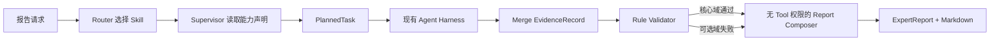

# 专家报告运行时 Skill

## 定位与边界

`expert_report` 是项目运行时 Skill，不是新增领域 Agent，也不是 Tool 集合。它把“生成专家报告”固化为可版本化的方法、能力清单、输入协议、输出协议和质量门禁：



- Skill：声明 SOP、能力和输出质量要求。
- Supervisor：把能力映射为 `PlannedTask`，保留 Agent 唯一性与任务契约。
- Scheduler：继续负责 parallel/sequential 和 `depends_on`。
- Agent Harness：继续负责模型、Tool 白名单、中间件、循环、超时、重试、预算和 Observation 压缩。
- Report Composer：只读取 Validator 已验收的 State，不调用模型、Agent 或 Tool。

这样不会出现 Skill 绕过 Supervisor、跨域获取全部 Tool 权限或报告阶段重新发明事实的问题。

## 文件结构

```text
skills/
├── base.py                    # SkillSpec 最小协议
├── registry.py                # 发现与按需加载
├── planning.py                # capability -> PlannedTask 适配
└── expert_report/
    ├── SKILL.md               # 可读、可版本化 SOP
    ├── spec.py                # 触发词、输入归一化、能力选择
    ├── schemas.py             # ExpertReport / Section / Claim
    └── composer.py            # 证据约束组装与 Markdown 输出
```

`SKILL.md` 采用渐进加载：Router 仅使用短元数据和触发词，Supervisor 真正规划该 Skill 时才读取完整 SOP，并把内容摘要写入 State 供版本审计。

## 能力规划

| 能力 | Agent | 角色 | 验收事实 |
|---|---|---|---|
| `expert_profile_history` | TalentAgent | 核心 | 画像、教育、任职 |
| `research_achievements` | AchievementAgent | 核心 | 单人论文、单人专利 |
| `enterprise_relations` | EnterpriseAgent | 可选 | 企业角色、项目、专利 |
| `cooperation_network` | GraphReasoningAgent | 可选 | 一跳关系 |
| `external_public_evidence` | WebResearchAgent | 可选且显式开启 | 带 URL 的公开来源 |

完整报告默认执行前四项；简版只执行两个核心能力。只有问题或显式输入要求联网，且 `web_search_enabled=true` 时，才规划 WebResearchAgent。

## 调用方式

自然语言会自动选择 Skill：

```json
{
  "question": "请生成张伟的完整专家报告",
  "web_search_enabled": false
}
```

也可以显式选择并覆盖输入：

```json
{
  "question": "分析张伟",
  "requested_skill": "expert_report",
  "skill_input": {
    "report_type": "brief",
    "audience": "enterprise",
    "top_n": 5,
    "include_enterprise": false,
    "include_cooperation_network": false,
    "include_web": false
  }
}
```

`GET /skills` 返回当前可调用 Skill 的短元数据。报告完成后：

- `state.report_draft` 是稳定的 `ExpertReport` JSON；
- `state.report_markdown` 和 `final_answer` 是等价 Markdown；
- 前端检测 `report_draft` 后使用安全 DOM API 渲染章节和证据目录，不执行动态 HTML。

## 证据与降级规则

- 每个 `ReportClaim` 至少绑定一个本次 `evidence_catalog` 内存在的 `evidence_id`。
- 无证据的字段不会写成肯定结论，而会进入“风险与数据缺口”。
- 画像或科研成果失败时，Validator 阻断报告并触发有限重规划。
- 企业、网络或联网失败时，Validator 写入 `warnings`，报告保留核心章节并将相应章节标记为 `partial/unavailable`。
- 网页来源保持候选证据边界，不自动回写知识图谱。

## 测试与评测

```bash
pytest -q tests/test_expert_report_skill.py tests/test_expert_report_evaluation.py
python -m scripts.run_expert_report_evals --check
```

独立评测覆盖完整/简版能力规划、所有 Claim 的引用有效性、可选域超时降级和输入上限。CI 将 `.runtime/expert-report-eval.json` 作为构建产物上传。
