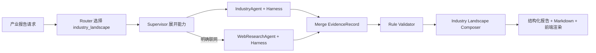

# 产业全景报告运行时 Skill

## 定位

`industry_landscape` 把产业全景研究固化为可版本化的 SOP、能力需求、输出协议和证据门禁。它不是 Agent，也不直接持有 Tool。



## 为什么第一版不调 EnterpriseAgent 和 GraphAgent

当前 EnterpriseAgent 的输入是人物或明确企业 ID，GraphAgent 的输入是明确实体 ID；现有任务协议还没有稳定支持“引用上游任务返回的产业节点/企业 ID”。在没有任务产物传递时强行调度，会产生固定企业或人物关系等无关结果。

因此第一版由 IndustryAgent 完成产业节点、结构、关联企业和事件查询，WebResearchAgent 只负责可选公开来源。后续增加 `task_output_ref` 或共享产物引用后，再扩展企业技术尽调和产业关系网络。

## 能力与工具

| 能力 | Agent | Tool | 角色 |
|---|---|---|---|
| `industry_landscape_core` | IndustryAgent | `search_industry_segments` | 核心，解析产业节点 |
| 同上 | IndustryAgent | `get_chain_structure` | 核心，读取产业链结构 |
| 同上 | IndustryAgent | `get_node_companies` | 核心，读取关联企业 |
| 同上 | IndustryAgent | `get_node_events`、`rank_top_events` | 核心，读取和排序事件 |
| `external_industry_evidence` | WebResearchAgent | `search_web` | 可选，公开来源补充 |

产业节点、链结构和企业记录原本没有 `evidence_id`。Evidence Normalizer 会为这些可定位的图记录创建稳定的 `derived` 引用，内容仍是 Tool 返回快照，不会伪造市场事实。

## 输入与调用

自然语言自动触发：

```json
{
  "question": "请生成人工智能产业全景报告",
  "web_search_enabled": false
}
```

显式调用：

```json
{
  "question": "分析目标产业",
  "requested_skill": "industry_landscape",
  "skill_input": {
    "industry_query": "人工智能",
    "report_type": "brief",
    "audience": "investment",
    "include_web": false,
    "top_n_companies": 5,
    "top_n_events": 5
  }
}
```

支持的触发短语包括“产业全景报告”“产业链全景报告”“行业全景报告”和“产业研究报告”。`GET /skills` 可查看当前注册的 Skill。

## 输出和质量规则

`state.report_draft` 遵循 `IndustryLandscapeReport`：

- 产业范围与节点概览；
- 产业链结构；
- 关联企业；
- 重点产业事件；
- 可选公开来源；
- 关键数据信号、风险与数据缺口；
- 证据目录和覆盖率。

每个 `IndustryClaim` 必须绑定本次报告证据目录中的 ID。报告只陈述记录中存在的节点、企业、事件日期和重要度，不把它们推断为市场规模、竞争力、投资价值或未来趋势。

Industry 核心域失败时有限重规划；Web 可选域失败时保留内部产业报告，并在 `warnings` 和数据缺口中说明降级。

## 测试与评测

```bash
pytest -q tests/test_industry_landscape_skill.py tests/test_industry_landscape_evaluation.py
python -m scripts.run_industry_landscape_evals --check
```

评测覆盖完整报告、简版输入、引用有效性、联网超时降级和输入上限。CI 上传 `.runtime/industry-landscape-eval.json`。
