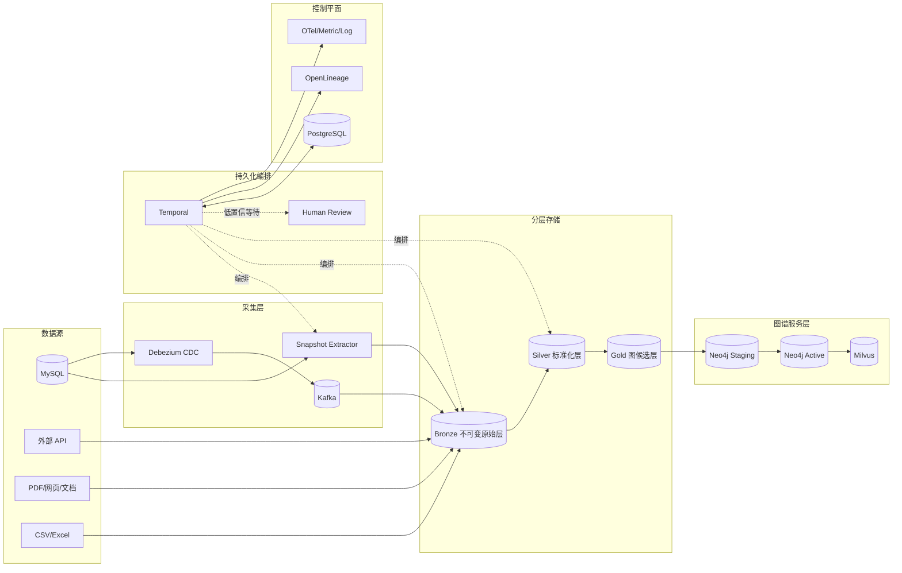
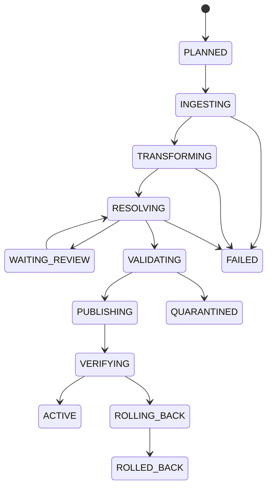

# 知识图谱构建 Workflow：生产级架构与实施蓝图

> 目标：将多源结构化、半结构化和非结构化数据，持续构建为身份一致、质量可控、可回滚、可追溯的知识图谱。  
> 定位：独立于当前查询系统的“图谱写入链路”，可作为后续项目重构的目标架构。  
> 设计原则：确定性数据工程为主，LLM 只处理不确定语义；至少一次投递，端到端幂等；先验证再发布；事实与证据不可分离。

---

## 1. 设计结论

推荐采用以下组合：

| 层次 | 推荐技术 | 职责 |
|---|---|---|
| 批量/增量采集 | MySQL Snapshot + Debezium + Kafka | 初始全量、Binlog CDC、事件缓冲和回放 |
| 持久化编排 | Temporal | 节点重试、超时、人工审核等待、故障恢复、补偿 |
| 周期调度/补数 | Temporal Schedule；已有 Airflow 时可作为外层调度 | 定时全量对账、历史分区回填 |
| 原始与中间层 | S3/MinIO + Parquet/Iceberg（可选） | 不可变原始数据、标准化数据、可重复计算 |
| 控制与身份库 | PostgreSQL | Workflow Registry、mapping、assertion、evidence、outbox |
| 在线图谱 | Neo4j | canonical entity、关系和图查询 |
| 实体语义索引 | Milvus + BGE-M3 | 候选召回、别名和描述性实体搜索 |
| 数据质量 | Pydantic/JSON Schema + SQL 规则 + 自定义质量引擎 | 记录级、实体级、关系级和批次级门禁 |
| 血缘 | OpenLineage + Marquez（或兼容后端） | Job、Run、Dataset 级血缘 |
| 可观测性 | OpenTelemetry + Prometheus + Grafana + Loki | Trace、Metric、Log 和告警 |
| 人工审核 | Review API + Web UI | 低置信实体对齐、冲突关系和高风险删除审批 |

如果第一阶段不希望引入太多基础设施，可以先使用：

```text
Temporal + PostgreSQL + MinIO + Neo4j + Milvus
```

Kafka/Debezium、OpenLineage和完整可观测平台可以在第二阶段加入，但数据协议、幂等键和状态模型必须从第一天按最终架构设计。

---

## 2. 为什么选择这套架构

### 2.1 Temporal 作为核心 Workflow Engine

图谱构建不是简单的定时 DAG，它包含：

- 可能运行数小时的批次；
- 对外部数据库、模型和向量服务的调用；
- 节点级重试与超时；
- 实体消歧的人机协同；
- 发布失败后的补偿；
- 服务重启后从原位置恢复。

Temporal 的 Workflow 负责确定性编排，所有数据库、HTTP、LLM 和文件操作放在 Activity 中。Activity 可以独立配置 Retry Policy、timeout 和 heartbeat。Workflow 自身不做不可重复的 I/O。

### 2.2 不把整个链路都做成 Agent

以下节点必须是确定性 Activity：

- 数据抽取；
- 字段标准化；
- Schema 校验；
- 唯一键生成；
- 图差异计算；
- Neo4j/Milvus 写入；
- 数量对账；
- Watermark 提交。

LLM 只适合：

- 非结构化文档中的实体/关系候选抽取；
- 别名和机构名称的语义辅助；
- 本体属性映射建议；
- 低置信候选的解释生成。

LLM 输出只能是“候选或特征”，不能直接成为已发布事实。它必须经过 Schema、业务规则、置信策略或人工审核。

### 2.3 不承诺虚假的端到端 Exactly-Once

MySQL、Kafka、对象存储、PostgreSQL、Neo4j 和 Milvus 之间没有一个共同分布式事务。Debezium 在故障恢复后也可能重放部分事件。

正确目标是：

```text
At-least-once delivery
+ stable idempotency key
+ inbox/outbox
+ unique constraint
+ compare-and-set watermark
= effectively-once business result
```

即允许消息和 Activity 重复执行，但最终业务状态不重复。

---

## 3. 总体架构



---

## 4. 数据分层

### 4.1 Bronze：不可变原始层

Bronze 保存采集时的完整事实，不做业务覆盖：

- 原始 payload；
- 数据源、表、主键；
- Snapshot/CDC 模式；
- Binlog/GTID/offset；
- schema version；
- 采集时间和源端业务时间；
- 内容哈希；
- 删除标记。

推荐分区：

```text
s3://kg-bronze/{source}/{dataset}/ingest_date=YYYY-MM-DD/hour=HH/part-*.parquet
```

Bronze 不允许原地更新。规则升级、误处理回滚和审计都依赖这一层。

### 4.2 Silver：标准化断言层

Silver 保存：

- 标准化字段；
- 标准化规则及版本；
- 解析成功/失败状态；
- source assertion；
- 数据质量结果；
- 对 Bronze 记录的引用。

它描述“某个来源声称了什么”，还不代表系统已经认定为 canonical truth。

### 4.3 Gold：图谱候选与发布层

Gold 保存：

- canonical entity candidate；
- canonical relation candidate；
- resolution decision；
- confidence 和解释；
- evidence IDs；
- 图变更计划；
- 发布版本。

Neo4j 和 Milvus 是服务层，不是唯一事实来源。图数据库损坏时，应能从 Bronze/Silver/Gold 和 PostgreSQL 重建。

---

## 5. 核心数据协议

### 5.1 SourceRecordEnvelope

```json
{
  "event_id": "mysql-gkx:server-1:mysql-bin.001234:9981:row-2",
  "source": "mysql_gkx",
  "dataset": "dwd_scholar",
  "source_record_id": "450e887j",
  "operation": "UPSERT",
  "event_time": "2026-08-18T10:00:00Z",
  "ingested_at": "2026-08-18T10:00:02Z",
  "schema_version": "dwd_scholar@3",
  "position": {"file": "mysql-bin.001234", "pos": 9981},
  "payload": {},
  "content_hash": "sha256:..."
}
```

`event_id` 是消费幂等键，`source + dataset + source_record_id` 是来源记录身份。

### 5.2 SourceAssertion

不要直接用来源记录覆盖 canonical entity，而要先建“来源断言”：

```json
{
  "assertion_id": "ast_...",
  "subject_source_key": "mysql_gkx:dwd_scholar:450e887j",
  "predicate": "AFFILIATED_WITH",
  "object": "清华大学",
  "valid_time": {"from": "2017-01-01", "to": null},
  "system_time": {"from": "2026-08-18T10:00:02Z", "to": null},
  "evidence_id": "ev_...",
  "status": "ACTIVE"
}
```

同时保存 valid time 和 system time，可支持“事实何时有效”与“系统何时知道该事实”的双时态查询。

### 5.3 CanonicalEntity

```json
{
  "canonical_id": "person_01J...",
  "entity_type": "Scholar",
  "display_name": "张伟",
  "status": "ACTIVE",
  "canonical_version": 12,
  "created_at": "...",
  "updated_at": "..."
}
```

canonical ID 一旦对外发布，默认永不复用。实体合并后使用 redirect，而不是把旧 ID 分配给别人。

### 5.4 EntityMapping

```json
{
  "source": "mysql_gkx",
  "source_entity_id": "450e887j",
  "canonical_id": "person_01J...",
  "decision": "AUTO_MATCH",
  "confidence": 0.97,
  "resolver_version": "resolver@7",
  "evidence_ids": ["ev_1", "ev_2"],
  "valid_from": "...",
  "valid_to": null
}
```

mapping 需要版本化，支持后续实体拆分和纠错。

### 5.5 EvidenceRecord

```json
{
  "evidence_id": "ev_01J...",
  "run_id": "run_01J...",
  "source_event_id": "mysql-gkx:...",
  "source_uri": "mysql://gkx/dwd_scholar/450e887j",
  "bronze_uri": "s3://kg-bronze/...",
  "source_record_id": "450e887j",
  "source_content_hash": "sha256:...",
  "transform_version": "normalize@5",
  "ontology_version": "techkg@9",
  "resolver_version": "resolver@7",
  "model": null,
  "prompt_version": null,
  "created_at": "..."
}
```

如果 LLM 参与，还要保存 model、prompt version、temperature、structured output、token usage 和输入内容哈希；敏感原文应保存安全引用而非直接写日志。

---

## 6. Workflow 层级

### 6.1 顶层 KGReleaseWorkflow

```text
KGReleaseWorkflow
├── PlanRunActivity
├── SourceIngestWorkflow × N
├── NormalizeWorkflow × Partition
├── EntityResolutionWorkflow × EntityType
├── RelationBuildWorkflow × RelationType
├── QualityGateWorkflow
├── GraphPublishWorkflow
├── IndexPublishWorkflow
├── ReconciliationWorkflow
└── ActivateReleaseActivity
```

顶层只持有元数据和对象引用，不把百万条数据放进 Workflow History。

### 6.2 分区原则

建议按以下之一分区：

- `hash(source_record_id) % N`；
- 数据源 + 表 + 主键范围；
- 业务时间窗口；
- 实体类型；
- 租户。

单个 Activity 处理 500～5000 条记录，具体大小通过负载测试确定。大批次使用 Child Workflow 和 Continue-As-New 控制历史长度。

### 6.3 Run 类型

| 模式 | 用途 |
|---|---|
| `SNAPSHOT` | 首次全量或灾难重建 |
| `INCREMENTAL` | Watermark 增量 |
| `CDC` | 持续消费 Binlog |
| `BACKFILL` | 指定时间/分区补数 |
| `REPROCESS` | 规则、模型或本体升级后的重算 |
| `RECONCILE` | 源与图谱周期对账 |
| `ROLLBACK` | 回退发布版本 |

---

## 7. 端到端节点设计

### Node 0：Register Run

生成：

- `run_id`；
- `release_id`；
- 代码 Git SHA；
- ontology/schema/normalizer/resolver/model 版本；
- 输入数据集和时间范围；
- 运行策略和质量阈值。

运行开始后版本全部冻结。长流程恢复时不能静默切换新 Prompt、新模型或新规则。

### Node 1：Source Discovery 与 Contract Check

检查：

- 表和字段是否存在；
- 类型是否发生兼容/不兼容变化；
- 主键和更新时间字段是否可用；
- 数据源时区、字符集和排序规则；
- 是否具有只读权限；
- Binlog 保留期是否覆盖最大恢复窗口。

不兼容 Schema Drift 直接阻断；兼容新增字段记录告警后继续。

### Node 2：Snapshot/CDC 边界协调

首次接入要避免 Snapshot 与 CDC 之间丢数据：

1. 记录一致性快照的起始 offset；
2. 执行 Snapshot；
3. 从已记录 offset 开始消费 CDC；
4. 通过 event_id 去重；
5. 追平后切换为正常 CDC。

必须监控 Binlog 保留时间。如果连接器停机太久导致 offset 对应日志已被清理，应重新 Snapshot，而不是从“当前时间”继续造成静默漏数。

### Node 3：Extract to Bronze

职责：

- 主键游标/流式读取；
- 写不可变 Parquet；
- 计算 record count、min/max key、checksum；
- 写 manifest；
- 发 OpenLineage START/COMPLETE；
- 成功后提交分区 checkpoint。

禁止使用深分页 `OFFSET` 扫描大表。使用 keyset pagination 或 CDC offset。

### Node 4：Normalize

标准化规则包括：

- Unicode NFKC；
- 空白、全半角和标点统一；
- 中英文姓名顺序和大小写；
- 机构、职称、学科、地区别名字典；
- 日期、时区和开放区间；
- 编码修复；
- JSON 数组展开；
- 单位和枚举映射；
- PII 分类与脱敏标签。

保留 raw value、normalized value、rule ID 和 rule version。标准化不能破坏原值。

### Node 5：Record-Level Validation

检查：

- JSON Schema/Pydantic；
- 必填字段；
- 格式、长度、类型；
- 主键稳定性；
- 日期范围；
- 枚举合法性；
- 内容哈希；
- PII 策略。

记录结果分为：

- `PASS`；
- `WARN`：继续但计入质量指标；
- `QUARANTINE`：进入隔离区；
- `REJECT`：永久拒绝。

### Node 6：Ontology Mapping

把源字段映射到图谱本体：

```text
dwd_scholar.name       → Scholar.name
dwd_scholar.work_org   → Scholar-[:AFFILIATED_WITH]->Organization
paper.author_ids[]     → Scholar-[:AUTHOR_OF]->Paper
```

本体必须版本化，包括：

- Node Label 和 Relationship Type；
- 属性名称、类型和约束；
- 允许的起点/终点类型；
- cardinality；
- 数据治理级别；
- 兼容性策略。

本体升级先做 migration plan，不允许运行中的 Workflow 自动采用最新版。

### Node 7：Candidate Generation / Blocking

实体对齐不能让每条记录与全库比较。先用 Blocking 生成小候选集：

- 强标识符：ORCID、邮箱、统一社会信用代码；
- 标准化姓名 + 机构；
- 姓名拼音/英文名；
- 电话/邮箱哈希；
- 共同作者、项目和机构等图结构特征；
- BGE-M3 Dense + Sparse + Milvus RRF；
- 拼写和编辑距离召回。

目标是高 Recall@K，排序和决策由下一阶段完成。

### Node 8：Entity Resolution

推荐四层决策：

1. **Deterministic Link**：历史 mapping 或强唯一标识符；
2. **Rule Scoring**：姓名、机构、职称、时间、共同作者等特征；
3. **Learned Ranker**：使用标注数据训练 pairwise classifier/ranker；
4. **LLM Adjudication**：仅对难例提供语义特征和解释，不覆盖硬冲突。

决策类型：

| 决策 | 处理 |
|---|---|
| `AUTO_MATCH` | 绑定已有 canonical ID |
| `CREATE_NEW` | 创建新实体 |
| `NEED_REVIEW` | Workflow 等待人工 Signal |
| `CONFLICT` | 阻断或进入治理队列 |
| `REJECT` | 无效记录 |

自动确认不能只看 Top1 分数，至少同时满足：

```text
top1_score >= absolute_threshold
top1_score - top2_score >= margin_threshold
no_hard_conflict
required_identifiers_consistent
```

所有决策保存候选、特征、阈值、模型版本和解释。

### Node 9：Human Review

Reviewer 应看到：

- 原始记录和标准化结果；
- Top-K 候选；
- 命中/冲突特征；
- 来源证据；
- 相关图邻居；
- 模型建议但不隐藏不确定性。

审核结果通过 Temporal Signal 返回。Workflow 可以等待数小时或数天而不占用 Worker。

审核决策本身成为训练数据，用于阈值校准和后续 ranker 训练。高风险实体合并建议双人复核。

### Node 10：Canonicalization 与 Source Assertion

更新 canonical entity 时不要采用“最后写入者获胜”。推荐属性级策略：

- 来源优先级；
- 新鲜度；
- 完整度；
- 多来源一致性；
- 人工审核覆盖；
- 业务有效时间。

每个 canonical 属性都保留 supporting assertions。来源删除时只撤销该 assertion；只有没有任何有效来源支持时，canonical fact 才失效。

### Node 11：Relation Construction

关系 ID 应稳定，例如：

```text
relationship_id = hash(
  relation_type,
  source_canonical_id,
  target_canonical_id,
  business_key,
  valid_from
)
```

关系必须带：

- source/target canonical ID；
- relation type；
- valid/system time；
- confidence；
- evidence IDs；
- provenance；
- assertion status。

### Node 12：Graph-Level Quality Gate

至少覆盖：

#### 完整性

- 必填属性完整率；
- source → canonical 映射率；
- 关系端点解析率；
- Evidence 覆盖率。

#### 一致性

- 唯一键冲突；
- 非法 self-loop；
- 关系起止类型不合法；
- 时间区间错误；
- 同一来源自相矛盾。

#### 分布与漂移

- 新增/修改/删除数量异常；
- 实体类型占比变化；
- 平均度、孤立节点率变化；
- 对齐置信分布变化；
- 未解析率和人审率变化。

#### 业务规则

- 论文至少有标题和年份；
- AUTHOR_OF 两端必须是 Scholar 和 Paper；
- 项目结束时间不早于开始时间；
- 企业统一社会信用代码唯一。

质量门禁示例：

```yaml
hard_fail:
  unresolved_endpoint_rate: "> 0.1%"
  uniqueness_conflicts: "> 0"
  missing_evidence_rate: "> 0.01%"
soft_fail:
  entity_count_change: "> 20%"
  auto_match_rate_change: "> 10%"
```

阈值需要按实体类型和来源分别配置，不能全库共用一个比例。

### Node 13：Build Graph Mutation Plan

先生成变更计划，不直接写 Active Graph：

```json
{
  "mutation_id": "mut_...",
  "release_id": "rel_...",
  "operation": "UPSERT_RELATION",
  "business_key": "AUTHOR_OF:person_1:paper_9",
  "expected_version": 4,
  "new_version": 5,
  "payload": {},
  "evidence_ids": ["ev_..."]
}
```

支持 dry-run，输出节点/关系增删改数量、影响范围和删除清单。大规模删除必须人工批准。

### Node 14：Publish to Staging Graph

发布前先创建唯一约束和索引，再使用参数化 Cypher 批量写入。

```cypher
CREATE CONSTRAINT scholar_canonical_id IF NOT EXISTS
FOR (n:Scholar) REQUIRE n.canonical_id IS UNIQUE;
```

实体写入只在稳定键上 `MERGE`：

```cypher
MERGE (n:Scholar {canonical_id: $canonical_id})
ON CREATE SET n.created_at = $now
SET n += $properties,
    n.entity_version = $entity_version,
    n.release_id = $release_id,
    n.updated_at = $now
```

关系先 MATCH 两端，再按稳定 relationship ID MERGE。不要把所有可变属性放进 MERGE pattern，否则属性变化可能创建重复元素。

Activity 重试时依靠：

- Neo4j 唯一约束；
- stable mutation ID；
- PostgreSQL `applied_mutations` inbox；
- entity version compare-and-set；
- 批次 checkpoint。

### Node 15：Staging Validation 与 Reconciliation

发布后必须重新检查：

- mutation 数与实际写入数；
- 节点和关系唯一性；
- dangling relation；
- 随机证据回查；
- 典型 Cypher smoke query；
- 与 Silver/Gold 的 checksum；
- 关键业务样例；
- 查询延迟和索引命中。

只有 Staging 验证通过才允许激活。

### Node 16：Milvus Index Build

从已验证的 canonical entity 构建索引，记录：

- embedding model name/version；
- dimension；
- tokenizer/normalizer version；
- collection schema version；
- source release ID；
- vector content hash。

推荐新建版本化 collection 或 partition，完成 Recall@K 和 smoke test 后再切 alias，不要原地重建在线索引。

### Node 17：Atomic Activation

不要逐步把半成品暴露给查询系统。可选方案：

1. Blue/Green Neo4j database 或服务路由；
2. 节点、关系携带 `release_id`，查询读取 `active_release`；
3. 小规模增量使用事务批次，并在控制库原子更新可见 watermark。

激活动作只修改一个小型、原子的 release pointer：

```text
active_release: rel_20260818_001 → rel_20260818_002
```

### Node 18：Commit Watermark

只有满足以下条件才提交源端 Watermark：

- 图谱已激活；
- Milvus 已激活；
- 对账通过；
- Evidence 和 OpenLineage 事件已落库；
- 没有待处理 hard failure。

使用 compare-and-set 防止并发 Run 覆盖新 Watermark。

---

## 8. 幂等、重试与失败分类

### 8.1 幂等键

| 操作 | 幂等键 |
|---|---|
| CDC 接收 | `event_id` |
| Bronze 文件 | `source + partition + offset range + hash` |
| 标准化记录 | `event_id + normalizer_version` |
| 对齐决策 | `source_record_key + resolver_version + input_hash` |
| 实体 | `canonical_id` |
| 关系 | `relationship_id` |
| 图变更 | `mutation_id` |
| Embedding | `canonical_id + content_hash + model_version` |
| 发布 | `release_id` |

### 8.2 Retry Policy

| 错误类型 | 策略 |
|---|---|
| 网络超时、连接重置 | 指数退避 + jitter |
| 429/限流 | 尊重 Retry-After，降低并发 |
| 数据库瞬时锁冲突 | 短退避重试 |
| Schema/格式错误 | 不重试，Quarantine |
| 身份硬冲突 | 不重试，Human Review |
| 权限/凭据错误 | 不重试，立即告警 |
| LLM 非法 JSON | 小次数重试，再降级/人审 |
| 代码缺陷 | Workflow 失败，修复后从节点恢复 |

Activity 必须配置：

- `start_to_close_timeout`；
- `schedule_to_close_timeout`；
- heartbeat；
- 最大尝试次数；
- non-retryable error 类型。

### 8.3 DLQ 与 Quarantine 的区别

- DLQ：技术上未成功消费或处理的事件，修复系统后可重放；
- Quarantine：事件已成功读取，但数据质量或语义不合格，需要修数据或人工处理。

不能把二者混在一个“失败表”里。

---

## 9. 更新、删除、合并与拆分

### 9.1 更新

canonical entity 使用乐观版本：

```text
UPDATE ... SET version = version + 1
WHERE canonical_id = ? AND version = expected_version
```

冲突时重新读取最新断言并重算，不盲目覆盖。

### 9.2 删除

CDC DELETE 只撤销来源断言：

```text
source assertion ACTIVE → RETRACTED
```

若还有其他有效来源支持，canonical fact 继续存在。没有来源支持后先标为 `INACTIVE`，经过保留期和审批再物理清理。

### 9.3 实体合并

```text
person_old → MERGED_INTO → person_survivor
```

保留：

- old ID redirect；
- mapping 迁移历史；
- 关系重定向记录；
- 审批和 Evidence；
- merge version。

### 9.4 实体拆分

拆分比合并更复杂，必须支持：

- 创建新 canonical IDs；
- 按 assertion 重新分配属性和关系；
- 更新 source mappings；
- 重建受影响图邻域和向量；
- 发布 correction release；
- 保留旧版本以供回溯。

---

## 10. 发布、回滚和灾难恢复

### 10.1 发布状态机



### 10.2 回滚

优先使用版本切换回滚，而不是生成大量反向 Cypher：

- active release pointer 回切；
- Milvus collection alias 回切；
- 新 release 标记 `ROLLED_BACK`；
- Watermark 不前移；
- 保留失败 release 供调查。

### 10.3 灾难恢复

定期演练：

- PostgreSQL PITR；
- 对象存储版本和跨区复制；
- Neo4j backup/restore；
- 从 Gold 全量重建 Neo4j；
- 从 canonical entity 重建 Milvus；
- Temporal Namespace 备份/恢复策略；
- Kafka offset 丢失后的 Snapshot 恢复。

明确 RPO/RTO，例如：

```text
RPO ≤ 15 分钟
RTO ≤ 2 小时
```

---

## 11. 数据质量指标

### 11.1 准确性

- Entity Resolution Precision/Recall/F1；
- 自动匹配准确率；
- 人审推翻率；
- 关系抽取 Precision/Recall；
- 属性冲突率。

### 11.2 完整性

- source ingestion completeness；
- required property completeness；
- canonical mapping coverage；
- relationship endpoint resolution rate；
- evidence coverage。

### 11.3 一致性

- duplicate canonical entity rate；
- uniqueness violation count；
- dangling edge count；
- source/graph reconciliation mismatch；
- temporal conflict rate。

### 11.4 时效性

- CDC lag；
- event-to-active latency；
- oldest unprocessed event age；
- human review waiting time。

### 11.5 稳定性

- Workflow success rate；
- Activity retry rate；
- quarantine/DLQ rate；
- rollback rate；
- mean recovery time。

指标必须按 source、entity type、relation type、tenant 和 release 分维度查看。

---

## 12. 可观测性与血缘

### 12.1 Trace

统一关联字段：

```text
trace_id
workflow_id
run_id
release_id
activity_id
partition_id
source_event_id
canonical_id
mutation_id
```

禁止把密码、Token、完整 PII 和未脱敏原文写入 Trace。

### 12.2 Metric

关键告警：

- CDC lag 超阈值；
- Workflow 长时间无 heartbeat；
- 自动匹配率突变；
- Quarantine 激增；
- 图写入吞吐下降；
- Staging 对账不一致；
- 人审积压；
- Binlog 保留窗口不足。

### 12.3 OpenLineage

每个 Workflow/Activity 映射为 Job/Run，MySQL 表、Bronze/Silver/Gold 分区、Neo4j release 和 Milvus collection 映射为 Dataset。至少发送 START 和 COMPLETE/FAIL/ABORT，并使用 Facet 记录 schema、partition、quality、Git SHA 和 model version。

---

## 13. 安全与治理

- 数据源账户只读；图发布账户与查询账户分离；
- Secret Manager/Vault 管理凭据；
- PostgreSQL、Kafka、Neo4j、对象存储全链路 TLS；
- tenant_id 贯穿 event、mapping、evidence 和图谱；
- PII 分级、字段加密、哈希 blocking；
- 人审 RBAC 和双人审批；
- 审核与合并操作写不可篡改审计日志；
- 删除满足保留期、法务和来源约束；
- Prompt Injection 防护：外部文本只作为数据，不作为 Workflow 指令；
- LLM Tool 白名单，输出必须通过 Schema；
- 训练/评测集与线上敏感数据隔离。

---

## 14. LLM 节点的生产约束

任何 LLM Activity 必须具备：

1. 固定 model alias 对应不可变版本；
2. versioned prompt；
3. JSON Schema/Pydantic 输出；
4. 低 temperature；
5. 输入截断和 PII 策略；
6. timeout、rate limit 和预算；
7. 缓存键：`input_hash + prompt_version + model_version`；
8. 离线 golden set；
9. shadow/canary 发布；
10. 规则校验和人审兜底。

以下硬冲突不能由 LLM 推翻：

- 两个不同 ORCID；
- 两个不同统一社会信用代码；
- 明确互斥的身份主键；
- 来源系统已人工确认的 mapping；
- 不满足图谱本体类型约束。

---

## 15. 测试与评测体系

### 15.1 单元测试

- normalizer 规则；
- stable ID；
- scoring feature；
- hard conflict；
- mutation generation；
- quality rule。

### 15.2 Contract Test

- MySQL schema；
- CDC envelope；
- Bronze/Silver/Gold schema；
- Neo4j ontology；
- Milvus dimension；
- OpenLineage event。

### 15.3 Workflow Test

- Activity 重试；
- Worker crash 后 replay；
- Human Review Signal；
- Continue-As-New；
- timeout/cancel；
- non-retryable error；
- 补偿与回滚。

### 15.4 数据质量回归

Golden Dataset 至少覆盖：

- 同名不同人；
- 一人多名、中英文名；
- 机构改名；
- 错别字；
- 共同作者辅助对齐；
- 时间冲突；
- 新实体；
- 应拒识实体；
- merge/split；
- source deletion。

### 15.5 故障注入

- Kafka 重复消息；
- Activity 执行完但 ACK 前崩溃；
- Neo4j 部分批次成功；
- Milvus 索引失败；
- PostgreSQL 短暂不可用；
- LLM 429/超时/非法 JSON；
- 服务在等待人审时重启；
- Binlog gap。

验收标准不是“没有失败”，而是失败后不会丢数、不会重复发布、可以从 Evidence 解释并恢复。

---

## 16. 推荐数据库表

PostgreSQL 控制库建议至少包含：

```text
workflow_runs
workflow_partitions
activity_attempts
source_datasets
schema_versions
watermarks
inbox_events
outbox_events
source_assertions
canonical_entities
entity_mappings
resolution_candidates
resolution_decisions
review_tasks
evidence_records
quality_results
graph_mutations
applied_mutations
graph_releases
ontology_versions
model_versions
prompt_versions
audit_logs
```

大 payload、原始文件和完整模型输入放对象存储，PostgreSQL 保存 URI、hash 和索引字段。

---

## 17. API 边界

建议提供：

| API | 用途 |
|---|---|
| `POST /kg-runs` | 创建 Snapshot/Incremental/Backfill Run |
| `GET /kg-runs/{id}` | 查询状态、节点和指标 |
| `POST /kg-runs/{id}/cancel` | 协作式取消 |
| `POST /kg-runs/{id}/retry` | 从失败节点恢复 |
| `GET /kg-runs/{id}/lineage` | 查看数据血缘 |
| `GET /kg-runs/{id}/quality` | 查看质量门禁 |
| `GET /reviews` | 获取待审核任务 |
| `POST /reviews/{id}/decision` | 提交 MATCH/NEW/REJECT |
| `GET /entities/{id}/provenance` | 查询实体全部来源和 Evidence |
| `POST /releases/{id}/activate` | 审批激活 |
| `POST /releases/{id}/rollback` | 回滚版本 |

API 只触发/查询 Workflow，不在 HTTP 请求中同步执行大批次。

---

## 18. 分阶段落地路线

### Phase 1：可靠批处理基线

- Temporal Workflow；
- PostgreSQL Registry；
- MinIO Bronze/Silver/Gold；
- Snapshot + Watermark 增量；
- canonical ID/mapping/assertion/evidence；
- 规则实体对齐；
- Neo4j Staging + dry-run + quality gate；
- Milvus 版本化索引；
- 版本激活和回滚。

验收：同一批次重复运行三次，图谱结果完全一致。

### Phase 2：CDC 与人机协同

- Debezium + Kafka；
- event inbox 去重；
- Snapshot/CDC 协调；
- Human Review UI；
- DLQ/Quarantine；
- OpenLineage；
- 完整告警。

验收：随机重启 Worker、重复投递事件，不丢数、不产生重复实体或关系。

### Phase 3：智能实体解析

- BGE-M3 + Milvus blocking；
- learned ranker；
- LLM 难例辅助；
- active learning；
- 阈值按实体类型校准；
- merge/split 治理。

验收：自动匹配准确率达到业务目标，人审率受控且可解释。

### Phase 4：规模化与多租户

- 分区并发和限流；
- 多租户隔离；
- Blue/Green 发布；
- 灾难恢复演练；
- 成本归因；
- SLO 和容量规划。

---

## 19. 不推荐的实现方式

避免：

- 一个 Python 脚本从 MySQL 直接写 Neo4j；
- 抽取成功后立即推进 Watermark，图写入失败却无法补偿；
- 用姓名作为 canonical ID；
- 向量 Top1 直接自动合并实体；
- 用 `CREATE` 重试图写入；
- 把可变属性全部放进 Cypher `MERGE` pattern；
- 来源删除就直接删除 canonical entity；
- LLM 输出未经校验直接写图；
- Workflow State 保存百万条业务记录；
- 只保存最终实体，不保存来源断言和决策；
- 在 Active Graph 上边写边让用户查询；
- 把 DLQ、数据隔离、人审任务混为一个失败表；
- 声称跨所有异构系统实现 end-to-end exactly-once。

---

## 20. 面试讲解主线

可以用四层回答：

### 第一层：业务目标

> 我把知识图谱构建从一次性同步脚本升级为可恢复 Workflow，解决多源身份不一致、增量重复、质量不可控和事实不可追溯问题。

### 第二层：核心流程

> 数据先进入不可变 Bronze，再标准化为 source assertion；通过 Blocking、规则、Ranker 和人审映射到 canonical ID；生成关系后经过质量门禁，先发布 Staging Graph，对账通过再原子激活 Neo4j 和 Milvus 版本。

### 第三层：可靠性

> 系统按 at-least-once 设计，每个事件、实体、关系和 mutation 都有稳定幂等键；Temporal 负责 Activity 重试和长流程恢复，Neo4j 使用唯一约束与 MERGE，Watermark 只在完整发布成功后提交。

### 第四层：可信性

> 每个 canonical 属性和关系都由 source assertion 与 Evidence 支撑，并保存规则、模型、本体和发布版本；任何结果都能回溯到原始记录，也能对错误 release 快速回滚。

---

## 21. 简历表述建议

完整落地后可以写：

> 设计并建设生产级知识图谱构建 Workflow，基于 Snapshot/CDC 将 MySQL 等多源数据编排为不可变采集、标准化断言、本体映射、混合实体消歧、关系构建、质量门禁及 Neo4j/Milvus 版本化发布节点；采用 Temporal 持久化编排、at-least-once + 幂等键、节点级重试、Watermark、Staging 对账和版本回滚保障增量链路可靠性，并通过 canonical ID、Evidence、双时态断言及 OpenLineage 实现跨库身份一致与全链路可追溯。

如果只落地了部分能力，应删去未实现的技术名词，并把“建设”改为“参与设计”或“完成核心链路原型”。

---

## 22. 最终验收清单

### 正确性

- [ ] 所有实体使用稳定 canonical ID；
- [ ] 每个关系端点均已解析；
- [ ] 所有已发布事实均有 Evidence；
- [ ] Schema、本体和质量规则版本冻结；
- [ ] 低置信对齐可人工审核；
- [ ] merge/split/delete 有明确语义。

### 可靠性

- [ ] 重复事件不会产生重复结果；
- [ ] Activity 重试安全；
- [ ] Worker 重启后可恢复；
- [ ] 部分发布失败不会暴露半成品；
- [ ] Watermark 只在激活成功后提交；
- [ ] 可以按 release 回滚；
- [ ] 可以从数据分层重建 Neo4j/Milvus。

### 可观测性

- [ ] Run/Activity/Partition 可查询；
- [ ] CDC lag、质量、吞吐和人审积压有指标；
- [ ] OpenLineage 能展示输入输出 Dataset；
- [ ] 日志不泄露凭据和 PII；
- [ ] 失败有明确 DLQ/Quarantine/Review 分类。

### 生产治理

- [ ] 数据源、发布和查询账户权限分离；
- [ ] 大规模删除需要审批；
- [ ] Prompt、模型和阈值有发布流程；
- [ ] 实体解析有 Golden Set；
- [ ] 定期执行全量 reconciliation；
- [ ] 已完成灾难恢复演练。

---

## 23. 官方参考资料

- [Temporal Documentation](https://docs.temporal.io/)：Durable Execution、Workflow/Activity 和故障恢复。
- [Temporal Retry Policies](https://github.com/temporalio/documentation/blob/main/docs/encyclopedia/retry-policies.mdx)：Activity 重试、Workflow 确定性和幂等要求。
- [Debezium MySQL Connector](https://debezium.io/documentation/reference/stable/connectors/mysql.html)：Snapshot、Binlog offset、重复事件与恢复边界。
- [Apache Airflow Dynamic Task Mapping](https://airflow.apache.org/docs/apache-airflow/stable/authoring-and-scheduling/dynamic-task-mapping.html)：运行时分区映射与 map/reduce。
- [Apache Airflow Backfill](https://airflow.apache.org/docs/apache-airflow/stable/core-concepts/backfill.html)：历史数据重处理和并发控制。
- [Neo4j MERGE](https://neo4j.com/docs/cypher-manual/current/clauses/merge/)：幂等模式写入以及与约束配合的注意事项。
- [Neo4j Constraints](https://neo4j.com/docs/cypher-manual/current/schema/constraints/)：唯一性、存在性、类型和 Key 约束。
- [OpenLineage Specification](https://github.com/OpenLineage/OpenLineage/blob/main/spec/OpenLineage.md)：Job、Run、Dataset、RunEvent 和 Facet 模型。
- [Apache Kafka Design](https://kafka.apache.org/43/design/design/)：幂等 Producer、事务和 Exactly-Once 的适用边界。

---

## 24. 一句话总结

完整的知识图谱构建 Workflow 不是“把数据写进 Neo4j”，而是：

```text
不可变采集
→ 来源断言
→ 版本化标准化与本体映射
→ 可解释的实体解析
→ 有 Evidence 的实体和关系
→ 多层质量门禁
→ Staging 验证
→ Neo4j/Milvus 原子版本发布
→ Watermark 提交
→ 可回放、可审计、可回滚
```

其中最重要的三个工程约束是：**稳定身份、幂等执行、证据血缘**。
