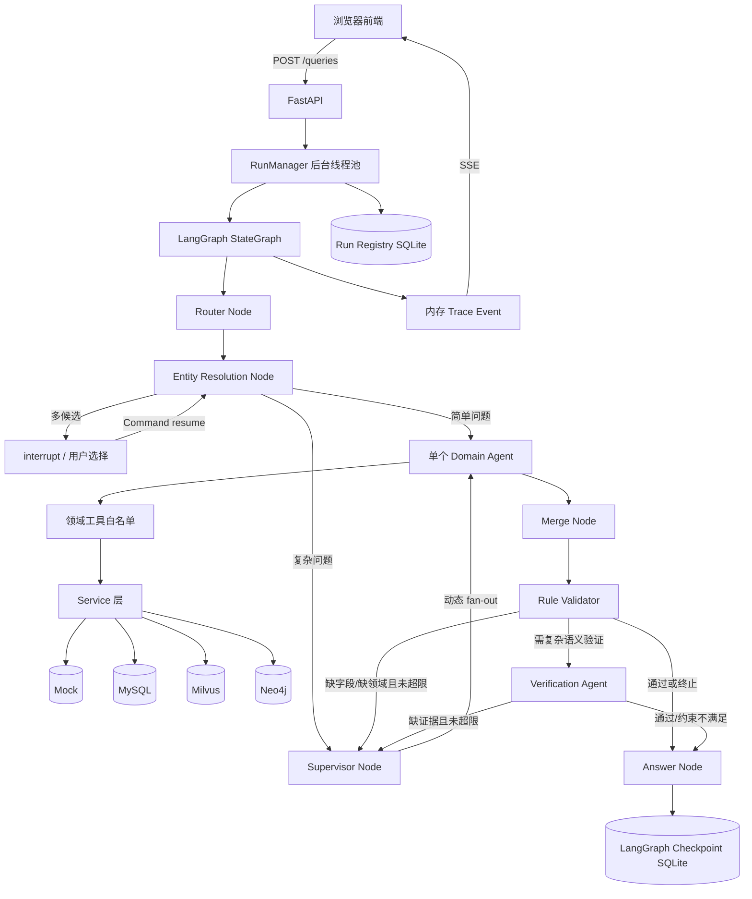
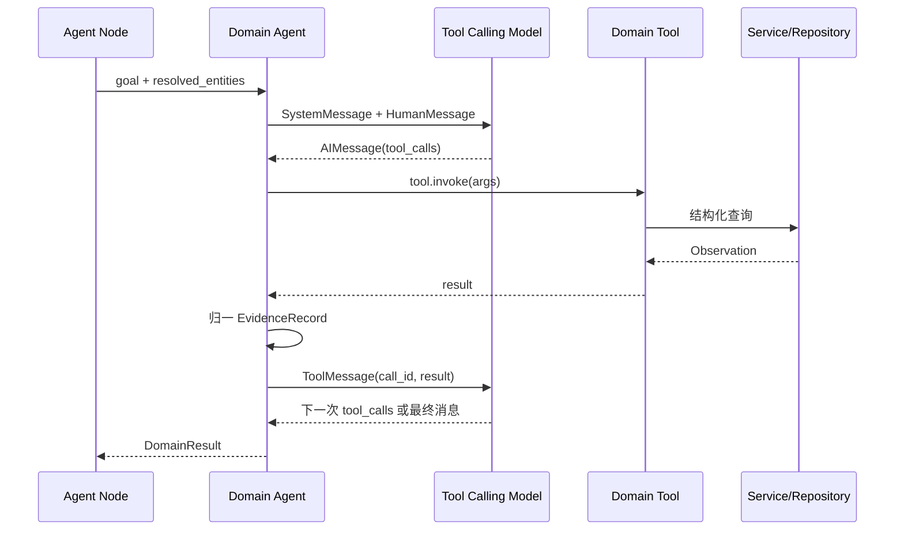
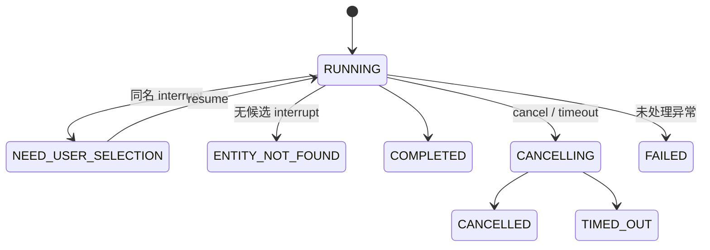

# 亿级科技知识图谱 Multi-Agent GraphRAG：完整流程、实现细节与面试指南

> 项目路径：`/Users/zhouwei/Desktop/multi-agent-program`  
> 代码阶段：Stage 9  
> 文档依据：2026-08-18 当前 `main` 分支代码（commit `1a6bcb1`）  
> 验证结果：`67 passed`；离线 Demo 全链路执行成功

---

## 1. 先用一分钟讲清这个项目

这是一个面向科技知识图谱问答的 **Multi-Agent GraphRAG 系统**。它接收自然语言问题，先判断问题属于人才、科研成果、企业、产业链还是图关系领域，再完成实体消歧，把自然语言姓名统一成 canonical entity ID。简单问题直接进入一个领域 Agent；复杂问题由 Supervisor 拆成多个带验收契约的任务，通过 LangGraph 动态并行分发给多个领域 Agent。

每个领域 Agent 都运行独立的多轮 Tool Calling Loop，并且只能看到自己领域的工具。工具通过 Service/Repository 分层访问 Mock、MySQL、Milvus 或 Neo4j。Tool Observation 会被归一成统一 `EvidenceRecord`。各分支在 Merge Node 汇合后，Rule Validator 做确定性校验；只有涉及“长期稳定合作伙伴”等复杂语义时，才进入 Verification Agent 做第二层验证。最终 Answer Node 只组合已通过校验的事实，不使用模型自由生成外部知识。

FastAPI 将每次查询作为后台 Run 执行，使用 SSE 实时推送节点和工具轨迹；LangGraph SQLite Checkpoint 保存工作流状态，另一个 SQLite Run Registry 保存运行状态、错误和耗时。系统支持同名实体中断恢复、Run 取消、超时、健康探针、端到端评测和前端可观测界面。

一句话概括项目价值：

> 用“受约束的多智能体协作 + 混合实体解析 + 多数据库 GraphRAG + 两层证据校验”，解决知识图谱问答中的身份一致性、领域协同、答案可追溯和运行可治理问题。

---

## 2. 项目要解决的核心问题

### 2.1 为什么不是一个大模型直接回答

一个通用 Agent 同时处理所有领域，会有几个问题：

1. 工具数量过多，模型容易选错工具或传错参数；
2. 人才、论文、企业、产业图的数据结构和验证规则不同；
3. 同名专家可能被不同工具解析成不同的人；
4. 模型生成的结论很难追踪到数据库原始记录；
5. 一个复杂问题失败后，难以只补查缺失部分；
6. 长耗时调用会阻塞 HTTP 请求，用户也看不到执行过程。

本项目把这些问题分别交给确定职责的组件：

| 问题 | 项目方案 |
|---|---|
| 意图与领域判断 | Router Node |
| 同名、别名和跨库身份 | Entity Resolution + canonical ID |
| 跨领域拆解 | Supervisor Node + Task Contract |
| 领域内自主检索 | 5 个 Domain Agent + 工具白名单 |
| 多分支结果汇总 | Merge Node |
| 数据正确性 | Rule Validator |
| 复杂语义关系 | Verification Agent |
| 防止自由幻觉 | 确定性 Formatter + Answer Node |
| 长任务与人工介入 | Background Run + interrupt/resume + SSE |
| 多后端演进 | Service/Repository 分层 |

### 2.2 GraphRAG 在这里具体指什么

本项目不是“把图谱全文塞进 Prompt”。它的 GraphRAG 体现在：

- 先将问题中的 mention 解析到图谱实体；
- Agent 通过结构化工具检索人物、论文、项目、专利、企业、产业链与图关系；
- Neo4j 支持邻居、最短路径、K 跳扩展和路径强度；
- Milvus 使用 Dense + Sparse + RRF 做实体召回；
- 检索结果形成结构化事实和证据，再进入验证与答案组装。

因此它更准确地说是：**由 Agent 编排的、多数据源的、证据驱动 GraphRAG**。

---

## 3. 总体架构



### 3.1 最重要的角色边界

项目刻意区分 **Node** 与 **Agent**：

- Node 执行固定职责，输入输出协议明确，不进行开放式“思考—行动”循环；
- Agent 根据目标和 Tool Observation 自主决定下一步工具，直到不再产生 `tool_calls`。

所以 Router、Entity Resolution、Supervisor、Merge、Rule Validator、Answer 都是 Node。五个领域智能体和 Verification Agent 才是 Agent。

“是否调用 LLM”不是判断 Agent 的标准。Router 和 Supervisor 可以调用模型，但它们仍只是固定职责的结构化 Node。

---

## 4. 仓库目录与职责

| 目录/文件 | 职责 |
|---|---|
| `app/main.py` | FastAPI、后台查询 API、SSE、健康检查、静态前端 |
| `graph/` | Shared State、条件路由、LangGraph 图构建 |
| `nodes/` | Router、消歧、Supervisor、Agent 包装、Merge、Validator、Answer |
| `agents/` | 领域 Agent 与 Verification Agent 的 Tool Calling Loop |
| `tools/` | LangChain `@tool` 定义；Agent 可见能力边界 |
| `services/` | 后端选择、ID 转换、证据、资源生命周期、运行控制 |
| `repositories/` | MySQL、Neo4j、Milvus、SQLite 的实际读写 |
| `models/` | Pydantic 协议、配置、模型适配器、任务契约 |
| `formatters/` | 把已验证的领域结果确定性转换为中文段落 |
| `data/` | 离线 Mock 实体、成果、企业、产业和图数据 |
| `frontend/` | 无构建步骤的原生 HTML/CSS/JavaScript 前端 |
| `scripts/` | Milvus/Neo4j 同步与实体、端到端评测 |
| `evals/` | 实体消歧和 Stage 9 端到端用例 |
| `tests/` | 67 个自动化测试 |
| `.runtime/` | 本机 Checkpoint、Run Registry、Milvus Lite、模型缓存，不入 Git |
| `demo.py` | interrupt/resume 离线演示入口 |

推荐按以下顺序读代码：

1. `graph/state.py`
2. `graph/builder.py` 和 `graph/routing.py`
3. `nodes/` 的执行顺序
4. `agents/base.py`
5. `models/llm.py`
6. `tools/` → `services/` → `repositories/`
7. `app/main.py` 和 `services/run_service.py`
8. `formatters/`、`tests/`、`scripts/`

---

## 5. LangGraph 的完整执行流程

### 5.1 图是如何构建的

`graph/builder.py::build_graph()` 使用 `StateGraph(GraphRAGState)` 注册全部节点：

```text
START
  → router
  → entity_resolution
  → simple: 对应领域 Agent
    或 complex: supervisor → 动态并行 Domain Agents
  → merge
  → validator
  → 可选 verification_agent
  → answer
  → END
```

每个节点外都包了一层 `traced_node()`，其作用是：

- 节点执行前检查取消/超时信号；
- 记录脱敏后的输入快照；
- 节点执行后再次检查取消/超时；
- 记录输出、异常或 interrupt 事件。

### 5.2 Shared State

`GraphRAGState` 是 `TypedDict(total=False)`。初始调用不需要一次性提供所有字段，每个 Node 只返回自己负责的局部更新，由 LangGraph 合并。

状态可以按生命周期分组：

| 阶段 | 关键字段 |
|---|---|
| 输入 | `thread_id`, `question`, `max_replans` |
| 路由 | `intent`, `complexity`, `primary_domain`, `requires_verification`, `entity_mentions` |
| 实体 | `resolved_entities`, `entity_backend_ids`, `entity_candidates` |
| 计划 | `plan`, `tasks`, `task_history`, `replan_count` |
| 领域结果 | `talent_result`, `achievement_result`, `enterprise_result`, `industry_result`, `graph_result` |
| 证据与校验 | `evidence`, `validation_result`, `verification_result` |
| 输出 | `final_answer` |

Agent 内部完整 Message History 不写进 Shared State。这样能减少 Checkpoint 体积，也避免把模型内部过程耦合到全局工作流。

---

## 6. 从用户问题到答案：逐节点实现

### 6.1 Router Node

入口：`nodes/router_node.py::router_node()`。

它调用 `ModelFactory.structured_model().invoke_router(question)`，得到 `RouterOutput`：

```json
{
  "intent": "跨领域综合分析",
  "entity_mentions": ["张伟", "李明"],
  "complexity": "complex",
  "primary_domain": "achievement",
  "requires_verification": false
}
```

五个领域是：

- `talent`：画像、任职、教育、同事、校友；
- `achievement`：论文、项目、专利、科研合作；
- `enterprise`：企业角色、企业项目、企业专利；
- `industry`：产业链、产业节点、企业和事件；
- `graph`：邻居、多跳路径、局部子图、关系强度。

Router 后还有确定性 Guardrail。若问题只命中一个明确业务领域，而模型给错 `primary_domain`，规则会纠正它；真正的跨领域问题不会被强行覆盖。

Mock Router 的局限是它只用规则提取“张伟/李明”，真实泛化依赖 OpenAI-Compatible 模型。

### 6.2 Entity Resolution Node

入口：`nodes/entity_resolution_node.py::entity_resolution_node()`。

它必须先于所有领域 Agent，原因是不同数据库可能使用不同内部 ID，同名专家也可能对应多个实体。如果 Agent 各自解析姓名，就可能把不同人的事实合并到同一答案。

处理结果有三种：

1. 唯一候选或高置信候选：自动写入 `resolved_entities`；
2. 多个接近候选：调用 LangGraph `interrupt()`，状态为 `NEED_USER_SELECTION`；
3. 无候选：同样 interrupt，但状态为 `ENTITY_NOT_FOUND`，不继续调用领域 Agent。

用户选择后，API 使用同一个 `run_id/thread_id` 调用：

```python
graph.invoke(Command(resume=selections), config={"configurable": {"thread_id": run_id}})
```

LangGraph 恢复中断时会从该 Node 开头重新执行，到同一个 `interrupt()` 位置后取出 resume 值。因此日志中再次出现消歧事件是正常行为，不代表重复暂停。

Node 会验证：

- resume 必须是 `{姓名: entity_id}`；
- 每个歧义姓名都必须有选择；
- 选择的 ID 必须属于该姓名的候选集合。

### 6.3 简单与复杂问题分流

`graph/routing.py::after_resolution()`：

- `complexity=simple`：直接进入 `primary_domain` 对应 Agent；
- `complexity=complex`：进入 Supervisor。

简单问题跳过 Supervisor，降低延迟和模型调用成本。例如“张伟发表过哪些论文？”直接走 Achievement Agent。

### 6.4 Supervisor / Planner Node

入口：`nodes/supervisor_node.py::supervisor_node()`。

Supervisor 接收：

- 用户问题；
- 已解析的 canonical IDs；
- 上一轮 `validation_result`；
- 上一轮 `verification_result`；
- `task_history`。

输出 `SupervisorPlan`，每个 `PlannedTask` 包含：

```json
{
  "task_id": "task_achievement",
  "agent": "achievement_agent",
  "goal": "查询专家的共同论文与学术合作",
  "required_fact_types": ["common_papers", "common_projects", "cooperation_summary"],
  "required_entity_ids": ["person_zw_001", "person_lm_001"]
}
```

这里的关键不是“拆出一段自然语言”，而是生成 **可验收任务契约**：

- `required_fact_types` 规定必须返回哪些业务事实；
- `required_entity_ids` 规定事实必须针对哪些实体；
- Validator 能据此判断 Agent 是否真的完成任务。

Supervisor 模型输出后还有领域 Guardrail，并用 `models/contracts.py::required_fact_types()` 重新规范契约。例如纯专利问题只要求 `common_patents`，不会错误要求论文和项目。

复杂任务通过 `planned_agents(state)` 返回 Agent 名称列表，LangGraph 动态 fan-out 并行执行。代码接受 `execution_mode` 字段，但当前图总是 fan-out，并没有真正实现 sequential 调度，这是需要诚实说明的边界。

### 6.5 Domain Agent 的局部 Tool Calling Loop

核心实现：`agents/base.py::ToolCallingDomainAgent`。

构建 Agent 时执行：

```python
self.model = model.bind_tools(tools)
self.tools = {tool.name: tool for tool in tools}
```

因此每个 Agent 只看得到自己的工具 Schema。运行时消息序列是：



循环上限是 12 轮。停止条件是模型返回不含 `tool_calls` 的 `AIMessage`。工具不存在、参数错误或后端异常会写入 `errors`，不会悄悄忽略。

多实体任务的 System Prompt 明确要求优先使用共同、重叠、合作、路径和聚合工具，而不是分别查询两个人的资料后主观推断关系。

统一返回结构：

```json
{
  "agent": "achievement_agent",
  "summary": "完成 3 次工具调用，得到 3 组结果",
  "facts": [{"tool": "get_common_papers", "data": []}],
  "evidence": [],
  "tool_calls": [{"name": "get_common_papers", "arguments": {}}],
  "errors": []
}
```

### 6.6 五个领域 Agent 与工具边界

| Agent | 专属工具 | 主要数据来源 |
|---|---|---|
| TalentOrganizationAgent | `get_person_profile`, `get_employment_history`, `get_education_history`, `match_employment_overlap` | Mock / MySQL |
| ResearchAchievementAgent | `get_author_papers`, `get_common_papers`, `get_common_projects`, `aggregate_cooperation`, `get_person_patents`, `get_common_patents` | Mock / MySQL |
| EnterpriseRelationAgent | `get_person_company_roles`, `get_company_projects`, `get_company_patents` | Mock / Neo4j |
| IndustryChainAgent | `get_chain_structure`, `get_node_companies`, `get_node_events`, `rank_top_events` | Mock / Neo4j |
| GraphReasoningAgent | `get_neighbors`, `find_path`, `k_hop_expand`, `calculate_path_strength` | Mock / Neo4j |

工具白名单既减少模型选择空间，也构成最小权限边界。即使模型生成了其他工具名，Agent 仍会报“工具未授权”。

### 6.7 Merge Node

入口：`nodes/merge_node.py::merge_node()`。

Merge 做三件事：

1. 收集五个领域结果；
2. 按 `evidence_id` 去重，形成全局 `evidence`；
3. 为本轮任务追加 `task_history`，记录 attempt 和 completed/error。

它不生成自然语言答案，也不进行复杂业务判断。这样保留了领域输出的结构化形态，方便后续验证和调试。

### 6.8 Rule Validator：第一层确定性验证

入口：`nodes/validator_node.py::validator_node()`。

它是纯 Python Node，不调用 LLM，主要检查：

- canonical entity ID 是否存在；
- 计划要求的领域结果是否返回；
- `required_fact_types` 对应的 Tool 是否实际调用；
- Task 中的实体集合是否与本次解析结果一致；
- EvidenceRecord 必填字段是否完整；
- 无内容快照的证据 ID 是否能从 EvidenceService 回查；
- 单人论文是否归属于目标作者；
- 共同论文作者是否包含全部目标实体；
- 共同项目参与者、时间范围与成果计数是否一致；
- 专利发明人是否包含全部目标实体；
- 任职重叠是否覆盖全部目标实体；
- 图路径的 hop、nodes、edges 数量是否一致；
- TOP 产业事件是否按重要度降序。

输出：

```json
{
  "valid": true,
  "needs_replan": false,
  "missing_domains": [],
  "errors": []
}
```

规则失败且 `replan_count < max_replans` 时回到 Supervisor。Supervisor 读取缺失领域，只补调缺失任务，而不是全部重跑。

### 6.9 Verification Agent：第二层语义验证

只有同时满足以下条件才进入：

- Router 判断 `requires_verification=true`；
- Rule Validator 已通过。

典型问题是：“张伟和李明是否是长期稳定的核心科研合作伙伴？”

Verification Agent 最多执行 8 轮，并依次利用工具检查：

1. `verify_evidence`：证据 ID 是否存在；
2. `check_source`：来源是否可信；
3. `get_cooperation_timeline`：合作时间线；
4. `validate_relation`：是否同时存在共同论文和项目；
5. `check_constraints`：年份跨度与成果数量是否达标。

规则层解决“数据结构与事实是否一致”，语义层解决“这些事实是否足以支持某个复合概念”。这比让 LLM 同时承担两类判断更稳定。

Verification 的 `FAIL` 分两种：

- 缺少证据：`needs_replan=true`，回 Supervisor 补查；
- 已有证据但业务约束不满足：直接回答“不是”，无需反复检索。

### 6.10 Answer Node

入口：`nodes/answer_node.py::answer_node()`。

它不调用模型。五个领域的自然语言解释由 `formatters/` 中的确定性函数完成，Answer Node 只负责组合：

- 已解析姓名与 canonical ID；
- 各领域事实段落；
- 跨领域综合结论；
- 可选语义验证结论；
- 最多 20 个证据编号；
- “未使用知识图谱之外事实”的声明。

若 Rule Validator 最终失败，则输出“无法形成可靠结论”及具体校验问题，不会在证据不足时编造答案。

---

## 7. 模型层：Mock 与真实模型如何统一

### 7.1 ModelFactory

`models/llm.py::ModelFactory` 隔离业务代码与具体模型 SDK：

- `structured_model()`：供 Router/Supervisor 使用；
- `tool_calling_model(domain)`：供五个领域 Agent 使用；
- `verification_model()`：供 Verification Agent 使用。

`MODEL_PROVIDER=mock` 使用确定性教学模型；`MODEL_PROVIDER=openai` 使用 `langchain_openai.ChatOpenAI`，因此可以连接 OpenAI-Compatible API。当前本机配置连接 GLM-5.2 的兼容接口。

### 7.2 Structured Output

真实 Router/Supervisor 使用 `with_structured_output(schema, method="json_mode")`：

- Prompt 中显式给出 Pydantic JSON Schema；
- 要求只返回 JSON；
- 最后再由 Pydantic 校验。

这样解决兼容模型不稳定支持原生 Structured Output 的问题。

### 7.3 Mock 不是简单返回固定答案

Mock Tool Calling Model 仍然使用标准 `AIMessage.tool_calls` 和 `ToolMessage` 协议，按 Message 中已有 Observation 逐步决定下一工具。它让自动化测试能覆盖真实 Agent 控制流，而不依赖网络或付费模型。

---

## 8. 混合实体解析

### 8.1 三种后端模式

- `mock`：按 Mock 姓名精确匹配；
- `mysql`：权威库姓名精确召回；
- `milvus`：Dense + Sparse 向量召回；
- `hybrid`：MySQL 精确召回 + Milvus 语义补召回 + 可解释重排。

### 8.2 Milvus 检索

`MilvusEntityRepository` 为每个实体存储：

- `canonical_id`、姓名、机构、职称和 `search_text`；
- BGE-M3 的 1024 维 Dense Vector；
- Sparse lexical weights。

查询时构造两个 `AnnSearchRequest`：

- Dense 使用 COSINE；
- Sparse 使用 IP；
- `RRFRanker(k=60)` 融合排序。

Milvus Lite 与 Standalone 使用相同 `MilvusClient` API，本地只需把 URI 指向 `.runtime/*.db`。

### 8.3 Hybrid 融合打分

`EntityService._hybrid_search()` 先按 canonical ID 合并两路候选，再计算：

```text
final_score = exact_score + context_score + vector_score

exact_score:
  姓名精确匹配 = 0.70

context_score:
  问题中命中机构 = 0.20
  问题中命中职称 = 0.05

vector_score:
  min(1 / vector_rank, 1) × 0.10
```

同时保存 `match_reasons`、`retrieval_method`、`vector_rank`、`context_score` 和 `final_score`，前端可以解释候选为什么出现。

自动确认策略：

1. 只有一个 MySQL 精确候选时直接确认；
2. 只有一个精确候选时直接确认；
3. 否则 Top1 分数至少 0.90，且领先 Top2 至少 0.15 才确认；
4. 其余情况交给用户选择。

这些阈值是教学默认值，生产环境应使用真实标注集校准。

---

## 9. canonical ID 与跨数据库映射

Shared State 只保存 canonical ID，不保存某个数据库的内部主键作为全局身份。

示例：

```text
canonical: person_zw_001
MySQL:    450e887j
Neo4j:    SCH001
```

调用链：

```text
State canonical ID
  → Service 查询前 to_backend()
  → Repository 使用数据库内部 ID
  → Service 返回前 to_canonical()
  → State / Evidence 保持 canonical ID
```

`EntityIdMappingRepository` 在未知映射时保留原 ID，方便渐进迁移。但当前映射来自教学用内存常量，生产环境应替换为独立 mapping 表或身份服务。

这样设计的好处：

- Agent 和 Task Contract 不绑定数据库；
- MySQL 与 Neo4j 能对齐同一实体；
- 替换后端不需要修改 Agent；
- 验证器可使用统一身份集合。

---

## 10. Tool → Service → Repository 分层

### 10.1 Tool 层

Tool 负责向模型暴露稳定、简洁的类型化能力。它不应该包含连接管理、SQL/Cypher 拼接或复杂后端选择。

### 10.2 Service 层

Service 负责：

- 根据环境配置选择 Mock/真实 Repository；
- canonical ID 与 backend ID 转换；
- 少量跨记录业务计算；
- 把不同后端结果统一成 Tool 需要的结构。

### 10.3 Repository 层

Repository 负责具体数据访问：

- `MySQLRepository`：学者、任职、教育、论文、项目、专利，只读参数化查询；
- `MilvusEntityRepository`：建 Collection、索引、upsert、Dense/Sparse Hybrid Search；
- `Neo4jGraphRepository`：企业、产业以及图路径查询；
- `EvidenceRepository`：按实体回查统一证据；
- `SQLiteRunRepository`：持久化 Run 状态。

### 10.4 资源生命周期

`services/resources.py` 使用 `lru_cache` 复用进程级 Service。Graph、Enterprise、Industry 在启用 Neo4j 时共享同一个 Repository/Driver。FastAPI shutdown 时统一关闭 Milvus、Neo4j、SQLite 等资源并清理缓存。

这避免每次 Tool Call 都创建数据库连接，也让连接生命周期集中可控。

---

## 11. 统一 EvidenceRecord

Tool Observation 进入 Agent 后立即由 `normalize_tool_output()` 转换：

```json
{
  "evidence_id": "mysql_paper_123",
  "fact_type": "common_paper",
  "source_type": "mysql",
  "source_name": "mysql:gkx.dwd_scholar_papers",
  "source_record_id": "123",
  "entity_ids": ["person_zw_001", "person_lm_001"],
  "event_time": 2023,
  "content": {"paper_id": "123", "title": "..."},
  "source_tool": "get_common_papers"
}
```

完整证据链：

```text
Repository 原始记录
→ Service 统一 ID
→ Tool Observation
→ normalize_tool_output
→ DomainResult.evidence
→ Merge 去重
→ Rule Validator
→ Answer 展示 evidence_id
```

聚合统计不会伪装成原始证据。例如 `aggregate_cooperation` 只是统计共同论文数量和年份，真正证据仍是论文和项目记录。

当前科研证据能从实际 Achievement 后端回查；部分人才、企业、产业和图证据仍通过规范前缀视作领域 Repository 引用。要做到生产级审计，应让所有领域都支持按 `source_record_id` 强回查。

---

## 12. 图推理实现

### 12.1 Mock 图

`GraphService` 的本地图实现包括：

- `get_neighbors`：扫描边，返回一跳邻居；
- `find_path`：BFS 查找最多 `max_hops` 的一条最短路径；
- `k_hop_expand`：按层扩展未访问节点；
- `calculate_path_strength`：最短路径上所有边权的乘积。

路径强度：

```text
strength = weight(edge1) × weight(edge2) × ... × weight(edgeN)
```

路径越长或弱边越多，乘积通常越小。

### 12.2 Neo4j

真实后端由 `Neo4jGraphRepository` 执行参数化 Cypher，覆盖：

- 邻居；
- 限定跳数的最短路径；
- K 跳子图；
- 路径强度；
- 人物—企业角色；
- 企业项目和专利；
- 产业链结构、节点企业和事件。

Repository 返回后，Graph/Enterprise Service 再把 Neo4j ID 转回 canonical ID。

---

## 13. FastAPI、后台 Run 与持久化

### 13.1 为什么使用后台 Run

模型、多数据库查询和人工消歧可能持续很久。如果 HTTP 请求同步等待，会导致超时，用户也无法观察进度。

`POST /queries` 的实际流程：

```text
校验请求
→ 生成或接受唯一 run_id
→ 防止 run_id/Checkpoint 复用
→ 创建 Run Registry 记录
→ ThreadPoolExecutor 提交 graph.invoke
→ 立即返回 202 RUNNING
```

默认最多 4 个 Worker，超时 120 秒。

### 13.2 Run 状态机



终态包括：`COMPLETED`、`FAILED`、`NEED_USER_SELECTION`、`ENTITY_NOT_FOUND`、`CANCELLED`、`TIMED_OUT`。

### 13.3 两类 SQLite 的区别

| 存储 | 默认路径 | 保存内容 | 用途 |
|---|---|---|---|
| LangGraph Checkpointer | `.runtime/checkpoints.sqlite` | 图 State、next node、历史快照 | interrupt/resume、状态恢复、历史查看 |
| Run Registry | `.runtime/runs.sqlite` | Run 状态、错误、interrupt、耗时 | API 状态查询、重启后治理 |

Run Registry 不保存完整结果；终态 State 可从 Checkpoint 读取。服务重启时，遗留的 `RUNNING/CANCELLING` 会被标记为 `FAILED(ProcessRestarted)`，不会假装任务仍在运行。

### 13.4 取消和超时

取消与超时是协作式的：

- RunManager 设置线程安全的停止信号；
- `traced_node()` 在每个 Node 前后调用 `raise_if_stopped()`；
- 已经进行中的一次网络/数据库调用不会被 Python 强行杀死；
- 调用返回后，在下一个 Node 边界终止。

这种方式避免在线程执行中间强制终止而破坏连接或 Checkpoint，但不能保证立即取消阻塞的外部调用。

---

## 14. API 清单

| 方法 | 路径 | 作用 |
|---|---|---|
| `POST` | `/queries` | 创建后台 Run，返回 202 |
| `POST` | `/query` | `/queries` 的兼容别名 |
| `POST` | `/queries/{run_id}/resume` | 提交实体选择并恢复 |
| `POST` | `/queries/{run_id}/cancel` | 请求协作式取消 |
| `GET` | `/queries/{run_id}` | 查询 Run、State 和最终答案 |
| `GET` | `/queries/{run_id}/stream` | SSE 轨迹和终态 |
| `GET` | `/queries/{run_id}/events?after=N` | 增量事件兼容接口 |
| `GET` | `/queries/{run_id}/history` | LangGraph Checkpoint 历史 |
| `GET` | `/health` | 返回静态配置，不访问真实后端 |
| `GET` | `/health/dependencies` | 主动探测启用的后端 |
| `GET` | `/metrics` | Run 状态数、平均耗时和 Worker 数 |
| `GET` | `/` | 前端页面 |

新问题必须使用新 `run_id`。复用已有 Run 或 Checkpoint ID 返回 `409`，防止旧 State 合入新问题。

---

## 15. SSE 与可观测性

前端用：

```javascript
new EventSource(`/queries/${runId}/stream?after=${cursor}`)
```

服务端发送两类命名事件：

- `trace`：Router、Node、Agent、Tool、Validator 等细粒度事件；
- `status`：终态和最终 State。

若没有新事件，会每 0.5 秒发送 heartbeat。客户端维护 cursor，避免重连后重复处理旧事件。

事件系统的安全和容量控制：

- 按 key 名递归隐藏 password、secret、api_key、token、authorization；
- 单快照字符数限制；
- 单线程最多事件数限制；
- 内存中最多线程数限制；
- 默认日志只写事件摘要，不输出完整 payload。

注意：Trace Event 本身只存在进程内存，进程重启后不会恢复；Checkpoint 和 Run Registry 才持久化。

---

## 16. 前端实现

前端是 FastAPI 同源托管的原生 HTML/CSS/JavaScript，不需要 Node 构建。

主要交互：

- 输入问题和 `max_replans`；
- 自动生成独立 `run_id`；
- 提交后按钮切换为“停止分析”；
- SSE 实时渲染执行轨迹；
- 点击事件查看脱敏的输入输出；
- `NEED_USER_SELECTION` 时展示候选并提交选择；
- 展示最终中文答案和完整 State；
- 支持复制 State；
- 页面启动时调用 `/health` 显示 Stage、Embedding 和实体后端。

前端不直接访问数据库或模型，所有状态以服务端 Run 为准。

---

## 17. 当前本机实际配置

以下内容由当前 `.env` 加载结果核实，敏感值未读取或展示：

| 项目 | 当前值 |
|---|---|
| 模型 | `openai` 兼容模式，`glm-5.2` |
| Base URL | 智谱 OpenAI-Compatible API |
| 实体后端 | `milvus` |
| Embedding | `BAAI/bge-m3`, 1024 维 |
| Milvus | `.runtime/milvus-bge-m3.db` |
| 科研成果后端 | `mock` |
| 图后端 | `mock` |
| 企业后端 | `mock` |
| 产业后端 | `mock` |
| Checkpoint | SQLite |
| 后台 Worker | 4 |
| Run 超时 | 120 秒 |

这意味着当前交互运行是“真实 GLM + 本地 Milvus 实体检索 + 其余领域 Mock 数据”的混合形态。自动化测试通过 `tests/conftest.py` 强制使用 Mock，因而不依赖 API Key 或数据库在线。

---

## 18. 配置与启动

### 18.1 安装

```bash
cd /Users/zhouwei/Desktop/multi-agent-program
python3.11 -m venv .venv
source .venv/bin/activate
python -m pip install -r requirements.txt
```

### 18.2 完全离线运行 Demo

```bash
MODEL_PROVIDER=mock \
ENTITY_BACKEND=mock \
ACHIEVEMENT_BACKEND=mock \
GRAPH_BACKEND=mock \
ENTERPRISE_BACKEND=mock \
INDUSTRY_BACKEND=mock \
python demo.py
```

### 18.3 启动 Web 服务

```bash
uvicorn app.main:app --reload
```

打开 `http://127.0.0.1:8000`。

### 18.4 测试

```bash
pytest -q
```

当前结果：

```text
67 passed, 1 warning
```

唯一 warning 来自 FastAPI TestClient 对旧 httpx 适配层的弃用提示，不影响测试结果，但后续应升级测试客户端依赖。

### 18.5 数据同步与评测

```bash
# 实体消歧评测
python -m scripts.evaluate_entity_resolution

# Stage 9 离线端到端评测
python -m scripts.evaluate_stage9_e2e

# 使用真实配置评测
python -m scripts.evaluate_stage9_e2e --live

# 同步 Milvus 实体
python -m scripts.sync_milvus_entities --source mock
python -m scripts.sync_milvus_entities --source mysql --limit 10000

# MySQL → Neo4j，默认 dry-run
python -m scripts.sync_neo4j_research_graph --limit 100

# 显式写入
python -m scripts.sync_neo4j_research_graph --limit 100 --batch-id stage9-001 --apply
```

Neo4j 同步使用 `MERGE` 保证重复执行幂等；默认 dry-run 降低误写风险。

---

## 19. 测试体系覆盖了什么

67 个测试不是只测工具返回值，覆盖了主要架构特性：

- 同名实体 interrupt/resume；
- 简单问题跳过 Supervisor；
- 五 Agent 动态 fan-out；
- 多轮 ToolMessage 循环和停止条件；
- 工具白名单；
- Rule Validator 的论文、项目、专利、图路径和产业排序校验；
- Verification Agent 五步工具链；
- 只补缺失领域的 replan；
- `max_replans` 限制；
- MySQL/Neo4j Repository 委托；
- canonical/backend ID 转换；
- Dense/Sparse Embedding 与 Milvus RRF；
- Hybrid 候选融合与未知实体；
- Run Registry 重启恢复；
- 超时与队列中取消；
- SSE trace 与 terminal status；
- 前端资源和 API；
- 统一 EvidenceRecord；
- 端到端业务答案。

CI 还执行：

- Ruff 的致命语法/名称检查；
- Python `compileall`；
- `node --check frontend/app.js`；
- 全量 pytest；
- Stage 9 离线端到端评测。

---

## 20. 一个真实示例的状态演进

问题：

> 综合分析张伟和李明的学术和职业合作关系。

### 第一步：Router

```json
{
  "complexity": "complex",
  "primary_domain": "achievement",
  "entity_mentions": ["张伟", "李明"]
}
```

### 第二步：实体消歧中断

Mock 中张伟和李明各有两个候选，因此返回 `NEED_USER_SELECTION`。

用户选择：

```json
{
  "张伟": "person_zw_001",
  "李明": "person_lm_001"
}
```

### 第三步：Supervisor

根据“学术”和“职业”，并行规划：

- Talent Agent：任职重叠；
- Achievement Agent：共同论文、共同项目和聚合统计。

### 第四步：并行 Agent

Talent 调用 `match_employment_overlap`；Achievement 依次调用：

1. `get_common_papers`；
2. `get_common_projects`；
3. `aggregate_cooperation`。

### 第五步：Merge 与 Validator

Merge 得到 5 条去重证据。Validator 检查任务工具齐全、共同作者/项目参与者一致、数据完整，最终 PASS。

### 第六步：Answer

离线运行得到的核心结论是：

- 两人在清华大学存在任职时间重叠；
- 有两篇共同论文；
- 有一个共同科研项目；
- 答案附带 5 个证据编号。

---

## 21. 关键设计亮点及其面试表达

### 21.1 亮点一：Node 与 Agent 分工清晰

推荐表达：

> 我没有把每个调用模型的组件都叫 Agent。路由、规划、校验和答案组装都是输入输出固定的工作流 Node；只有需要基于 Observation 多轮选择工具的组件才是 Agent。这样控制流更可预测，也方便测试。

### 21.2 亮点二：实体解析先于领域检索

> 多 Agent 系统最危险的问题之一不是工具失败，而是不同 Agent 查到了不同的同名实体。我把 Entity Resolution 放在 fan-out 之前，并要求 Shared State 只保存 canonical ID，从根上保证所有分支查询的是同一个人。

### 21.3 亮点三：Task Contract 可验收

> Supervisor 不只输出“让某 Agent 做事”，而是输出 required_fact_types 和 required_entity_ids。Rule Validator 能判断任务是否真的完成，避免 Agent 调了一个无关工具也被视为成功。

### 21.4 亮点四：两层验证

> 可确定的数据约束由 Python Rule Validator 完成，复杂语义关系才交给 Verification Agent。这样既保留可复现性，又能处理“长期稳定合作伙伴”这类复合判断。

### 21.5 亮点五：统一证据协议

> MySQL、Neo4j 和 Mock 的返回结构不同，我在 Tool Observation 边界把它们归一为 EvidenceRecord。Merge、Validator 和 Answer 只依赖统一证据协议，最终结论能追溯到 evidence_id。

### 21.6 亮点六：运行时治理

> 我没有让 FastAPI 同步等待整个图，而是把每次查询抽象成唯一 Run。前端通过 SSE 看轨迹，SQLite Checkpoint 支持 interrupt/resume，Run Registry 管状态、超时和重启后的失败恢复。

---

## 22. 已知局限与改进方向

面试时主动说明边界通常比回避更加分。

### 22.1 Mock Router 泛化有限

Mock 只识别教学样例中的姓名和关键词。真实环境要依赖模型或引入 NER、词典及实体链接模型。

改进：加入 NER + alias 字典 + 领域分类评测集，并对模型输出做更强 schema/业务校验。

### 22.2 `execution_mode=sequential` 尚未真正实现

Supervisor Schema 支持 parallel/sequential，但图当前总是把任务列表动态 fan-out。

改进：为有依赖的任务生成 DAG，使用 Send 或子图按依赖调度，而不是只返回字符串字段。

### 22.3 Hybrid 分数是人工规则

0.70/0.20/0.05/0.10 以及 0.90 阈值是可解释教学参数，不是线上校准结果。

改进：收集同名、别名、中英文、机构、职称、拼写错误和不存在实体标注，优化 Recall@K、Top1 Accuracy、自动确认准确率和拒识准确率。

### 22.4 ID Mapping 仍是内存常量

生产环境不能依赖 `data/mock_entity_mappings.py`。

改进：建立版本化 mapping 表，支持来源、置信度、合并历史、拆分和审计。

### 22.5 证据强回查未覆盖所有领域

科研成果已走 EvidenceRepository；部分其他领域仍按 evidence ID 前缀信任引用。

改进：每个 Repository 实现统一 `get_evidence(source_record_id)`，Validator 对所有证据回查原始记录和版本。

### 22.6 事件没有持久化

SSE Trace 在内存中，服务重启会丢失。Checkpoint 能恢复 State，但不能恢复完整可观测时间线。

改进：写入 PostgreSQL/ClickHouse/OpenTelemetry，并将 run_id 作为 trace correlation ID。

### 22.7 取消不能中断正在进行的外部调用

当前只在 Node 边界协作式停止。

改进：为模型、MySQL、Neo4j 和 Milvus 设置严格 timeout；使用 async 驱动、任务队列或可取消的进程 Worker。

### 22.8 后台执行仅是单进程线程池

多实例部署时，内存 Run/Event/Signal 无法天然共享。

改进：使用 Celery/RQ/Arq/Kafka 等任务系统，Redis 保存运行信号，Checkpoint 使用支持并发的数据库。

### 22.9 图路径强度模型简单

边权乘积只是一种启发式，不能代表真实业务关系强度。

改进：按关系类型、时间衰减、证据质量和路径长度学习权重，并返回多条候选路径而非一条最短路径。

### 22.10 安全与权限仍是教学级

API 尚未实现认证、租户隔离、限流和数据库行级权限。

改进：OIDC/JWT、RBAC、tenant_id 贯穿 State/Repository、审计日志、速率限制、输入与输出策略检查。

### 22.11 健康探针可进一步严格

Hybrid EntityService 顶层 `ready` 当前固定为 true，虽然子项会报告 MySQL/Milvus 状态，但聚合逻辑还可以更严谨。

改进：顶层 `ready = mysql.ready and milvus.ready`，并区分 required/optional dependency。

---

## 23. 高频面试问题与参考回答

### Q1：为什么用 Multi-Agent，而不是单 Agent 加很多工具？

单 Agent 工具空间过大，领域 Prompt 和校验规则互相干扰。本项目按领域划分工具白名单，每个 Agent 的上下文更小、权限更低、结果协议一致；Supervisor 只在复杂问题时组合它们。代价是编排和状态管理更复杂，所以简单问题会绕过 Supervisor。

### Q2：Supervisor 自己为什么不是 Agent？

它只做结构化任务规划，没有业务工具，也没有基于 Tool Observation 的行动循环。它是模型驱动的 Node，不是 Agent。

### Q3：怎样保证多个 Agent 查的是同一个人？

先集中执行 Entity Resolution，再把唯一 canonical ID 写入 Shared State。Service 在 Repository 边界转换 MySQL/Neo4j 内部 ID，结果返回前转回 canonical ID。

### Q4：LangGraph 的 interrupt/resume 怎么工作？

Entity Resolution 调用 `interrupt(payload)`，Checkpointer 保存当前图状态。API 使用同一 thread_id 和 `Command(resume=selection)` 恢复。节点会从头重放，到同一 interrupt 位置取得 resume 值继续执行。

### Q5：复杂 Agent 如何并行？

Supervisor 输出任务列表，条件路由函数返回对应 Agent 节点名列表，LangGraph 动态 fan-out。所有领域节点都连到 Merge，框架在汇合点合并分支更新。

### Q6：如何避免 LLM 幻觉？

四层约束：实体先解析；Agent 只能调用白名单工具；Rule Validator 检查结构和数据一致性；Answer Node 不调用模型，只格式化已验证事实并附 evidence ID。

### Q7：Rule Validator 与 Verification Agent 有什么不同？

Rule Validator 处理可确定、可重复的约束，如作者集合、时间、count 和证据字段。Verification Agent 处理需要组合多个证据才能判断的语义概念，如长期稳定的核心合作伙伴。

### Q8：为什么还需要 replan？

Agent 可能少调工具、后端暂时缺结果或语义验证发现证据不足。Validator/Verification 把缺失项结构化反馈给 Supervisor，只补缺失领域，并用 `max_replans` 防止无限循环。

### Q9：Milvus 为什么同时用 Dense 和 Sparse？

Dense 适合语义相似，如描述性输入和别名；Sparse 保留姓名、机构、职称等精确词项信号。RRF 融合能减少单一召回方式的偏差，MySQL 再提供权威精确身份来源。

### Q10：为什么 MySQL 精确召回还要 Milvus？

MySQL 适合姓名精确匹配，但无法很好处理别名、描述性查询和语义近似。Milvus 负责补召回，最终仍通过上下文、分差阈值和人工确认控制误解析。

### Q11：为什么需要两个 SQLite？

Checkpoint 保存 LangGraph 的执行语义，用于恢复和历史；Run Registry 保存服务治理语义，如 RUNNING、FAILED、timeout、interrupt 和 duration。职责不同，解耦后更容易替换其中任意一个。

### Q12：SSE 为什么不使用 WebSocket？

这里主要是服务端单向推送执行轨迹，用户操作仍通过普通 POST。SSE 实现简单、自动重连、与 HTTP 基础设施兼容。若未来需要双向实时控制或大量交互，再考虑 WebSocket。

### Q13：这个系统如何扩展一个新领域 Agent？

1. 定义 Service/Repository；
2. 定义带类型和 docstring 的 Tool；
3. 用 `ToolCallingDomainAgent` 构建 Agent；
4. 增加薄 Agent Node 和 State 结果字段；
5. 在 Builder 注册节点与边；
6. 扩展 Router/Supervisor 领域协议；
7. 增加 Task Contract、Validator 和 Formatter；
8. 补单元、工作流和端到端测试。

### Q14：如果数据库失败会怎样？

Tool 捕获异常并写入 DomainResult.errors；Merge 保留任务记录；Validator 判定失败并可触发最小重规划。未恢复的异常由 RunManager 标为 FAILED。`/health/dependencies` 可提前暴露后端不可用。

### Q15：如何上线到多实例生产环境？

需要把线程池和内存状态外置：任务进入分布式队列；Run/Event/取消信号放 Redis 或数据库；Checkpoint 换 PostgreSQL；接入 OpenTelemetry；增加鉴权、租户隔离、限流和连接池；对模型与数据库设置超时和熔断。

---

## 24. 面试白板讲解顺序

如果面试官让你现场画架构，按这个顺序：

1. 画 User → FastAPI → Background Run → LangGraph；
2. 画 Router → Entity Resolution；
3. 从 Entity Resolution 分 simple/complex；
4. complex 画 Supervisor → 多 Agent 并行 → Merge；
5. 每个 Agent 下方画 Tool → Service → Repository；
6. Repository 下画 MySQL/Milvus/Neo4j；
7. Merge 后画 Rule Validator → Verification → Answer；
8. 侧边补 Checkpoint、Run Registry 和 SSE；
9. 最后强调 canonical ID 与 EvidenceRecord 横贯全链路。

建议开场先讲业务问题，再讲组件；不要从 LangGraph API 细节开始。

---

## 25. 必须记住的代码入口

| 想回答的问题 | 代码入口 |
|---|---|
| 图怎样连接 | `graph/builder.py::build_graph` |
| State 有什么 | `graph/state.py::GraphRAGState` |
| 条件如何跳转 | `graph/routing.py` |
| 路由协议 | `models/schemas.py::RouterOutput` |
| 实体如何消歧 | `nodes/entity_resolution_node.py` |
| Hybrid 如何打分 | `services/entity_service.py::_hybrid_search` |
| 任务如何规划 | `nodes/supervisor_node.py` |
| Task Contract | `models/contracts.py` |
| Agent Loop | `agents/base.py::ToolCallingDomainAgent.run` |
| 模型如何替换 | `models/llm.py::ModelFactory` |
| 证据如何统一 | `services/evidence_normalizer.py` |
| 规则校验 | `nodes/validator_node.py` |
| 语义验证 | `agents/verification_agent.py` |
| 答案如何防幻觉 | `nodes/answer_node.py` + `formatters/` |
| 后台任务 | `services/run_service.py::RunManager` |
| API 与 SSE | `app/main.py` |
| 资源复用 | `services/resources.py` |

---

## 26. 最后总结

这个项目最值得掌握的不是“有几个 Agent”，而是以下完整闭环：

```text
自然语言问题
→ 结构化路由
→ 统一实体身份
→ 可验收任务规划
→ 受限工具空间内的 Agent 自主检索
→ 多数据库结果归一
→ 统一证据链
→ 确定性规则校验
→ 必要时语义验证
→ 可追溯答案
→ 后台运行、恢复、取消、超时和观测
```

面试中的核心主线可以浓缩为三句话：

1. **身份一致性**：先消歧，Shared State 只保存 canonical ID；
2. **协作可控性**：Supervisor 用 Task Contract 调度白名单 Agent，Validator 可验收并最小重规划；
3. **答案可信性**：Tool Observation 统一成 EvidenceRecord，规则与语义两层验证，Answer 不自由补知识。

能把这三条讲清楚，再结合 interrupt/resume、Hybrid Search、Repository 分层和后台 Run，你就掌握了这个项目真正的工程价值。
